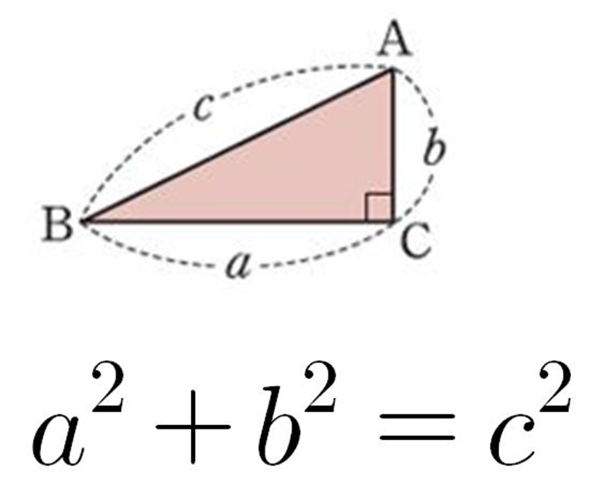

# 20230816 [Java] 문제풀이 


## [프로그래머스] 디펜스 게임


#### 첫 풀이는 71.9 로, 시간 초과 때문에 실패를 했다


#### 2 중 for문으로, slicing을 하고, 정렬을 하면서 앞의 숫자 위주로 더하면서 정답을 구했다


```java
import java.util.*;
class Solution {
    public int solution(int n, int k, int[] enemy) {
        int answer = 0;
        
        if (k == enemy.length) return k;
        if (k > enemy.length) return enemy.length;
        
        for (int i = enemy.length; i >= k; i--) {
            int[] newEnemy = new int[i];
            int tempAdd = 0;
            int tempCompare = 0;
            boolean isTrue = true;
            
            for (int j = 0; j < i; j ++) {
                newEnemy[j] = enemy[j];
                tempAdd += enemy[j];
            }
            
            Arrays.sort(newEnemy);
            
            for (int h = 0; h < i - k; h ++) {
                tempCompare += newEnemy[h];
                
                if (tempCompare > n) {
                    isTrue = false;   
                    break;
                }
            }
            
            if (isTrue) {
                answer = i;
                break;
            }
        }
        
        return answer;
    }
}
```


#### 두번째 풀이는 우선순위 큐를 사용했다


#### k번 즉 무한권만큼 for문을 돌며 우선순위 큐에 숫자를 넣는다


#### k번을 넘을 경우 우선순위 큐에 있는 숫자들을 하나씩 꺼내면서, 누적 숫자가 n보다 크면, 그 위치를 반환하면 된다

- 우선순위 큐를 사용하면 작은 숫자부터 먼저 나오게 된다


```java
import java.util.*;
class Solution {
    public int solution(int n, int k, int[] enemy) {
        if (k >= enemy.length) return enemy.length;
        
        int myTeam = 0;
        
        PriorityQueue<Integer> pq = new PriorityQueue<>();
        
        for (int i = 0; i < enemy.length; i ++) {
            pq.add(enemy[i]);
            
            if (pq.size() > k) {
                myTeam += pq.poll();
                if (myTeam > n) return i;
            }
        }
        
        return enemy.length;
    }
}
```


## [프로그래머스] 점 찍기

> #### 아직 갈 길이 멀은거 같다... ㅜ.ㅜ
>
> - 문제도 이해가 안 되었고, 어떻게 풀지 거의 몰랐다
> - 다행인 것은, 다른 분들의 풀이를 금방 해석할 수 있었다는 점이다




#### 피타고라스 공식을 사용하여 (0, 0)에서 (x, y)에 대한 거리를 구한다


#### 단 2중 for문을 사용하는 것은 시간복잡도 때문에 시간 초과가 일어날 가능성이 높다

- 제한사항에 d가 1,000,000이다


#### 여기서 입력으로 받아오는 d 는 원점과의 거리다

- 즉 위에서 삼각형의 'c' 는, 입력값으로 주어지는 d가 된다


#### x 값을 0부터 d까지 순회하면서, y 값을 구하면 된다

- 즉 위의 삼각형의 a를 0부터 d 까지 하나씩 순회를 한다
- 그리고 **'c ^ 2 - a ^ 2 = b ^ 2'** 인 공식을 사용해서, b 값을 구한다
- 구한 b 값을 k로 나누고 1을 더하면, x 좌표에 대해, 몇 개의 y 좌표에 점을 찍을 수 있는지 확인이 된다


```java
class Solution {
    public long solution(int k, int d) {
        long answer = 0;

        for (int a = 0; a <= d; a += k) {
            
            // 위에 c^2 - a^2 = b^2 공식이다 (y값을 구하기) 
            double b = Math.sqrt(Math.pow(d, 2) - Math.pow(a, 2));
            
            answer += (long) b / k + 1;
        }
        
        return answer;
    }
}
```


