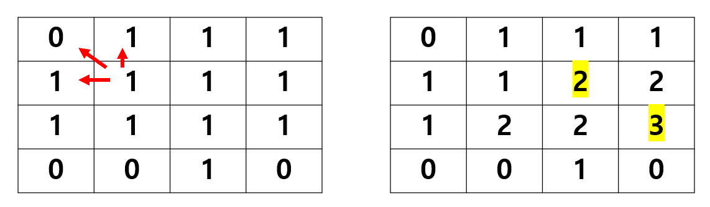

# 꼭 보기! 20231003 [Java] 문제풀이 (다익스트라 + dfs)


## [프로그래머스] 배달 - 다익스트라


#### 다익스트라 알고리즘을 활용


#### 1부터 시작하여, 모든 마을들에 갈 수 있는 최적의 거리를 계산


#### 그 후, 1부터 시작하여 모든 마을들에 갈 수 있는 거리들을 순회하며, 답을 찾는다


```java
import java.util.*;


class Solution {
    
    static class Node {
        int to;
        int distance;

        Node(int to, int distance) {
            this.to = to;
            this.distance = distance;
        }
    }
    
    public int solution(int N, int[][] road, int K) {
        int answer = 0;
        
        int[] allDistances = new int[N + 1];
        List<List<Node>> list = new ArrayList<>();
        
        for (int i = 0 ; i < allDistances.length; i++) {
            allDistances[i] = Integer.MAX_VALUE;
            list.add(new ArrayList<>());
        }
        
        for (int i = 0; i < road.length; i++) {
            list.get(road[i][0]).add(new Node(road[i][1], road[i][2]));
            list.get(road[i][1]).add(new Node(road[i][0], road[i][2]));
        }
    
        int[] result = findDistance(list, allDistances);
        
        // 최적의 거리들이 들어간 배열을 순회한다
        for (int r : result) {
            if (r <= K) answer ++;
        }

        return answer;
    }
    
    public int[] findDistance(List<List<Node>> list, int[] allDistances) {
        PriorityQueue<Node> pq = new PriorityQueue<>((x1, x2) -> x2.distance - x1.distance); 
        allDistances[1] = 0;
        
        pq.add(new Node(1, 0));
        
        while (!pq.isEmpty()) {
            
            Node current = pq.remove();
            
            for (int i = 0; i < list.get(current.to).size(); i++) {
                Node next = list.get(current.to).get(i);
                
                if (allDistances[current.to] + next.distance <= allDistances[next.to]) {
                    allDistances[next.to] = allDistances[current.to] + next.distance;
                    pq.add(next);
                }
                
            }
        }
        
        return allDistances;
    }
}
```


## [프로그래머스] 가장 큰 정사각형



#### 위, 왼쪽, 왼쪽 위에 있는 숫자들을 확인한다

- 모두 0이 아니고, 같은 숫자면, 1을 더해준다
- 0이 없을 때지만, 위, 왼쪽, 왼쪽 위에 있는 숫자들 같지 않다면, 그 중 제일 큰 숫자를 넣어 준다
- 0이 하나라도 있을 경우 1을 넣어준다


```java
import java.util.*;

class Solution
{
    
    public int solution(int[][] board)
    {
        int answer = 0;
        
        if (board.length < 2 && board[0].length < 2) {
            int count = 0;
            
            for (int i = 0; i < board.length; i++) {
                for (int j = 0; j < board[i].length; j ++) {
                    if (board[i][j] == 1) count ++;
                }
            }
        
            
            if (board.length <= 2 && board[0].length <= 2) {
                if (count == 4) return 4;
                else if (count > 0) return 1;
                else return 0;
            }
        }
        
        
        int[][] tempBoard = new int[board.length][board[0].length];
        
        for (int i = 0; i < board.length; i++) {
            for (int j = 0; j < board[i].length; j ++) {
                tempBoard[i][j] = board[i][j];
            }
        }
        
        for (int i = 1; i < board.length; i++) {
            for (int j = 1; j < board[i].length; j ++) {
                
                if (board[i][j] == 1) {
                    int left = tempBoard[i][j - 1];
                    int leftTop = tempBoard[i - 1][j - 1];
                    int top = tempBoard[i - 1][j];
                    
                    tempBoard[i][j] = Math.min(left, Math.min(leftTop, top)) + 1;
                    answer = Math.max(answer, tempBoard[i][j]);
                    
                }
            }
        }
        

        return answer * answer;
    }
}
```


## [프로그래머스] 게임 맵 최단거리


#### 일반적인 BFS 문제였다


#### Queue를 사용했고, 거리를 계산하는 이중 for문을 하나를 더 사용하여, 해당 좌표를 이미 방문을 했는지, 그리고 그 좌표까지 간 거리보다 더 빠른 거리로 갈 수 있는지를 계산해준다


```java
import java.util.*;
class Solution {
    
    int[][] DIR = {{-1, 0}, {0, -1}, {0, 1}, {1, 0}};
    
    public int bfs(int[][] maps) {
        int R = maps.length;
        int C = maps[0].length;
        
        Queue<int[]> queue = new LinkedList<>();
        int[][] visited = new int[R][C];
        visited[0][0] = 1;
        
        queue.add(new int[]{0, 0});
        
        while (!queue.isEmpty()){
            
            int[] cur = queue.poll();
            int curRow = cur[0];
            int curCol = cur[1];
            
            for (int i = 0; i < 4; i ++) {
                int sr = curRow + DIR[i][0];
                int sc = curCol + DIR[i][1];
                
                if ((0 <= sr && sr < R) && (0 <= sc && sc < C)) {
                    
                    if (maps[sr][sc] == 1) {
                        
                        if (visited[sr][sc] == 0) {
                            visited[sr][sc] = visited[curRow][curCol] + 1;
                            queue.add(new int[]{sr, sc});
                        } else if (visited[sr][sc] != 0 && visited[sr][sc] > visited[curRow][curCol] + 1) {
                            visited[sr][sc] = visited[curRow][curCol] + 1;
                            queue.add(new int[]{sr, sc});
                        }
                    }
                }
            }
        }
        
        return visited[R - 1][C - 1];
    }
    
    public int solution(int[][] maps) {
        int answer = bfs(maps);
        
        if (answer == 0) return -1;
        return answer;
    }
}
```


## [프로그래머스] 단체 사진 찍기 - dfs


#### 완전 탐색을 통해서 8 캐릭터가 구성할 수 있는 모든 경우의 수를 찾는다


#### 그 경우의 수에 따라, 주어진 조건을 만족할 수 있는지 확인한다


```java
import java.util.*;
class Solution {
    
    String[] friends = new String[]{"A", "C", "F", "J", "M", "N", "R", "T"};
    boolean[] visited = new boolean[8];
    String[] order = new String[8];
    int count = 0;
    
    public void takePhoto(int depth, String[] data) {
        
        if (depth == 8) {
            if (check(data)) {
                count ++;
            }
            return;
        }
        
        for (int i = 0; i < 8; i++) {
            
            if (!visited[i]) {
                visited[i] = true;
                order[depth] = friends[i];
                takePhoto(depth + 1, data);
                visited[i] = false;
            }
        }   
    }
    
    public boolean check(String[] data) {
        
        HashMap<Character, Integer> map = new HashMap<>();
        
        for (int i = 0; i < 8; i ++) {
            map.put(order[i].charAt(0), i);
        }
        
        for (int i = 0; i < data.length; i ++) {
            char one = data[i].charAt(0);
            char two = data[i].charAt(2);
            char compare = data[i].charAt(3);
            int distance = data[i].charAt(4) - '0';
            
            if (compare == '=') {
                if (Math.abs(map.get(one) - map.get(two)) != distance + 1) return false;
            } else if (compare == '>') {
                if (Math.abs(map.get(one) - map.get(two)) <= distance + 1) return false;
            } else if (compare == '<') {
                if (Math.abs(map.get(one) - map.get(two)) >= distance + 1) return false;
            }
        }
        
        return true;
    }
    
    public int solution(int n, String[] data) {
        
        takePhoto(0, data);
        
        return count;
    }
}
```


