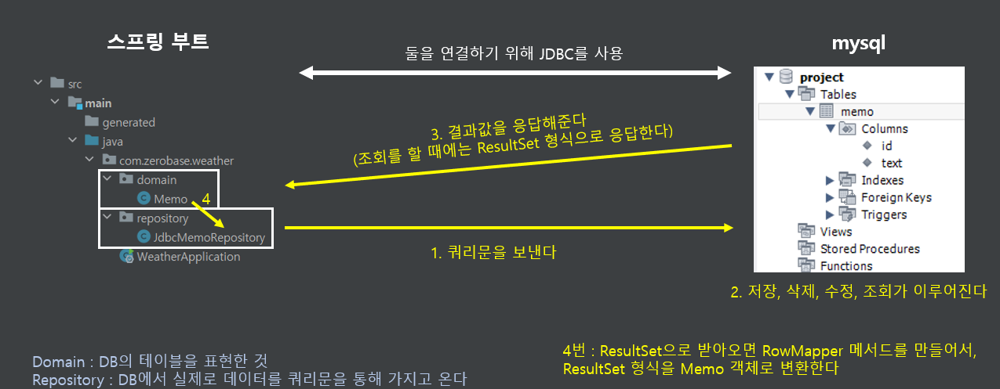

# 스프링 DB


## Persistence Framework


#### 데이터는 Persistence하다 (영속성)

- 어플리케이션을 사용할 때에, 사용했던 데이터가 저장되고, 없어지면 안 된다
- 즉, 프로그램이 꺼진다고 데이터가 없어지면 안 된다


#### 이렇게 프로그램이 꺼져도 데이터가 유지될 수 있도록 영속성을 가지게 해주는 것이 Persistence Framework이다

- **SQL Mapper**
  - SQL 쿼리를 개발자가 직접 작성한다
  - 쿼리 수행 결과와 객체를 매핑한다 (쿼리를 가지고 Spring Boot와 DB가 연결이 된다)
- **ORM (Object Relation Mapping)**이 있다
  - java 함수를 사용하면 자동으로 SQL이 만들어진
  - DB 테이블과 객체를 매핑한다 (쿼리 없이 간접적으로 Spring Boot에 있는 객체와 DB에 있는 테이블을 내부적으로 처리를 한다)


#### Persistence Framework

- DB와 Spring Boot를 이어주는 것이 Persistence Framework이다
- 재사용 및 유지보수에 용이하고 / 직관적인 코드로 장점이 있다
  - DB의 종류가 바뀌어도 Persistence Framework는 하나로 사용될 수 있다
  - Persistence Framework가 없으면 DB와 Spring Boot를 코드마다 연결을 시켜야 한다


## JPA vs JDBC


#### JPA : Java Persistence API

- **ORM 중의 한 종류다**
- JPA는 자바용 ORM이다
- 쿼리를 대신 짜주고, JDBC를 통해서 DB와 연결을 시켜준

```java
// ==== build.gradle ====
implementation 'org.springframework.boot:spring-boot-starter-data-jpa'
runtimeOnly 'mysql:mysql-connector-java'
    
// ==== src/main/java/resources/application.properties에 추가 ====

// com.mysql.cj.jdbc.Driver 드라이버를 사용하겠다는 것 
spring.datasource.driver-class-name=com.mysql.cj.jdbc.Driver

// mysql의 위치를 명시하기
spring.datasource.url=jdbc:mysql://localhost:3306/project?serverTimezone=UTC&characterEncoding=UTF-8

// 유저네임 정확히 입력
spring.datasource.username=root

// 비밀번호 정확히 입력
spring.datasource.password=비밀번호입력

// 내부적으로 생성된 sql을 콘솔창에 보여주겠나?
spring.jpa.show-sql=true

// jpa DB를 mysql로
spring.jpa.database=mysql
```


##### JPA를 사용할 때에는 DB 테이블과 매핑할 클래스에 @Entity를 꼭 붙일 것

- DB 테이블을 위해 여러 Entity를 만들 수 있다 (상황에 따라 다르다!)
- **@Entity** 어노테이션을 통해 연결될 테이블과 사용할 값들을 명시한다
- 그냥 **@Entity**를 사용하면, 클래스 이름과 같은 DB 테이블을 찾는다
- **@Entity(name="테이블 이름")** 

```java
@Getter
@Setter
@AllArgsConstructor
@NoArgsConstructor
@Entity(name="example")
public class Example {

    @Id
    @GeneratedValue(strategy = GenerationType.IDENTITY)
    private int id;

    private String text;
}
```


##### Repository 패키지 안에 JPA 인터페이스를 만든다

```java
@Repository
public interface JpaMemoRepository extends JpaRepository<Memo, Integer> {
}
```

- 여기서 JpaRepository<Memo, Integer> 를 상속 받은 것을 볼 수 있다
- JpaRepository에 이미 쿼리문 관련된 것들이 명시가 되어 있어, 따로 쿼리문을 작성할 필요가 없다


#### JDBC : Java Database Connectivity

- **SQL Mapper 중의 한 종류다**
- 자바 데이터 베이스를 연결시켜주는 것이다 (어플리케이션, DB 사이에서, 서로 연결을 해준다)
  - 여기서 쿼리를 가지고 어플리케이션과 DB를 매핑을 해준다
  - 쿼리를 개발자가 직접 짜는 것이라서, 기능이 최소화 되어 있다

```java
// ==== build.gradle ====
implementation 'org.springframework.boot:spring-boot-starter-jdbc'
runtimeOnly 'mysql:mysql-connector-java'
    
    
// ==== src/main/java/resources/application.properties에 추가 ====

// com.mysql.cj.jdbc.Driver 드라이버를 사용하겠다는 것 
spring.datasource.driver-class-name=com.mysql.cj.jdbc.Driver

// mysql의 위치를 명시하기
spring.datasource.url=jdbc:mysql://localhost:3306/project?serverTimezone=UTC&characterEncoding=UTF-8

// 유저네임 정확히 입력
spring.datasource.username=root

// 비밀번호 정확히 입력
spring.datasource.password=비밀번호입력
```


