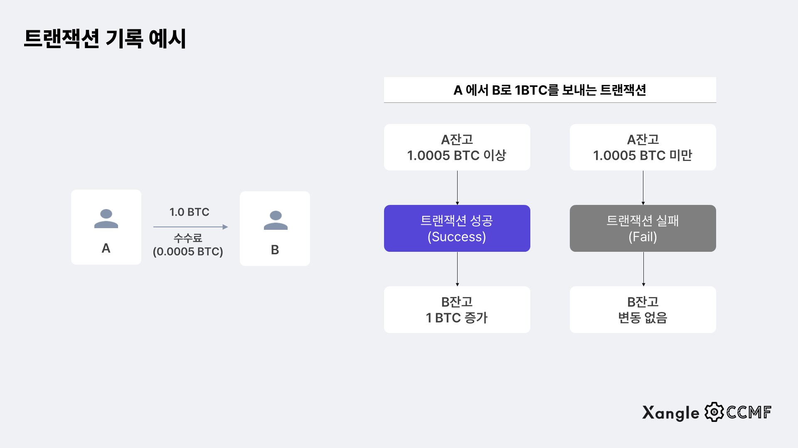

# 스프링 Transaction


## Transaction이란?




#### 데이터베이스의 상태를 변화시키기 위해 수행하는 작업 단위

- 상태 변화라는 것은 쿼리문을 이용하여, DB를 접근하고 수정하고, 삭제하는 것이다
- 작업 단위는 프로젝트 별 또는 상황 별로 나눌 수 있다
- 트랜잭션이 실패했을 때, 롤백으로, 트랜잭션이 실행하기 이전의 상태로 돌아가는 것이다
- **트랜잭션이 완전히 성공을 해야, DB를 제대로 관리할 수 있을 수 있다**
  - 트랜잭션 중에, 어떤 것은 성공하고, 어떤 것을 실패했을 때, 성공한 데이터가 저장이 된다면, DB가 복잡해질 수 있다


#### JPA든 JDBC든 모두 쿼리문을 사용하여 DB의 상태를 변화시키는 것이다

- JDBC는 쿼리문을 직접 작성하지만, JPA는 ORM을 통해 개발자가 간단하게 작성한 코드를 쿼리문으로 바꾸어 준다


### ✔️ 트랜잭션의 특징


#### 원자성 (Atomicity)

- 트랜잭션의 일부분만 성공하고 실패할 수 없다
- 무조건 트랜잭션 자체가 성공을 하거나, 실패를 한다
- 성공을 하면 DB의 상태를 변화시키는 것이고, 실패를 하면 DB의 상태를 그대로 두는 것이다


#### 일관성 (Consistency)

- 트랜잭션의 작업 처리 결과는 일관성을 가지고 있다
- 같은 작업을 했을 때에 다른 결과가 있으면 절대로 안 된다


#### 독립성 (Isolation)

- 서버 안에는 여러 DB가 있다, 즉 여러 개의 트랜잭션이 있다는 것이다
- 트랜잭션이 한꺼번에 DB에 상태 변화를 하는 것이 아니라, 트랜잭션 하나씩 DB에 접근을 할 수 있다


#### 지속성 (Durability)

- 트랜잭션을 성공적으로 수행했다면, DB 변화 상태가 계속 유지가 되어야 한다


### ✔️ 트랜잭션의 연산


#### Commit (커밋) : 트랜잭션 전체가 잘 커밋이 되었을 때에, DB의 상태를 변화시킨다


#### Rollback (롤백) : 트랜잭션 안에서 작업이 잘 안 되었을 때에 롤백, 즉 트랜잭션 처음으로 돌아간다


## 이러한 Transaction는 스프링에서 어떻게 다루면 좋을까?


#### @Transactional

- 일반적인 방법이다. 클래스 또는 메서드 위에 해당 어노테이션을 사용한다
- 해당 클래스 또는 메서드에는 프록시 객체가 생성이 된다
  - 프록시 객체 (Proxy) : 대행해주는 객체


#### 트랜잭션을 할때마다, 하나씩 수행을 하게 만들고, 다른 트랜잭션들이 기다리게 만드는 것은 안전하지만, 대기 시간이 있을 수 있다

- 안전하지만 비효율적
- 서비스마다 세부 설정을 다르게 할 수 있다 (아래 설명)


### Spring 트랜잭션의 세부 설정


#### Isolation (격리 수준)

> 동시에 여러 트랜잭션이 실행될 때, 트랜잭션의 작업 결과를 다른 트랜잭션에게 어떻게 노출할 것인지 결정
>
> - 기본적으로는 Default로 넣지만, 정말 중요한 데이터면 더 높은 격리 수준으로 설정을 한다
> - @Transactional(isolation=Isolation.DEFAULT)

- **DEFAULT**
  - 디폴트 설정이다, 일반적으로는 DB의 격리 수준은 READ_COMMITED가 디폴트다
- **READ_UNCOMMITED** - Dirty Read 발생
  - 하나의 트랜잭션이 커밋되기 전에 그 변화가 다른 트랜잭션에 그대로 노출된다
  - 가장 낮은 격리수준
- **READ_COMMITED** - Dirty Read 방지
  - 다른 트랜잭션이 커밋하지 않은 정보는 읽을 수 없음
  - 트랜잭션이 진행되고 있을 때는, 해당 데이터는 조회를 할 수 없다
- **REPEATABLE_READ** - Non-Repeatable Read 방지
  - 하나의 트랜잭션이 읽은 로우를 다른 트랜잭션이 수정할 수 없도록 막아주지만, 새로운 로우를 수정할 수는 있다
  - SELECT로 조건에 맞는 로우를 전부 가져오는 경우, 트랜잭션이 끝나기 전에 새로 추가된 로우가 발견되기도 한다
- **SERIALIZABLE** - Phantom Read 방지
  - 트랜잭션을 순차적으로 진행시킨다
  - 제일 안전하지만, 성능이 가장 떨어진다


#### Propagation (전파 수준)

> 트랜잭션을 어떻게 진행시킬지 결정하도록 전파 속성을 전달한다 
>
> - 트랜잭션 동작 도중 다른 트랜잭션을 호출하는 상황 

- **REQUIRED**
  - Default 설정이다
  - 미리 시작한 트랜잭션이 있으면 참여하고, 없으면 새로 시작하는 것
  - 부모 트랜잭션 안에, 자식 트랜잭션까지 실행을 하는 것 
- **SUPPORTS**
  - 이미 시작한 트랜잭션이 있으면 참여하고, 없으면 트랜잭션 없이 진행하는 것
  - 부모 트랜잭션 안에 자식 트랜잭션이 들어오면, 부모 트랜잭션에 참여를 하고, 그것이 아니면 트랜잭션 없이 진행
- **MANDATORY**
  - 이미 시작된 트랜잭션이 있으면 참여하고, 없으면 새로 시작하는 대신 없으면 예외를 발생시킨다
  - 혼자서 독립적으로 트랜잭션을 진행하면 안 되는 경우에 사용
- **REQUIRES_NEW**
  - 항상 새로운 트랜잭션을 시작해야 하는 경우에 사용
  - 이미 진행중인 트랜잭션이 있으면 이를 보류시키고 새로운 트랜잭션을 만들어 시작
  - 부모 트랜잭션이 있어도, 자식 트랜잭션이 실행할 때, 자식 트랜잭션만의 트랜잭션을 만들어 시작한다
- **NOT_SUPPORTED**
  - 이미 진행중인 트랜잭션이 있으면 보류시키고, 트랜잭션을 사용하지 않도록 한다
- **NEVER**
  - 이미 진행중인 트랜잭션이 있으면 예외를 발생시키며, 트랜잭션을 사용하지 않도록 한다
- **NESTED**
  - 이미 진행중인 트랜잭션이 있으면 중첩 트랜잭션을 시작한다
  - 이미 동작하는 트랜잭션 안에, 트랜잭션을 만드는 것
  - 부모 트랜잭션이 커밋이 되거나 롤백이 될 때에, 자식 트랜잭션에 영향이 가지만, 반대로 자식 트랜잭션에 대한 커밋 또는 롤백은 부모는 영향을 받지 않는다


#### ReadOnly 속성

> 트랜잭션은 읽기 전용 속성으로 지정한다
>
> - @Transactional(readOnly=true)

- ReadOnly 속성을 가지는 트랜잭션은 insert, delete, update를 할 수 없다
- 즉 조회, select만 할 수 있게 된다
- 기본 속성은 false로 되어 있다


#### 트랜잭션 롤백 예외

> 예외가 발생했을 때에 트랜잭션을 롤백한다
>
> - @Transactional(rollbackFor=Exception.class)
> - @Transactional(noRollbackFor=Exception.class)

- noRollbackFor : 특정 예외에는 롤백을 하지 않는 것
- 기본 설정은 RuntimeException, Error가 들어가 있다


#### timeout 속성

> 일정 시간 내에 트랜잭션을 끝내지 못 하면 롤백을 시키는 속성
>
> - @Transactional(timeout=시간)

- DB에 문제가 있어, 트랜잭션이 안 끝날 수도 있을 때에 유용하다


## 코드


#### 메인 어플리케이션 클래스에 @EnableTransactionManagement를 넣는다

```java
@SpringBootApplication
@EnableTransactionManagement
public class WeatherApplication {

	public static void main(String[] args) {
		SpringApplication.run(WeatherApplication.class, args);
	}

}
```


#### 주로 Service단에서 Transactional을 많이 사용한다 (class에 넣을 수 있고, method별로도 넣을 수 있다)

```java
import org.springframework.transaction.annotation.Transactional;

@Service
@Transactional
public class ExampleService {
    
    @Transactional(readOnly=true)
    public List<Example> readData(int id) {
            return exampleRepository.findAllById(id);
    }
}
```


#### Test 코드를 작성할 때에, Transactional 어노테이션을 사용하면, 모두 롤백이 된다
