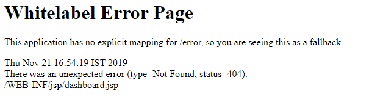

# 스프링 예외


## 스프링의 예외처리


#### 1. Whitelabel




#### 2. 400 : Bad Request

- 제대로 되지 않은 값을 넣었을 때, 스프링에서 알아서 예외처리 후  '**400 : Bad Request**'를 반환해준다


#### 3. try catch

- 코드를 try에서 실행하고, 예외가 발생하면 catch문에서 받아서 예외 처리를 해준다


#### 4. custom exception을 만들기

- exception 클래스를 새로 만들어서 예외 처리를 해준다
- 특정 Exception을 상속 받아서, 우리만의 exception을 만들 수 있다


### Exception Handler

- @Controller 또는 @RestController에 Exception Handler를 넣어, 해당 Controller 안의 예외들을 처리해주는 것이다
  - 프로젝트 전체는 아니다


### ControllerAdvice

- 모든 Controller에 대한 예외처리를 해준다
- 스프링 src/main/java/~~~ 에 config 패키지를 생성해준다
- config 패키지 않에 @RestControllerAdvice를 어노테이션으로 놓는다

```java
@RestControllerAdvice
public class GlobalExceptionHandler {

    @ResponseStatus(HttpStatus.INTERNAL_SERVER_ERROR)
    @ExceptionHandler(Exception.class)
    public Exception handleAllException(){
        System.out.println("Error from GlobalExceptionHandler");
        return new Exception();
    }
}
```


