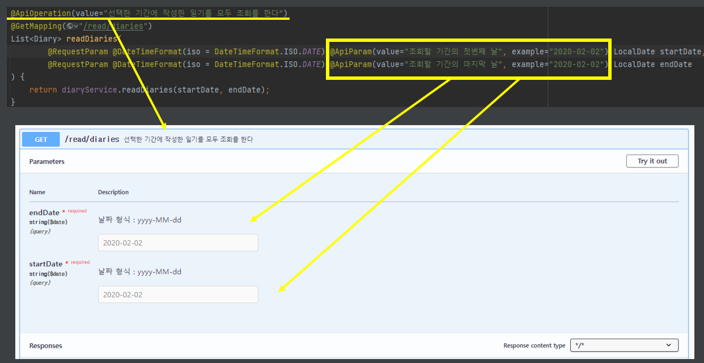
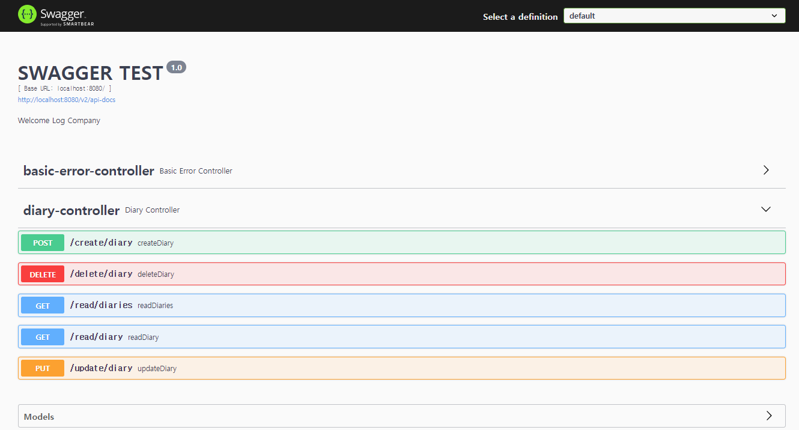

# 스프링 API 문서 만들기


## 작성 이유


#### 백엔드 개발자  같은 경우 프론트 개발자에게 문서를 전달하여, 어떤 기능이 있는지 알려준다


#### 백엔드 개발자끼리 정보를 공유할 수 있다


#### 즉 개발자가 만든 기능을 사람들이 이해할 수 있도록 작성을 하는 것이다


#### .txt로 만들면, 업데이트, 수정 하는 것이 어렵다 (개발 할 때마다 수정을 해야 한다)

- 계속 수정을 못 하면 사용자들이 기능을 제대로 못 사용할 수도 있다


## API 문서를 돕는 tool


#### Swagger / ReDoc / GitBook 등이 있다

- 고르는 방식은 협업의 방식, 사람들의 취향 등
- 사용한 언어를 고려해서 사용할 수 있다
- 사용성 : 간단한가???


### Swagger? 

- HTML로 접근을 할 수 있다
- API 문서를 만들면, 하나의 URL로 다른 사람에게 공유를 할 수 있다
  - 다른 사람들은 그 문서를 통해 바로 API를 사용할 수 있다


## Swagger 사용하기 (SpringBoot)


**Build.gradle** (dependency에 추가하기)

```java
implementation 'io.springfox:springfox-boot-starter:3.0.0'
implementation 'io.springfox:springfox-swagger-ui:3.0.0'
```


**application.properties**

```java
spring.mvc.pathmatch.matching-strategy=ant_path_matcher
```


**src/main/java/~~/config/SwaggerConfig.java**

```java
@Configuration
@EnableSwagger2
public class SwaggerConfig {
    @Bean
    public Docket api() {
        return new Docket(DocumentationType.SWAGGER_2)
                .select()
                .apis(RequestHandlerSelectors.any())
            // .apis(RequestHandlerSelectors.basePackage(패키지 이름))
            // error 컨트롤러가 없어진다
                .paths(PathSelectors.any())
                .build().apiInfo(apiInfo());
    }

    private ApiInfo apiInfo() {
        String description = "Welcome Log Company";
        return new ApiInfoBuilder()
                .title("SWAGGER TEST")
                .description(description)
                .version("1.0")
                .build();
    }
}
```

- .paths(PathSelectors.any())
  - PathSelectors.ant() 를 사용해서, 패턴을 지정을 하거나, 보여줄 패키지를 넣어서, 숨기고 싶은 API를 숨길 수 있다
    - Admin용 Controller를 따로 만든다


#### @ApiOperation(value = " ", note="")

- controller 각 매서드 위에 설정을 해 놓는

- 각 API를 제대로 설명을 할 수 있다 (value값)
- note는 value 밑에 해당 API를 더 설명해 줄 수 있다

```java
@RestController
@RequiredArgsConstructor
public class ExampleController {

    private final ExampleService exampleService;

    @ApiOperation(value="Example API에 대한 설명", notes="더 긴 설명을 넣을 수 있다")
    @PostMapping("/create/example")
    void createExample(
            @RequestParam @DateTimeFormat(iso = DateTimeFormat.ISO.DATE) LocalDate date,
            @RequestBody String text
            ) {
        exampleService.createExample(date, text);
    }
```




#### 결과물

- http://localhost:8080/swagger-ui/index.html


