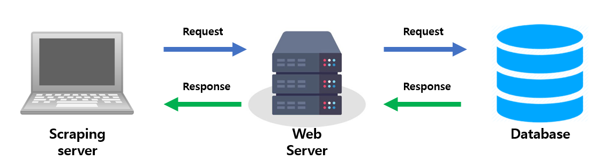
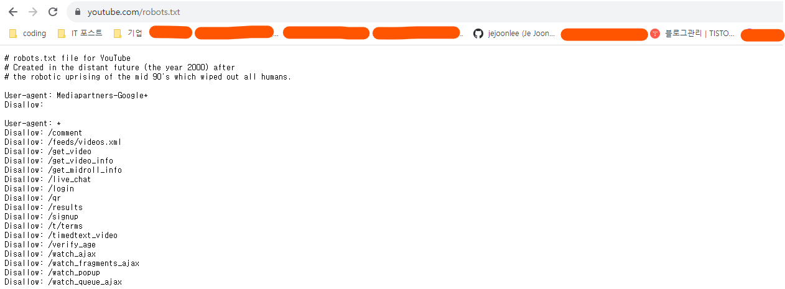
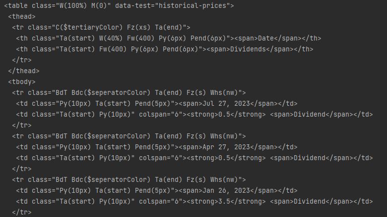

# 스프링 스크래핑


## 스크래핑이란?


#### 웹사이트 굉장히 많은 데이터를 가지고 있고, 사용자들이 보기 편하게 가공이 되어 있다

- HTML 문서를 보기 편하게 만든 것이 웹사이트


#### 웹사이트에 HTML을 통해 보여지는 정보들을 모으는 것이 웹 스크래핑이란 것이다


#### 웹 스크래핑은

- HTML 문서를 받고
- 문서를 파싱(Parsing, 구문 분석) 해서 
- 필요한 데이터를 추출한다 (일반적으로 파이썬으로 많이 사용된다)




#### Client 대신 스크래핑 서버가, 웹 서버에게 요청을 보내서 데이터를 받아오는 것이다

- 서버를 사용하는 유저들의 수가 많으면 서버 부하가 걸리듯이, 스크래핑 서버에서 너무 많은 요청을 보내면 서버 부하가 걸린다 
- 즉 서버에 요청을 보낼 때에는, 웹 서버에서 부하가 걸리지 않을 정도의 요청을 보내야 한다 


## 주의사항


#### 사이트의 데이터를 막 가져오면 안 된다!

- 데이터는 회사의 중요한 자산이다
- 스크래핑하는 웹 서버에 부하를 일으킬 수 있다


#### Robots.txt 를 확인한다

- 어떤 경로의 접근을 막는지 표시가 되어 있다 (Disallow)




#### Robots.txt가 없고, 스크래핑이 가능해도, 데이터를 가지고 올 때에는 요청 서버에 무리가 가지 않은 선에서 요청을 한다


## Java로 Jsoup을 사용하여 스크래핑 하기


```java
public class StockApplication {

    public static void main(String[] args) {

        try {
            // 연결할 URL
            Connection connection = Jsoup.connect("웹 사이트 URL");
            
            // 연결된 URL을 get 요청으로 가지고 온다, post는 post()로
            // Document로 return을 한다
            Document document = connection.get();
			
            // <table class="클래스이름" 속성이름=속성내용>내용</table>
            // 해당 내용은 태그 안에 속성 이름과 내용을 가지고 와서, 그 태그 안에 있는 html문서를 가지고 오는 것
            Elements elements = document.getElementsByAttributeValue("속성이름", "속성내용");

            Element element = elements.get(0);

            System.out.println(element);

        } catch (IOException e) {
            throw new RuntimeException(e);
        }
    }
}
```


#### 콘솔 창 예시)




#### 위에 것에서 데이터만 가지고 오려면 Jsoup에서 제공하는 메서드를 사용하면된다

- 그리고 태그 사이에 있는 문자들을 주로 데이터로 생각하고, 그 문자들을 가지고 오면 된다
- 그 외에 자식 태그를 잘 생각하면서 태그를 가지고 와서, 그 태그의 문자를 저장하면 된다
