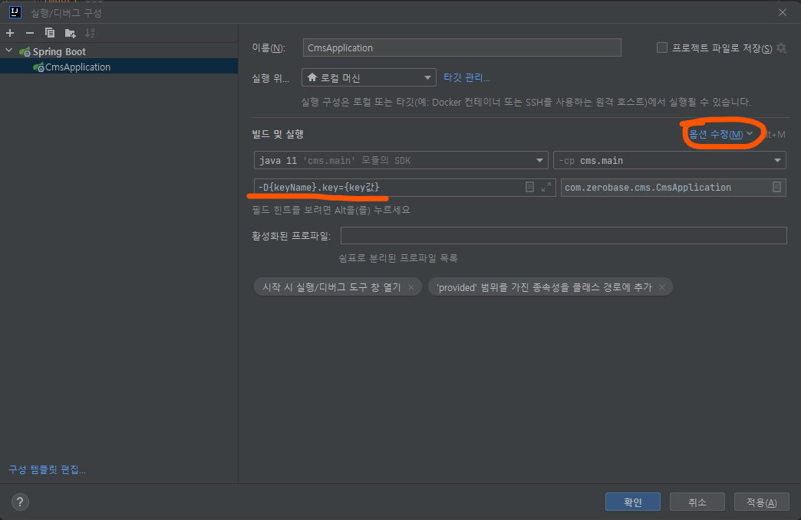

# 스프링 Secret Key


#### 민감한 정보를 외부에 노출되는 것을 막기

- Github에 내 코드를 올릴 때에, key 또는 비밀번호 같은 민감한 정보를 올릴 수 있


```java
@Value(value="${keyName.key}")
private String key;
```


#### 방법 1. 실행 / 구성 편집

- 옵션 수정을 눌러 VM 옵션 추가를 누르고, 아래와 같이 민감한 정보를 넣어준다





#### 방법 2. key 전용 properties 파일 만들기

- resource에 **application-API-KEY.properties** 파일을 만든다
