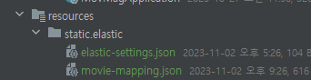

# [Spring] ElasticSearch + MySQL


참고한 블로그!!! 

https://backtony.github.io/spring/elk/2022-03-02-spring-elasticsearch-2/


#### 해당 프로젝트에서는 영화 DB를 TMDB API에서 가지고 와서 MySQL에 저장을 해 놓은 상태다

- ElasticSearch는 DB가 아닌 검색 엔진이기 때문에, MySQL에 저장되어 있는 포멧을, ElasticSearch 포멧으로 바꿔놔야 한다


#### 스프링에서는 Entity를 통해서 DB와 연결을 했다면, ElasticSearch는 Document를 사용한다

- 한 프로젝트 안에 Entity와 Document 두 개를 정확해 어노테이션을 통해 명시를 해야 한다
- 하드 코딩으로 Document를 만들지 않고, ElasticSearch index로 만들 수 있다고 하는데, 개인적으로 Document를 따로 생성하는 것이 더 편했다 (어차피 Entity 그대로 복붙하면 된다)


### 1. ElasticConfig 만들기

- elasticUrl은 **localhost:9200** 이다
- 나중에 **elasticsearch repository**를 사용하기 위해서 **@EnableElasticsearchRepositories** 어노테이션을 추가했다
  - Spring-data-JPA를 사용하는 것과 똑같다!

```java
@Configuration
@EnableElasticsearchRepositories
public class ElasticConfig extends AbstractElasticsearchConfiguration {

    @Value("${spring.elastic.url}")
    private String elasticUrl;


    @Override
    public RestHighLevelClient elasticsearchClient() {

        ClientConfiguration clientConfiguration = ClientConfiguration.builder()
                .connectedTo(elasticUrl).build();

        return RestClients.create(clientConfiguration).rest();
    }
}
```


### 2. MovieDocument.java

- 잘 보면 Entity와 똑같다
- 대신 ElasticSearch는 Column 대신 Field를 사용한다
- **@Document(indexName = "movie_index")** : 저장할 index, 즉 table의 이름이다
  - ElasticSearch는 table을 index라고 한다
- 추후에 저장한 영화 관련 Entity를 Document로 저장해야 해서, fromEntity 매서드를 따로 만들어 준다
- **@Setting** : 분석기를 매핑한다
- **@Mapping** : 타입을 매핑한다

```java
@Getter
@AllArgsConstructor
@NoArgsConstructor
@Builder
@ToString
@Setting(settingPath = "static/elastic/elastic-settings.json")
@Mapping(mappingPath = "static/elastic/movie-mapping.json")
@Document(indexName = "movie_index") // 정해줄 index (table) 이름
public class MovieDocument {

    @Id
    @Field(name="movie_id", type = FieldType.Keyword)
    private Long movieId;

    @Field(name="genre_id", type = FieldType.Object)
    private Map<String, Object> genreId = new HashMap<>();

    @Field(name="title_eng", type = FieldType.Text)
    private String titleEng;

    @Field(name="title_kor", type = FieldType.Text)
    private String titleKor;

    @Field(name="overview_eng", type = FieldType.Text)
    private String overviewEng;

    @Field(name="overview_kor", type = FieldType.Text)
    private String overviewKor;

    @Field(name="released_date", type = FieldType.Text)
    private String releasedDate;

    @Field(name="movie_score", type = FieldType.Double)
    private Double movieScore;

    @Field(name="runtime", type = FieldType.Long)
    private Long runtime;

    @Field(name="poster_path", type = FieldType.Text)
    private String posterPath;

    public static MovieDocument fromEntity(MovieEntity movieEntity) {
        return MovieDocument.builder()
                .movieId(movieEntity.getMovieId())
                .genreId(movieEntity.getGenreId())
                .titleEng(movieEntity.getTitleEng())
                .titleKor(movieEntity.getTitleKor())
                .overviewEng(movieEntity.getOverviewEng())
                .overviewKor(movieEntity.getOverviewKor())
                .releasedDate(movieEntity.getReleasedDate())
                .movieScore(movieEntity.getMovieScore())
                .runtime(movieEntity.getRuntime())
                .posterPath(movieEntity.getPosterPath())
                .build();
    }

}
```


- 아래와 같이 세팅과 매핑 json 파일을 만든다




#### elastic-setting.json

```json
{
  "analysis": {
    "analyzer": {
      "korean": {
        "type": "nori"
      }
    }
  }
}
```


#### movie-mapping.json

- 위에 document와 비교하면서 보면 쉬워진다
- analyzer 같은 경우, nori  분석기를 사용할 때에 명시해 준다

```json
{
  "properties": {

    "movieId": {
      "type": "keyword"
    },

    "genreId": {
      "type" : "object"
    },

    "titleEng": {
      "type": "text"
    },

    "titleKor": {
      "type": "text",
      "analyzer": "korean"
    },

    "overviewEng": {
      "type": "text"
    },

    "overviewKor": {
      "type": "text",
      "analyzer": "korean"
    },

    "released_date": {
      "type": "text"
    },

    "movie_score": {
      "type": "double"
    },

    "runtime": {
      "type": "long"
    },

    "poster_path": {
      "type":"text"
    }
  }
}
```


### 3. MovieSearchRepository

- JpaRepository와 똑같이 하면된다

```java
public interface MovieSearchRepository extends ElasticsearchRepository<MovieDocument, Long> {

    List<MovieDocument> findAllByTitleEng(String movieTitle);

    List<MovieDocument> findAllByTitleKor(String movieTitle);

}
```


### 4. MovieSearchServiceImpl

- 아래는 MovieDocument를 바로 리턴했지만, 추후에는 dto를 만들어서 응답을 할 예정이다
- 자세히 보면 그냥 서비스 클래스와 다를게 없다
- MySQL에서 있는 데이터들을 Entity로 불러와서 Document로 fromEntity메서드를 통해 객체를 만든 후, ElasticSearch에 저장을 해주면 된다

```java
@Service
@RequiredArgsConstructor
public class MovieSearchServiceImpl implements MovieSearchService {

    private final MovieRepository movieRepository;
    private final MovieSearchRepository movieSearchRepository;

    @Override
    public int saveAllMoviesToMovieDocument() {

        List<MovieDocument> movieDocumentList = movieRepository.findAll()
                .stream().map(MovieDocument :: fromEntity).collect(Collectors.toList());

        movieSearchRepository.saveAll(movieDocumentList);

        return movieDocumentList.size();
    }

    @Override
    public List<MovieDocument> searchMovie(String movieName, String lang) {

        if (lang.equals("ko-KR")) {
            return movieSearchRepository.findAllByTitleKor(movieName);
        } else if (lang.equals("eng")) {
            return movieSearchRepository.findAllByTitleEng(movieName);
        }

        return movieSearchRepository.findAllByTitleEng(movieName);
    }
}
```


### 5. MovieController

```java
@RestController
@RequestMapping("/movie")
@RequiredArgsConstructor
public class MovieController {

    private final MovieService movieService;
    private final MovieSearchService movieSearchService;

    // only admin
    @PostMapping("/save_movie_document")
    public int saveMovieDocument(){
        return movieSearchService.saveAllMoviesToMovieDocument();
    }

    // all
    @GetMapping("")
    public ResponseEntity<List<MovieDocument>> searchMovie(
            @RequestParam String movieName,
            @RequestParam String lang
    ) {
        return ResponseEntity.ok(movieSearchService.searchMovie(movieName, lang));
    }
}
```

