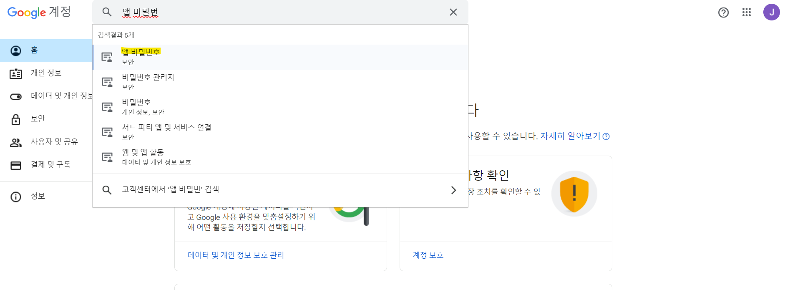
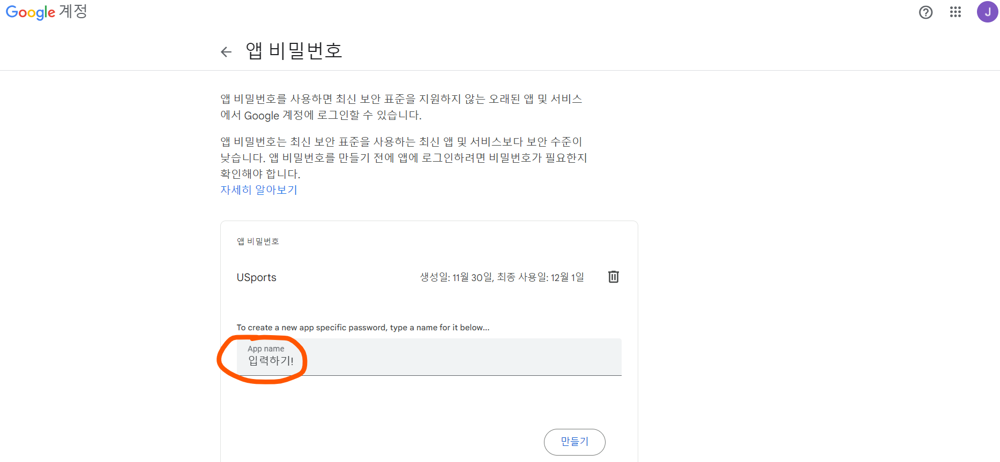
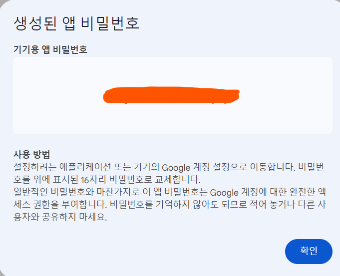
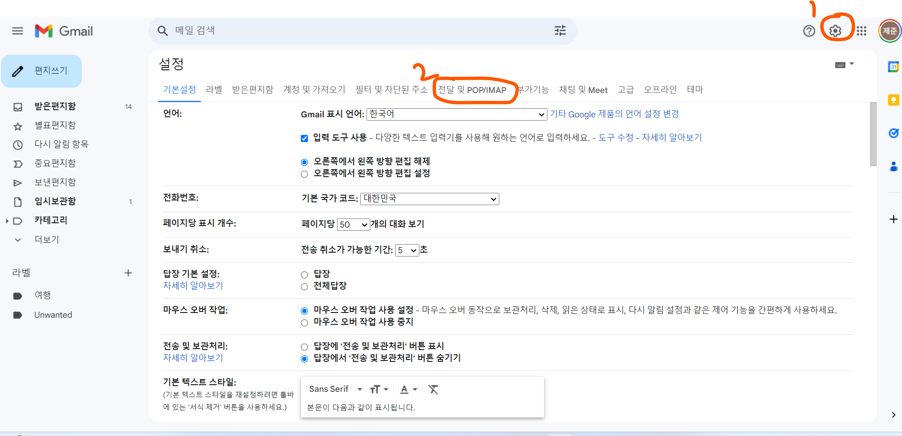

# [USports] Email 전송


#### 프로젝트에서 이메일 인증과, 임시 비밀번호를 이메일을 통해 는 것이 있다

#### 구글 SMTP 서버를 이용하였다

- 프로젝트 용 이메일을 새로 만들고, 프로젝트를 위해, 원래 비밀번호가 아닌, 프로젝트 용 비밀번호를 개인 설정에서 받을 수 있다


 #### Google 계정 관리에 들어가기

- 검색에서 앱 비밀번호를 치고, 들어가기
- 그러면 계정 비밀번호를 입력하라고 뜬다




#### App Name에 어플리케이션 이름 입력하기




#### 앱 비밀번호를 받고, 꼭 복사하기 (잊어버리면, 또 다시 앱을 입력해야 한다)

- 그리고 외부에 노출하지 말기!




#### Gmail의 설정에 들어가서 전달 및 POP/IMAP에 들어가기




#### 아래와 같이 설정하기


## build.gradle

아래 추가

```
implementation 'org.springframework.boot:spring-boot-starter-mail'
```


## application-private.properties

해당 내용들은 외부에 공개를 안 하는게 좋다

```properties
spring.mail.host=smtp.gmail.com
spring.mail.port=587
spring.mail.username=이메일
spring.mail.password=앱 비밀번호
spring.mail.properties.mail.smtp.auth=true

# SMTP서버가 TLS를 사용하여 안전하게 연결을 요구한다
spring.mail.properties.mail.smtp.starttls.enable=true
spring.mail.properties.mail.smtp.starttls.required=true

# 클라이언트가 SMTP 서버로부터 응답을 대기해야 하는 시간
# 서버에서 응답이 가지 않을 경우를 대비
spring.mail.properties.mail.smtp.timeout=5000

# 클라이언트가 SMTP 서버와의 연결을 설정하는데 대기하는 시간
spring.mail.properties.mail.smtp.connectiontimeout=5000

# 클라이언트가 작업을 완료하는데 대기해야 하는 시간 (Millisecond)
spring.mail.properties.mail.smtp.writetimeout=5000

# 이메일 인증 코드의 만료 시간 (Millisecond)
spring.mail.auth-code-expiration-millis=1800000
```


## EmailConfig

```java
@Configuration
public class EmailConfig {

    @Value("${spring.mail.host}")
    private String host;

    @Value("${spring.mail.port}")
    private int port;

    @Value("${spring.mail.username}")
    private String username;

    @Value("${spring.mail.password}")
    private String password;

    @Value("${spring.mail.properties.mail.smtp.auth}")
    private boolean auth;

    @Value("${spring.mail.properties.mail.smtp.starttls.enable}")
    private boolean starttlsEnable;

    @Value("${spring.mail.properties.mail.smtp.starttls.required}")
    private boolean starttlsRequired;

    @Value("${spring.mail.properties.mail.smtp.connectiontimeout}")
    private int connectionTimeout;

    @Value("${spring.mail.properties.mail.smtp.timeout}")
    private int timeout;

    @Value("${spring.mail.properties.mail.smtp.writetimeout}")
    private int writeTimeout;

    // 이메일 보내는 객체
    @Bean
    public JavaMailSender javaMailSender() {
        JavaMailSenderImpl mailSender = new JavaMailSenderImpl();
        mailSender.setHost(host);
        mailSender.setPort(port);
        mailSender.setUsername(username);
        mailSender.setPassword(password);
        mailSender.setDefaultEncoding("UTF-8");
        mailSender.setJavaMailProperties(getMailProperties());

        return mailSender;
    }

    private Properties getMailProperties(){
        Properties properties = new Properties();
        properties.put("mail.smtp.auth", auth);
        properties.put("mail.smtp.starttls.enable", starttlsEnable);
        properties.put("mail.smtp.starttls.required", starttlsRequired);
        properties.put("mail.smtp.connectiontimeout", connectionTimeout);
        properties.put("mail.smtp.timeout", timeout);
        properties.put("mail.smtp.writeTimeout", writeTimeout);

        return properties;
    }
}
```


## Controller

- 메일이 잘 보내지는지 확인하는 컨트롤러

```java
@RestController
@RequiredArgsConstructor
@RequestMapping("/member")
public class MailController {

    private final MailService mailService;

    /**
     * 메일 보내기
     * @param email
     * @return 인증 번호
     */
    @PostMapping("/mail/{email}")
    public String MailSend(
            @PathVariable("email") String email
    ){
        int number = mailService.sendEmailAuthMail(email);

        String num = " " + number;

        return num;
    }

}
```


## MailServiceImpl

#### createMail()

- MimeMessage의 객체를 만들어서, 매일 소재목, 내용을 넣을 수 있다


#### sendEmailAuthMail()

- createMail에서 만든 메일 내용을 JavaMailSender를 통해 보내게 된다

```java
@Service
@RequiredArgsConstructor
@Slf4j
public class MailServiceImpl implements MailService {

    private final JavaMailSender javaMailSender;
    private static final String senderEmail = "jejoonproject@gmail.com";

    public MimeMessage createMail(String mail, String value, String title, StringBuilder content) {

        MimeMessage message = javaMailSender.createMimeMessage();

        try {
            StringBuilder body = new StringBuilder();
            body.append("<h1>").append(value).append("<h1>").append(content);

            message.setRecipients(MimeMessage.RecipientType.TO, mail);
            message.setSubject(title);
            message.setText(String.valueOf(body), "UTF-8", "html");
        } catch(MessagingException e) {
            e.printStackTrace();
        }

        return message;
    }

    @Override
    @Async
    public int sendEmailAuthMail(String email) {

        String number = "1004";
        String title = MailConstant.MEMBER_EMAIL_AUTH_TITLE;
        StringBuilder content = MailConstant.AUTH_EMAIL_CONTENT;

        MimeMessage message = createMail(email, number, title, content);
        javaMailSender.send(message);

        return Integer.parseInt(number);
    }
}
```

