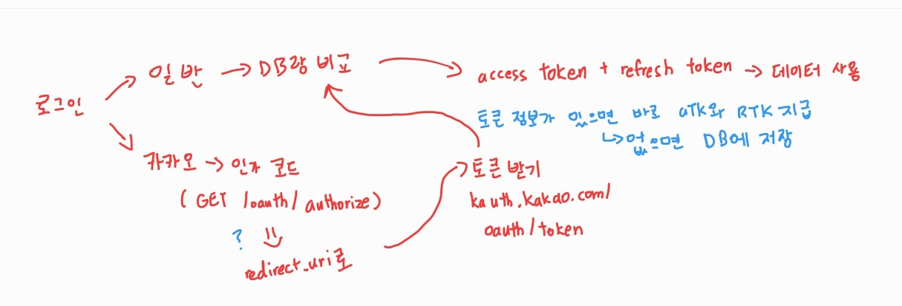

# [USports] Member OAuth2


#### Member를 만들고, 간편 인증이 필요할 것 같아 OAuth2를 사용하였다

- 그 중에 카카오 간편 로그인을 먼저 사용했다


## OAuth란?

> 항상 간편 로그인을 위해서 사용되는 프로토콜인 줄 알았다


#### OAuth를 공부하면서 느낀 것

- Resource Server, 즉 카카오나 네이버 같이 많은 사람들이 이미 회원가입을 한 어플리케이션에서, Client, 내 어플리케이션에게 자신들의 자원을 사용할 수 있는 권한을 주는 것이라고 크게 느꼈다
  - **Resource Owner** : 자원을 소유하는 사람 (예. 유저들)
  - **Resource Server** : Resource Owner의 정보가 저장되어 있는 서버 (예. 카카오, 네이버)
  - **Client** : Resource Server에 저장되어 있는 Resource Owner의 정보를 사용하려고 하는 어플리케이션 (예. 내가 만드는 어플리케이션)


#### 과정

1. 사용자가 카카오 간편 로그인을 시도한다
2. 카카오 (Resource Server)에서는 카카오 로그인 창을 띄어주거나, 유저가 해당 어플리케이션에 첫 로그인이면, 회원 동의 창을 띄어준다
3. 로그인을 하거나, 회원 동의를 완료했으면 카카오에서는 어플리케이션 (client)에게 인가 코드 (Authorization Code)를 발급해 준다
   - 인가 코드 같은 경우, 해당 회원에 대해, Resource Server에 있는 자원을 사용할 수 있다는 것을 1차적으로 확인
4. 인가 코드를 통해 Client는 Resource Server에게 Access Token을 요청하고, 발급을 받는다
5. 이 Access Token을 통해서 Client는 Resource Server에 저장되어 있는 Resource Owner의 자원을 사용할 수 있게 된다

> 여기서 자원이란 것은, 유저의 이메일, 나이 같은 자원도 얘기하지만, 그 외에, 구글 캘린더, 메세징 같은Resource Server에서 제공되는 다른 기능들도 사용할 수 있게 된다 (단, Resource Server로 부터 먼저 동의를 받아야 한다)


#### 내가 생각하고 만든 Member 가입 또는 로그인 구조

- 일반
  - 로그인 창에서 ID와 Password를 입력한다
  -  DB와 비교해서, ID가 있고, Password가 일치하면 JWT access token을 제공하여, 서비스를 사용할 수 있도록 권한을 준다
- 카카오
  - 인가 코드를 받는다 (이 때, redirect_uri도 같이 입력해야 한다)
  - 그리고 인가 코드를 통해 access token을 받는다
  - 그 토큰을 통해 해당 유저에 대한 데이터를 가지고 온다
  - Email가 서비스 DB에 있는지 없는지 확인하고, 없으면 자동으로 회원 가입을 시킨다
  - 있으면 바로 JWT access token을 발급하여 서비스를 사용할 수 있도록 권한을 준다




#### 위와 같이 생각하면 굳이 OAuth2를 사용하지 않아도 된다고 생각했다


#### 하지만, OAuth2 코드를 보고, 사용하지 않을 때의 코드를 보니, OAuth2를 사용하면 나중에 추가로 resource server를 사용할 때에, 더 쉽게 간편 로그인을 구축할 수 있다고 느꼈다


## 코드 구현


#### Build.gradle

```java
implementation 'org.springframework.boot:spring-boot-starter-oauth2-client'
```

- 추가로 thymeleaf와 spring-boot-starter-web을 가져와서, 간편 로그인이 잘 되는지 확인을 했다


#### application.properties

- 개인적으로 redirect-uri 가 제일 중요했던 것 같다
- **/login/oauth2/code** 는 OAuth2 에서 제공하는 Default redirect-uri다
  - 다른 uri로 넣었더니, 제대로 작동하지 않았다 ㅜ.ㅜ
- 그리고 google, github 같은 해외 **resource server** 같은 경우 **provider**를 추가할 필요가 없다
  - 이 뜻은, Kakao, Naver는 **provider**를 추가를 안 하면, OAuth가 작동이 안 된다

```properties
spring.security.oauth2.client.registration.kakao.client-id={client id}
spring.security.oauth2.client.registration.kakao.client-secret={client secret}
spring.security.oauth2.client.registration.kakao.redirect-uri=http://localhost:8080/login/oauth2/code/kakao
spring.security.oauth2.client.registration.kakao.client-authentication-method=POST
spring.security.oauth2.client.registration.kakao.authorization-grant-type=authorization_code
spring.security.oauth2.client.registration.kakao.scope=profile_nickname, account_email, gender
spring.security.oauth2.client.registration.kakao.client-name=Kakao

spring.security.oauth2.client.provider.kakao.authorization-uri=https://kauth.kakao.com/oauth/authorize
spring.security.oauth2.client.provider.kakao.token-uri=https://kauth.kakao.com/oauth/token
spring.security.oauth2.client.provider.kakao.user-info-uri=https://kapi.kakao.com/v2/user/me
spring.security.oauth2.client.provider.kakao.user-name-attribute=id
```


#### MemberDto (MemberEntity의 DTO)

- **OAuth2User** 를 implement 하면 getAttributes() 라는 메서드를 오버라이드 해야한다
  - 여기서 getAttributes() 는 OAuth2를 통해서, resource server에서 가지고 온 자원의 속성을 리턴해준다

```java
@Getter
@Setter
@Builder
@NoArgsConstructor
@AllArgsConstructor
public class MemberDto implements UserDetails, OAuth2User {

    private Long memberId;

    private String email;

    private String password;

    private LocalDateTime registeredAt;

    private LocalDateTime updatedAt;

    private LocalDateTime emailAuthAt;

    private boolean profileOpen;

    private Role role;

    private LoginBy loginBy;

    private Map<String, Object> attributes;

    public static MemberDto fromEntity(MemberEntity memberEntity){
        return MemberDto.builder()
                .memberId(memberEntity.getMemberId())
                .email(memberEntity.getEmail())
                .password(memberEntity.getPassword())
                .registeredAt(memberEntity.getRegisteredAt())
                .updatedAt(memberEntity.getUpdatedAt())
                .emailAuthAt(memberEntity.getEmailAuthAt())
                .role(memberEntity.getRole())
                .loginBy(memberEntity.getLoginBy())
                .build();
    }

    @Override
    public Map<String, Object> getAttributes() {
        return attributes;
    }

    @Override
    public Collection<? extends GrantedAuthority> getAuthorities() {

        List<GrantedAuthority> auth = new ArrayList<>();

        auth.add(new SimpleGrantedAuthority("ROLE_" + this.role));

        return auth;
    }

    @Override
    public String getUsername() {
        return this.accountName;
    }

    @Override
    public boolean isAccountNonExpired() {
        return false;
    }

    @Override
    public boolean isAccountNonLocked() {
        return false;
    }

    @Override
    public boolean isCredentialsNonExpired() {
        return false;
    }

    @Override
    public boolean isEnabled() {
        return false;
    }
}

```


#### CustomOAuth2MemberService

- `String registrationId = userRequest.getClientRegistration().getRegistrationId();`
  - 이 부분을 통해서 resource server가 어딘지 문자열로 구분지어 준다 
- `OAuth2MemberInfo memberInfo = checkResourceServer(registrationId, oAuth2User);`
  - resource server마다 값을 리턴해줄 때에, 형태가 다 다르다
    - 예를 들어 kakao에는 "kakao_account"에 속성을 넣어뒀다
  - 그래서 밑으로 가면 따로 KakaoMemberInfo를 만들어서, 필요한 값을 빼올 수 있는 클래스를 만들었다
- `Optional<MemberEntity> member = memberRepository.findByEmail(email);`
  - 만약 email을 통해서 맴버 엔티티를 가지고 오지 못 하면, resource server에서 가지고 온 정보를 DB에 저장한다
  - 반대로, 맴버 엔티티를 찾으면, 로그인을 할 수 있도록 해준다

```java
@Service
@RequiredArgsConstructor
@Slf4j
public class CustomOAuth2MemberService extends DefaultOAuth2UserService {

    private final MemberRepository memberRepository;
    private final PasswordEncoder passwordEncoder;

    @Override
    public OAuth2User loadUser(OAuth2UserRequest userRequest) throws OAuth2AuthenticationException {

        OAuth2User oAuth2User = super.loadUser(userRequest);

        // 서비스 구분을 위한 작업 (여기서 어느 서비스와 연동되는지 나옴. kakao 또는 naver 등)
        String registrationId = userRequest.getClientRegistration().getRegistrationId();
        log.info("{}", registrationId);

        OAuth2MemberInfo memberInfo = checkResourceServer(registrationId, oAuth2User);

        String provider = memberInfo.getProvider();
        String providerId = memberInfo.getProviderId();
        String nickName = memberInfo.getNickName();
        String email = memberInfo.getEmail();

        Optional<MemberEntity> member = memberRepository.findByEmail(email);

        MemberEntity memberEntity = null;

        if (member.isEmpty()) {

            memberEntity = memberRepository.save(
                    MemberEntity.builder()
                            .email(email)
                            .emailAuthAt(LocalDateTime.now())
                            .password(passwordEncoder.encode(UUID.randomUUID().toString().substring(0, 10)))
                            .profileOpen(false)
                            .loginBy(LoginBy.KAKAO)
                            .role(Role.UNAUTH)
                            .build());
        } else {
            memberEntity = member.get();
        }

        MemberDto memberDto = MemberDto.fromEntity(memberEntity);
        memberDto.setAttributes(oAuth2User.getAttributes());

        return memberDto;
    }

    private OAuth2MemberInfo checkResourceServer(String registrationId, OAuth2User oAuth2User) {

        OAuth2MemberInfo memberInfo = null;

        if (registrationId.equals("kakao")) {
            memberInfo = new KakaoMemberInfo(oAuth2User.getAttributes());
            log.info("{}",oAuth2User.getAttributes());
        }

        return memberInfo;
    }
}
```


#### KakaoMemberInfo

- **OAuth2MemberInfo** 라는 인터페이스를 만들었다
  - Kakao 뿐만 아닌, 다른 간편 로그인을 사용할 수 있어, 확장성을 위해 인터페이스를 만들었다

```java
public class KakaoMemberInfo implements OAuth2MemberInfo{

    private Map<String, Object> attributes;
    private Map<String, Object> kakaoAccountAttributes;
    private Map<String, Object> profileAttributes;

    public KakaoMemberInfo(Map<String, Object> attributes) {
        this.attributes = attributes;
        this.kakaoAccountAttributes = (Map<String, Object>) attributes.get("kakao_account");
        this.profileAttributes = (Map<String, Object>) kakaoAccountAttributes.get("profile");

    }

    @Override
    public String getProviderId() {
        return attributes.get("id").toString();
    }

    @Override
    public String getProvider() {
        return "kakao";
    }

    @Override
    public String getNickName() {
        return profileAttributes.get("nickname").toString();
    }

    @Override
    public String getEmail() {
        return kakaoAccountAttributes.get("email").toString();
    }

    @Override
    public String getGender() {
        return kakaoAccountAttributes.get("gender").toString();
    }
}

```


#### SecurityConfig

- 가장 애를 먹었던 부분이었던 것 같다
- OAuth2 부분만 보면된다
- 로그인 페이지는 /login으로 시작하고, 만들어 놓은 CustomOAuth2MemberService를 실행한다
- 해당 부분에서 성공을 하게 되면 OAuth2SuccessHandler에 들어간다
  - 해당 클래스는 JWT 토큰을 유저에게 생성해주는 메서드가 들어간 클래스다

```java
@Configuration
@EnableWebSecurity
@EnableGlobalMethodSecurity(prePostEnabled = true) // 어노테이션으로 권한 부여
@RequiredArgsConstructor
public class SecurityConfig {

    private final JwtAuthenticationFilter authenticationFilter;
    private final CustomOAuth2MemberService customOAuth2MemberService;
    private final OAuth2SuccessHandler oAuth2SuccessHandler;

    @Bean
    public SecurityFilterChain filterChain(HttpSecurity http) throws Exception {
         http
                .httpBasic().disable()
                .csrf().disable()
                .cors().and()
                .headers().frameOptions().disable();

         http
                .authorizeRequests()
                .antMatchers("/member/**").permitAll();

         http
                 .oauth2Login().loginPage("/login")
                 .userInfoEndpoint().userService(customOAuth2MemberService)
                 .and().successHandler(oAuth2SuccessHandler);

         http
                .addFilterBefore(authenticationFilter, UsernamePasswordAuthenticationFilter.class);

        return http.build();
    }

}
```


#### OAuth2SuccessHandler

- Access Token과 Refresh Token을 생성하고, Refresh Token은 redis에 저장을 한다

```java
@Component
@RequiredArgsConstructor
@Slf4j
public class OAuth2SuccessHandler  extends SimpleUrlAuthenticationSuccessHandler {

    private final TokenProvider tokenProvider;

    @Override
    public void onAuthenticationSuccess(HttpServletRequest request, HttpServletResponse response, Authentication authentication) throws IOException, ServletException {
        MemberDto memberDto = (MemberDto) authentication.getPrincipal();

        log.info("{}", memberDto.getAttributes());
        log.info("OAuth2 인증 성공");

        TokenDto token = tokenProvider.saveTokenInRedis(memberDto.getEmail());

        log.info("{}", token.getAccessToken());
        log.info("{}", token.getRefreshToken());
    }
}

```

