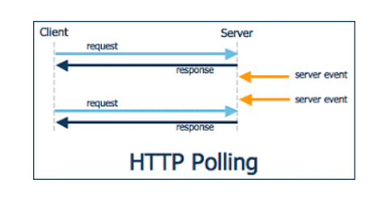
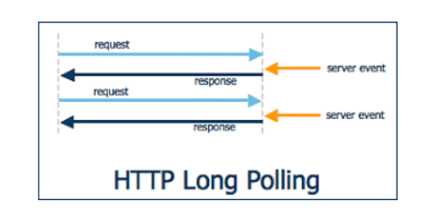
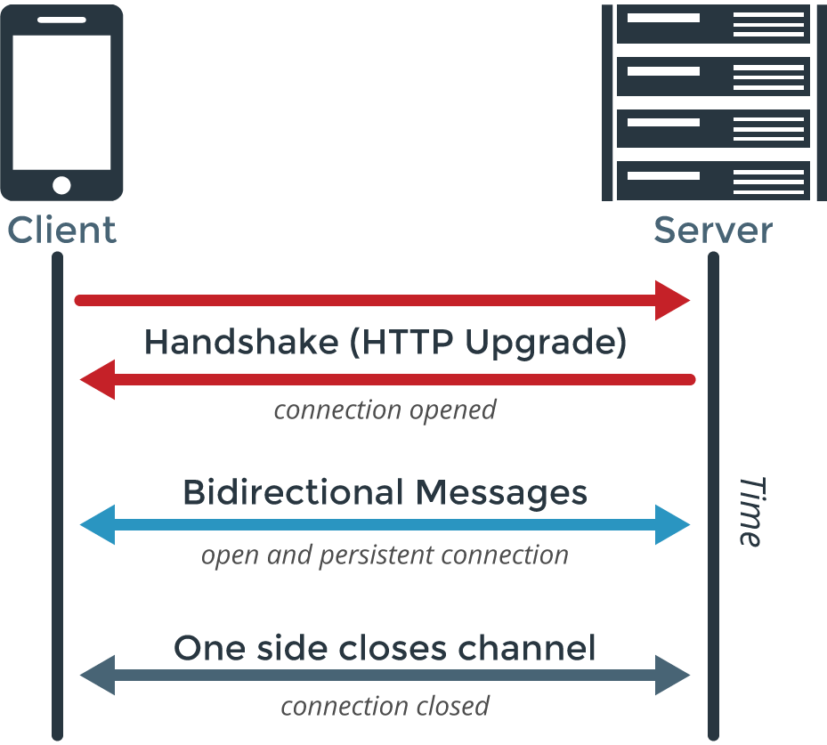
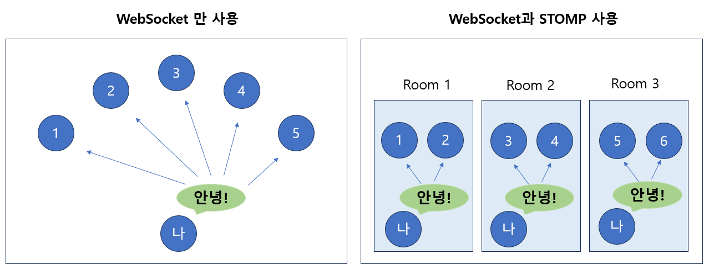

# [USports] Websocket

#### HTTP 프로토콜 같은 경우 클라이언트가 요청을 보내고, 보낸 요청을 서버에서 응답을 하는 방식이다

- 웹에서 이루어지는 데이터 교환의 제일 기초적인 단계다
- 하지만 요청을 하고 응답을 하는 하나의 사이클이 끝나면, 클라이언트와 서버간의 연결은 끝나게 된다
- example
  - 클라이언트가 https://www.naver.com 을 서버에 요청을 한다
  - 서버는 해당 페이지를 찾아서 응답을 해준다
  - 클라이언트가 페이지를 받으면 클라이언트와 서버의 연결 상태는 끊기게 된다
- 즉 주식 정보, 비트코인 정보 같이 실시간으로 봐야하기 위해서는 새로 고침을 계속 눌러야 할 것이다

#### 즉 실시간 데이터를 받기 위해 여러 방법이 있다

## Polling & Long Polling

#### Polling 같은 경우 특정 주기를 가지고 서버에 요청을 하는 방식이다

- 어떻게 보면 실시간 데이터를 받는다고는 할 수 없다
- 그리고 지속적인 요청 때문에, 클라이언트가 많아지면 서버에 과부하가 걸리게 된다

#### Polling과 비슷하지만, 실시간으로 데이터를 처리할 수 있다

- 먼저 요청을 보내고, 서버에서 어느 이벤트가 발생할때까지 기다린다
- 이벤트가 발생하면 바로 클라이언트에 응답을 해주는 방식이다
- 그리고 클라이언트는 다시 서버에 요청을 보내게 된다
- 기본적으로 Polling 보다는 서버에서 덜 부담을 갖겠지만, 이벤트에 대한 응답을 받기 위해 요청을 한다는 점에서 서버에 부담이 쌓일 수 있다

## SSE (Server-Sent Events)

#### SSE는 단방향 통신이다

- 클라이언트와 서버가 연결이 된다
- 서버에서 지속적으로 이벤트가 벌어지면 서버에서 클라이언트 측에 응답을 계속 해준다
- 클라이언트와 서버가 연결이 되었지만, 서버만 일방적으로 클라이언트에게 응답을 해주는 것이다
- 이는 주로 알림 기능 같이 서버에서 클라이언트에게 메세지 또는 이벤트를 보내는 작업에 유용한다
- 웹소켓 같지만, 단방향이라서 더 가볍다

## Websocket

#### SSE가 단방향이면, Websocket은 클라이언트와 서버가 모두 연결되어 있는 양방향 통신을 한다

- 어느 한쪽에서 연결을 끊을 때까지, 클라이언트와 서버가 메세지를 계속 보낼 수 있다
- 주로 채팅을 할 때에 많이 사용되는 기술이다

## 채팅방 구현

#### 채팅방을 구현할 때에 STOMP (Simple Text Oriented Protocol)을 사용했다

- **WebSocket** 만 사용할 때에
  - 방을 따로 나눌 수 없고, 서버에서 어떤 변경이 있으면, WebSocket에 연결되어 있는 모든 유저들에게 메세지가 간다
  - 위를 보면, 방이 따로 없는 공간에서, '나'가 안녕! 이라고 말을 하면 나 포함 모든 사람이 '나'가 어떤 말을 했는지 들을 수 있다
- **STOMP** 를 통해 방을 따로 나눌 수 있다 (자세한 내용은 채팅방 코드 구현에서)
  - STOMP를 통해 구독과 발행을 할 수 있다
    - 채팅방, room을 구독하고
    - 메세지를 발행하면, 해당 'room'에 구독되어 있는 모든 유저들에게 브로드캐스팅이 된다 
