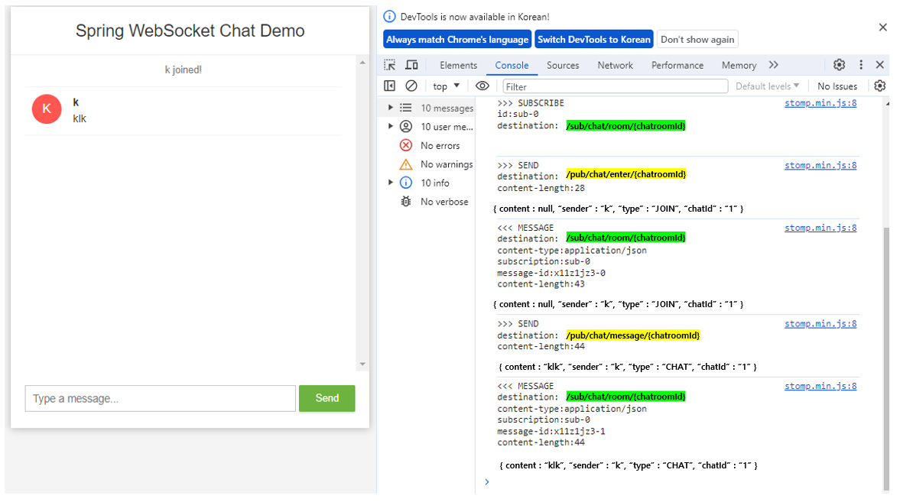

# [USports] Websocket 구현


## build.gradle

```java
implementation 'org.springframework.boot:spring-boot-starter-websocket'
implementation 'org.webjars:sockjs-client:1.1.2'
implementation 'org.webjars:stomp-websocket:2.3.3-1'
```


## WebSocketConfig

```java
@Configuration
@EnableWebSocketMessageBroker // STOMP를 사용 안 하고 EnableWebSocket으로 사용할 수 있다
public class WebSocketConfig implements WebSocketMessageBrokerConfigurer {
    @Override
    public void registerStompEndpoints(StompEndpointRegistry registry) {
        registry
                .addEndpoint("/ws/chat")  // URL 또는 URI
                .setAllowedOriginPatterns("*")
                .withSockJS(); // 소켓을 지원하지 않는 브라우저라면, sockJS를 사용
    }
    // message 브로커를 활성화 시키는 설정
    @Override
    public void configureMessageBroker(MessageBrokerRegistry registry) {
        // 메세지 구독 url (topic을 구독)
        registry.enableSimpleBroker("/sub"); // topic
        // 메세지 발행 url
        registry.setApplicationDestinationPrefixes("/pub"); //
    }
}
```

- STOMP를 사용 안 하고 WebSocket만 사용할 때에는 @EnableWebSocket 어노테이션을 사용해도 된다
- **registerStompEndpoints**
  - 해당 endpoint를 설정함으로서, 웹소켓과 연결하기 위한 endpoint를 설정해주는 것이다
- **configureMessageBroker**
  - 브로커, 즉 구독과 발행을 할 수 있도록 브로커를 활성화 시키는 설정이다
  - **enableSimpleBroker**
    - 클라이언트가 서버로 메세지를 보내는 URI 다
  - **setApplicationDestinationPrefixes**
    - 구독 경로를 설정할 수 있다
    - 구독 경로를 설정하는 것은, 같은 채팅방에 구독되어 있는 유저만 메세지를 받을 수 있다




- 노란색 : 클라이언트가 메세지를 보내게 된다
- 초록색 : 클라이언트가 설정한 특정 구독 ID (여기에서는 chatroomId = chatId)를 통해서, 어느 채팅방에 메세지를 보낼지 알 수 있다


## ChatController

```java
@RestController
@RequiredArgsConstructor
@Slf4j
public class ChatController {

    private final SimpMessageSendingOperations template;

    /**
     * 메세지를 보낼 때
     */
    @MessageMapping("/chat/message/{chatRoomId}")
    public void sendMessage(
            ChatMessageDto chat,
        	@DestinationVariable Long chatRoomId
    ) {
         return chatMessageDto;
        log.info("Chat {}", chat);
        chat.setContent(chat.getContent());
        template.convertAndSend("/sub/chat/room/" + chat.getChatRoomId(), chat);
    }

    @MessageMapping("chat/enter/{chatRoomId}")
    public void addUser(
            ChatMessageDto chat,
        	@DestinationVariable Long chatRoomId
    ) {
        // Add username in WebSocket session
        headerAccessor.getSessionAttributes().put("username", chatMessageDto.getSender());
        return chatMessageDto;
        log.info("{} 입장", chat.getSender());
        chat.setContent(chat.getSender() + "님이 입장하셨습니다");
        template.convertAndSend("/sub/chat/room/" + chat.getChatRoomId(), chat);
    }
}
```


- **MessageMapping**
  - /pub/chat... 형태로 해당 메세지를 발행해준다

- **SimpleMessageSendingOperations**
  - STOMP 같이, 매세지를 보내는 작업에 특화된 인터페이스다. MessageSendingOperation을 특화한 것 (docs.spring)
  - **MessageSendingOperations** : 특정 도착지에 메세지를 보내는 인터페이스다


## 채팅방 만들기


#### 위의 작업은 '채팅' 기능을 구현하는 것이다


#### 제대로된 채팅 기능을 구현하기 위해서는 추가로 채팅방을 만들어야 하고, 이것은 간단한 CRUD로 만들 수 있다


#### '채팅방'에 들어가면, 그 방 안에서, 위에서 구현한 채팅 기능을 넣어주면 된다


## RabbitMQ, Kafka?


#### 외부 브로커다


#### STOMP만 사용했을 경우, 이용자 수가 적으면 성능적으로 문제가 없다

- 하지만, 이용자 수가 증가하고 데이터가 많아지면 STOMP가 내장하고 있는 SimpleBroker는 Spring Boot가 실행되는 공의 메모리를 잡아 먹을 수 있다 (즉 서버에 부담을 가지게 되는 것이다)


#### Spring Docs

- You can (optionally) use message brokers (such as RabbitMQ, ActiveMQ, and others) to manage subscriptions and broadcast messages.
- 구독과 메세지를 전달하는데에 선택적으로 메세지 브로커들을 사용할 수 있다
