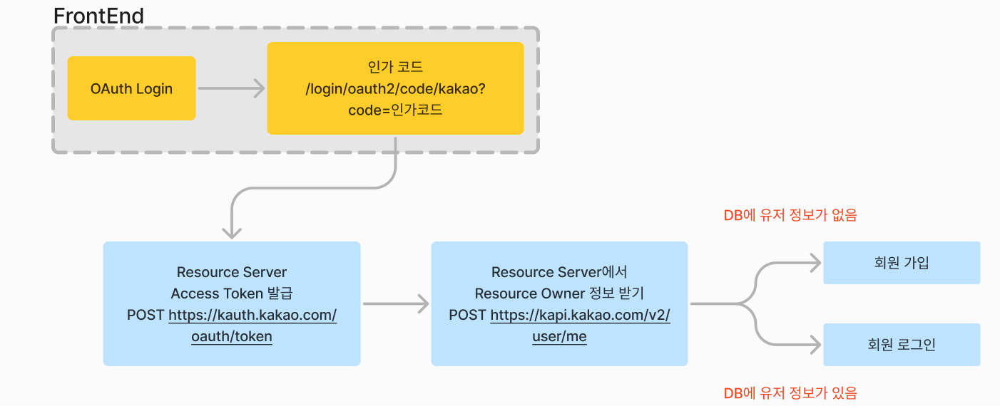

# [USports] Member OAuth with 프론트엔드


## OAuth with 프론트엔드


#### 앞서 OAuth2 client를 가지고 간편 로그인을 구현했다


#### OAuth2 client를 가지고 구현을 했을 때에, http://주소/oauth2/authorization/kakao 를 a 태그에 넣었을 때 작동을 했다

- 그리고 /success 로 redirect해서, 응답 값을 프론트에 보냈다


#### BUT, 우리 프론트엔드 개발자 분은 Next.js를 사용했고, 위 주소를 axios, get으로 하면, 잘 안 돌아간다고 했다

- 프론트 측에도 로그인을 하는 로직이 따로 있다
- **http://주소/oauth2/authorization/kakao** 를 redirection 없이 썼을 때는 응답값이 안 나오고
- /success 로 redirect 하게 되면, 프론트에서 get 요청을 한 것이 아니라서, 로그인을 제대로 구현할 수 없다고 했다


#### 위에 대한 설명

- OAuth2 Client를 사용하면, 위 그림에서 **인가 코드**, **OAuth Access Token 받기**, 그리고 **resource owner**의 정보 받기를 모두 해준다
- 모든 것이 완료되면, successHandler를 통해, 응답값과 성공을 한 후 redirect url로 보냈다
- BUT 백엔드 쪽에서 알아서 url을 redirect를 할 때에, 프론트에서 짜 놓은 로그인 로직과 맞지 않아서 문제가 생겼던 것 같다


## 해결!


#### 프론트에서 인가 코드를 받고, 그 인가 코드를 시작으로 유저 정보를 추출해 냈다

- OAuth2 Client 관련된 것들은 모두 삭제하고, 따로 구현을 했다


#### WebClient를 사용하였다

> 그 전에 스프링에서 RestTemplate보다 WebClient를 사용하는 것을 권고했던 것이 생각 났다
> 특히, RestTemplate보다 더 최신 기능이라고 나와있다

- 카카오 Access Token을 받아왔다
- 카카오 Access Token을 가지고, resource owner의 정보를 카카오에서 받아왔다





### Controller

- GET 을 통해서, 프론트에서 인가 코드를 받으면, 파라미터에 적힌 인가 코드를 가지고 온다
- 하나의 URL을 통해서 카카오 access token을 받아오고, 그 토큰을 통해서 유저 정보를 가지고 온다

```java
@RestController
@RequestMapping("/login/oauth2/code")
@RequiredArgsConstructor
@Slf4j
public class OAuthController {

  private final OAuthService oAuthService;
  private final TokenProvider tokenProvider;
  private final NotificationService notificationService;
  private final CookieService cookieService;

  @GetMapping("/kakao")
  public ResponseEntity<MemberLogin.Response> kakaoLogin(
      @RequestParam("code") String code,
      HttpServletRequest httpServletRequest,
      HttpServletResponse httpServletResponse
  ) {

    // 프론트에서 받아온 인가 코드를 통해 카카오 token을 받는다
    KakaoToken kakaoToken = oAuthService.kakaoGetAccessToken(code);

    // 토큰을 가지고 유저 정보를 통해, 회원가입을 시키거나 로그인을 시킨다
    MemberResponse memberResponse = oAuthService.kakaoLogin(kakaoToken);

    notificationService.checkUnreadNotificationAndSetSession(memberResponse.getMemberId(), httpServletRequest);

    TokenDto tokenDto = tokenProvider.saveTokenInRedis(memberResponse.getEmail());
    cookieService.setCookieForLogin(httpServletResponse,tokenDto.getAccessToken());

    return ResponseEntity.ok(MemberLogin.Response.builder()
            .memberResponse(memberResponse)
            .tokenDto(tokenDto)
        .build());
  }

}
```


### Service 프론트에서 받아온 인가 코드를 통해 카카오 token을 발급 받기

- requestBody에 요청 값을 넣기 위해, MultiValueMap을 사용한다
  - 요청에 위에서 프론트에서 받아온 인가 코드도 있다
  - MultiValueMap은 스프링에서 제공하는 인터페이스다
  - 인터페이스 이름과 같이, 하나의 key에 여러 value를 넣을 수 있는 Map이다
    - value는 리스트로 저장이 된다

```java
@Override
public KakaoToken kakaoGetAccessToken(String authorizationCode) {

  MultiValueMap<String, String> params = new LinkedMultiValueMap<>();
  params.add("grant_type", "authorization_code")
  params.add("client_id", CLIENT_ID);
  params.add("redirect_uri", REDIRECT_URL);
  params.add("code", authorizationCode);
  params.add("client_secret", CLIENT_SECRET);

  WebClient webClient = WebClient.create(ACCESS_TOKEN_URI);
  String response = webClient.post()
      .uri(ACCESS_TOKEN_URI)
      .body(BodyInserters.fromFormData(params))
      .header(HttpHeaders.CONTENT_TYPE, "application/x-www-form-urlencoded;charset=utf-8")
      .retrieve()
      .bodyToMono(String.class)
      .block();

  // json 형태로 변환
  ObjectMapper objectMapper = new ObjectMapper();
  KakaoToken kakaoToken = null;

  try {
    kakaoToken = objectMapper.readValue(response, KakaoToken.class);

  } catch (JsonProcessingException e) {
      e.printStackTrace();
  }

  return kakaoToken;
}
```


### Service, 유저 정보 가지고 오기

- 헤더에만 카카오에서 받아온 access token을 받아오면 된다

```java
private KakaoUserInfo getProfile(KakaoToken kakaoToken) {

  WebClient webClient = WebClient.create(USER_INFO_URI);
  String response = webClient.post()
      .uri(USER_INFO_URI)
      .header(HttpHeaders.AUTHORIZATION, "Bearer " + kakaoToken.getAccess_token())
      .header(HttpHeaders.CONTENT_TYPE, "application/x-www-form-urlencoded;charset=utf-8")
      .retrieve()
      .bodyToMono(String.class)
      .block();

  ObjectMapper objectMapper = new ObjectMapper();
  KakaoUserInfo kakaoUserInfo = null;

  try {
    kakaoUserInfo = objectMapper.readValue(response, KakaoUserInfo.class);

  } catch (JsonProcessingException e) {
    e.printStackTrace();
  }

  return kakaoUserInfo;
}
```


### KakaoToken과 KakaoUserInfo

- 카카오에서 응답값을 받으면, 그 응답값을 사용할 수 있어야 한다
- ObjectMapper를 통해서 응답값을 각 클래스 안에다 저장을 했다
- **여기서 중요한 것은 응답값이 JSON 형태일 텐데, Key와 클래스에 만든 변수명이 일치해야 한다**


#### KakaoToken

```java
@Getter
@Setter
@AllArgsConstructor
@NoArgsConstructor
@Builder
public class KakaoToken {

  // 카카오에서 받아오는 access_token이라 응답값의 key와 같아야 한다
  private String token_type;
  private String access_token;
  private int expires_in;
  private String refresh_token;
  private int refresh_token_expires_in;
  private String scope;

}
```


#### KakaoUserInfo

```java
@Getter
@Setter
@AllArgsConstructor
@NoArgsConstructor
@Builder
public class KakaoUserInfo {

  public Long id;
  public String connected_at;
  public KakaoAccount kakao_account;
  public Properties properties;

  @Getter
  @Setter
  @AllArgsConstructor
  @NoArgsConstructor
  @Builder
  public static class KakaoAccount {
    public boolean profile_nickname_needs_agreement;

    public Profile profile;

    @Getter
    @Setter
    @AllArgsConstructor
    @NoArgsConstructor
    @Builder
    public static class Profile {
      public String nickname;

    }

    public boolean has_email;
    public boolean email_needs_agreement;
    public boolean is_email_valid;
    public boolean is_email_verified;
    public String email;

    public boolean has_gender;
    public boolean gender_needs_agreement;
    public String gender;
  }

  @Getter
  @Setter
  @AllArgsConstructor
  @NoArgsConstructor
  @Builder
  public static class Properties {
    public String nickname;
  }
}

```

