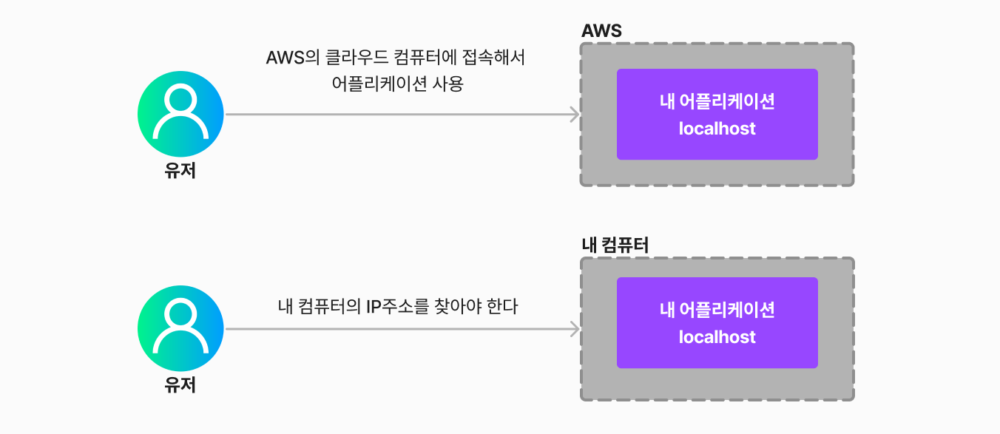
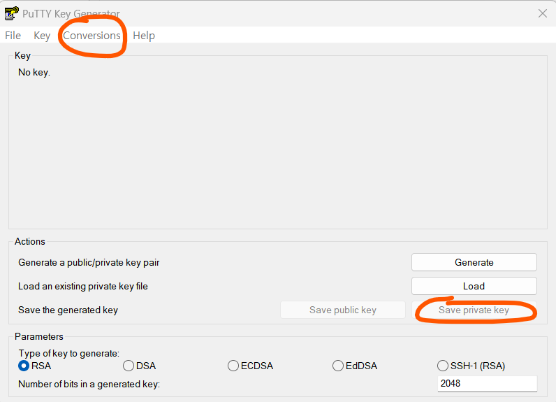
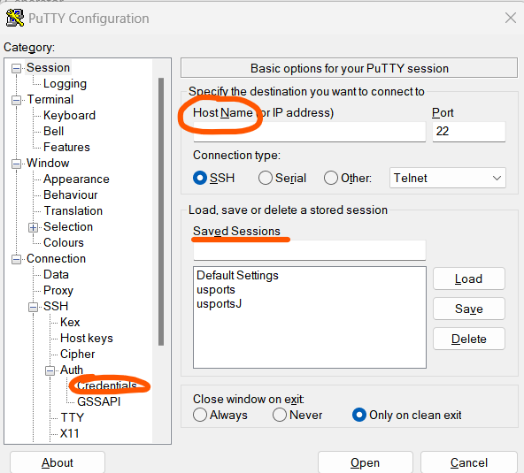

# [USports] Spring AWS 배포


## 배포란?


#### 프로젝트를 하다 보면, 프로젝트 테스트를 위해 localhost, 즉 로컬 서버로 어플리케이션을 띄운다


#### localhost는 '내 컴퓨터'의 서버를 사용하는 것이라서, 다른 사람들이 내 어플리케이션을 사용하기 위해서는, '내' 컴퓨터의 IP 주소, 그리고 컴퓨터의 주소까지 알아야 할 것이다

- 근데 이렇게 하면, 내가 컴퓨터를 끄게 되면, 내 어플리케이션을 사용하는 사람도 어플리케이션을 사용하지 못 할 것이다


#### 그래서 그 localhost를 클라우드 서버에 넣어두는 것이다

- 여기서 클라우드 서버는, 클라우드 컴퓨터로, 해당 컴퓨터에 내 어플리케이션을 올려두는 것이다
- 이렇게 하면, 클라우드가 없어지지 않는 이상, 어플리케이션은 24시간 돌아가게되고, 다른 유저가 '내' 컴퓨터의 IP 주소를 찾는 번거로움도 없어질 것이다




- 내 컴퓨터를 서버로 사용할 경우 유지 비용도 많이 든다
  - 특히 '나의' 컴퓨터를 다른 유저가 사용할 수 있도록 만드는 것이라서, 보안적으로 신경을 훨씬 더 많이 써야 한다
- **AWS의 클라우드 컴퓨터는 EC2 이다**


## 배포하기!


### EC2를 생성한다

- AWS에서 EC2를 만들면 되고, 프리티어를 사용하면 무료로 사용을 할 수 있다
- 아래를 참고하면 좋을 것 같다!

[SpringBoot 프로젝트 EC2 배포하기 (velog.io)](https://velog.io/@jonghyun3668/SpringBoot-프로젝트-EC2-배포하기#3-1-깃-설치하기)


### Ubuntu 접속하기

- putty를 사용했다
  - putty와 putty generator를 다운 받았다
- Putty Generator
  - Conversions -> Import Key (aws에서 받은 .pem 파일을 선택한다)
  - Save Private Key로 저장한다



- Putty
  - Host Name 에 EC2의 IPv4 주소를 입력한다
  - Credentials에 putty generate에서 만든 .ppk 파일을 업로드한다
  - Saved Sessions에 세션 이름을 원하는대로 입력해준다
  - Save를 누르면 새로운 Session이 만들어지고, Open을 누르면 ubuntu console로 이동하게 된다
  - login as 라고 뜰텐드 ubuntu를 입력하면 된다




### Java 설치하기

- SpringBoot로 프로젝트를 진행하여, Java를 설치하였다
- (EC2는 새로운 컴퓨터라고 생각하면 된다)


```terminal
# apt를 최신으로 업데이트 해준다 (advance package tool)
sudo apt-get update

# java jdk를 설치해준다
sudo apt-get install openjdk-11-jdk

# java가 잘 설치 되었는지 확인해준다
java -version
```


### Git 설치하기

- 프로젝트를 Github에 올렸기 때문에, 프로젝트를 가져오기 위해서 Git을 설치해야 한다
  - 내 컴퓨터에 Git을 설치하여, 프로젝트를 clone할 때를 생각하면 된다


```terminal
# 깃을 설치하기
sudo apt-get install git

# 깃이 잘 설치되었는지 확인하기
git --version

# .ssh로 넘어간다
cd .ssh

# SSH key를 생성한다
ssh-keygen -t rsa -C {깃헙 이메일 주소}
# Enter file in which to save the key (/home/ubuntu/.ssh/id_rsa): {아무것도 안 쳐도 된다}
# Enter passphrase (empty for no passphrase): {나는 비밀번호를 적었다}
# Enter same passphrase again: {나는 비밀번호로 적었다}

# id_rsa, id_rsa.pub가 생성될 것이다
```

- id_rsa.pub를 들어가서 ssh key를 깃헙에 입력하면 된다
  - Github -> Settings -> SSH and GPG Keys
  - 에서 SSH Keys의 New SSH Key를 클릭하고
  - Key에 id_rsa.pub에 적인 키를 넣으면 된다


### Docker 설치하기

```terminal
# 우분투 시스템 패키지 업데이트
sudo apt-get update

# 필요한 패키지 설치
sudo apt-get install apt-transport-https ca-certificates curl gnupg-agent software-properties-common

# Docker의 공식 GPG키를 추가
curl -fsSL https://download.docker.com/linux/ubuntu/gpg | sudo apt-key add -

# Docker의 공식 apt 저장소를 추가
sudo add-apt-repository "deb [arch=amd64] https://download.docker.com/linux/ubuntu $(lsb_release -cs) stable"

# 시스템 패키지 업데이트
sudo apt-get update

# 도커를 설치한다
sudo apt-get install docker-ce docker-ce-cli containerd.io

# 도커의 실행 상태를 확인한다
sudo systemctl status docker

# 도커를 실행한다
sudo docker run hello-world
```

- 도커를 실행했을 때에 오류가 생겼다
  - permission denied while trying to connect to the Docker daemon socket at unix:///var/run/docker.sock: Get "http://%2Fvar%2Frun%2Fdocker.sock/v1.24/containers/json": dial unix /var/run/docker.sock: connect: permission denied
  - **sudo chmod 666 /var/run/docker.sock** 로 해결 하였다!


### Github에서 프로젝트 가지고 오기

- Clone을 하면 된다!

```terminal
git clone {저장소 url}
```


### Docker Compose

- mariadb, mongodb, redis 등 docker-compose를 통해 실행을 해야 한다
- github에서 받아온 프로젝트 내에 docker-compose.yml 이 있다

```terminal
# docker-compose를 사용하기 전에 설치를 해야 한다
sudo apt install docker-compose

# docker-compose.yml 파일을 실행하기 위한 명령어
docker-compose -f docker-compose.yml up -d
```


### Build 하기

```terminal
# build를 하기 전에, gradlew 빌드 권한을 부여한다
chmod +x gradlew

# 프로젝트 폴더 내에서 명령어를 입력한다
./gradlew build

# 프로젝트 폴더/build/libs에
# 프로젝트이름-0.0.1-SNAPSHOT-plain.jar 프로젝트이름-0.0.1-SNAPSHOT.jar
# 가 생성되어 있을 것이다
# 아래와 같이 실행하면 springboot가 실행될 것이다
sudo java -jar USports-0.0.1-SNAPSHOT.jar
```


### 실행 중지하기

```terminal
# 프로세스를 죽여야 백그라운드에서 실행을 중지할 수 있다
sudo kill -9 {}
```

