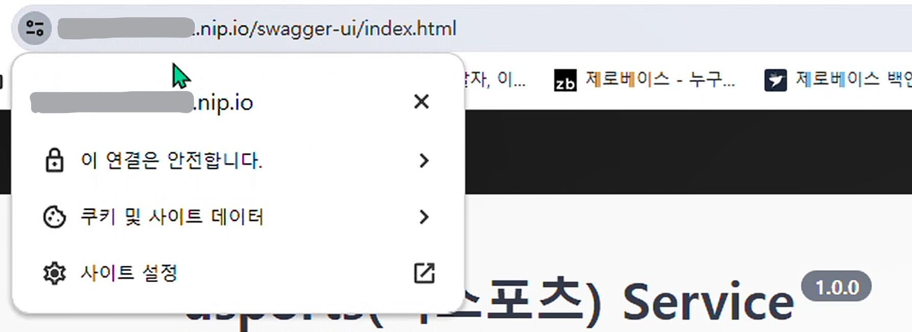

# [USports] HTTPS


#### 백엔드는 HTTP 프로토콜을 사용하고, 프론트는 HTTPS를 사용하여 배포했을 때에 웹소켓이 잘 안 먹혔다

- 웹소켓 같은 경우 HTTP는 ws 그리고 HTTPS는 wss 프로토콜을 사용하게 된다


#### 그래서 배포를 했을 때에, 실시간 채팅을 제대로 구현하기 위해서는 백엔드에서 HTTPS 프로토콜을 사용해야 겠다고 생각했다

- 여기서 HTTPS를 사용하면 자동으로 wss 프로토콜로 바뀌다고 한다


#### 대부분이 도메인을 구매해서, HTTPS로 바꿨다

- 하지만 개인적으로, 백엔드는 Rest API만 구축했지, 굳이 도메인까지 구매를 해야할까? 라는 의문점이 들기 시작했다
- 다행히, 도메인 구매 없이 HTTPS로 바꾸는 방법이 존재했다


#### Caddy와 nip.io를 사용하는 것이었다

- **nip.io** : 무료 오픈소스 서비스로, 모든 IP주소에 DNS (Domain Name System)에 와일드 카드를 사용할 수 있도록 만들어 준다
  - 즉 nip.io를 통해서 도메인 이름 없이 HTTPS 프로토콜을 구축하게 될 수 있는 것이다
- **Caddy** : 아주 강력한 웹 서버 오픈 소스로 HTTPS를 자동화 시켜준다
  - HTTPS 설정을 간단하고 자동화시켜주는 부분이 Caddy에서 매우 중요하다


#### 일단 기본적으로 EC2 인스턴스를 생성해야 한다 (그리고 어플리케이션도 돌아가야 한다)


## Caddy 설치하기


```terminal
# ubuntu를 열어서 아래를 복사 붙혀넣기를 하면 Caddy가 설치 된다
sudo apt install -y debian-keyring debian-archive-keyring apt-transport-https curl
curl -1sLf 'https://dl.cloudsmith.io/public/caddy/stable/gpg.key' | sudo gpg --dearmor -o /usr/share/keyrings/caddy-stable-archive-keyring.gpg
curl -1sLf 'https://dl.cloudsmith.io/public/caddy/stable/debian.deb.txt' | sudo tee /etc/apt/sources.list.d/caddy-stable.list
sudo apt update
sudo apt install caddy
```

- 우분투가 아닌 다른 OS이면 https://caddyserver.com/docs/install 를 참고하면 된다!


```terminal
# Caddy가 잘 설치되었는지 확인
caddy version
```


```terminal
# caddy.service 라는 이름의 파일을 만든다 (주소는 아래와 같이)
sudo vi /etc/systemd/system/caddy.service

# 그리고 아래를 복붙한다
[Unit]
Description=Caddy
Documentation=https://caddyserver.com/docs/
After=network.target network-online.target
Requires=network-online.target

[Service]
Type=notify
User=caddy
Group=caddy
ExecStart=/usr/bin/caddy run --environ --config /etc/caddy/Caddyfile
ExecReload=/usr/bin/caddy reload --config /etc/caddy/Caddyfile --force
TimeoutStopSec=5s
LimitNOFILE=1048576
LimitNPROC=512
PrivateTmp=true
ProtectSystem=full
AmbientCapabilities=CAP_NET_BIND_SERVICE

[Install]
WantedBy=multi-user.target
```


- Caddyfile에 내용을 입력해준다

```terminal
sudo vi /etc/caddy/Caddyfile
```


- 아래와 같이 이미 내용이 적혀있다

```terminal
# The Caddyfile is an easy way to configure your Caddy web server.
#
# Unless the file starts with a global options block, the first
# uncommented line is always the address of your site.
#
# To use your own domain name (with automatic HTTPS), first make
# sure your domain's A/AAAA DNS records are properly pointed to
# this machine's public IP, then replace ":80" below with your
# domain name.

:80 {
        # Set this path to your site's directory.
        root * /usr/share/caddy

        # Enable the static file server.
        file_server

        # Another common task is to set up a reverse proxy:
        # reverse_proxy localhost:8080

        # Or serve a PHP site through php-fpm:
        # php_fastcgi localhost:9000
}

# Refer to the Caddy docs for more information:
# https://caddyserver.com/docs/caddyfile

```

```terminal
# 이렇게 수정을 해 놓으면 된다
<EC2 인스턴스의 퍼블릭 IPv4 주소>.nip.io {
    reverse_proxy localhost:8080 # 들어오는 요청을 8080포트로 포워딩
}
```


### Caddy 실행하기

```terminal
sudo systemctl daemon-reload

sudo systemctl enable --now caddy

# Caddy가 잘 작동이 되었는지 확인 하는 것이다
# 확인을 할 때에 Active 부분에서 active면 작동이 잘 되고 있는 것이다
노
```

- 에러가 떠서, Caddyfile을 수정 할 때마다, 위 명령어를 실행했다
- 원래 sudo caddy start를 하면, Caddy가 실행되지만, sudo systemctl enable --now caddy 이 부분에서 실행이 될 수 있다
  - 그렇게 되면 아래와 같이 에러 메세지가 뜨게 된다
  - 처음에는 프로세스를 죽이고 다시 시작했지만, 나중에는 Caddy가 작동이 잘 되는 것을 보고, 그냥 어플리케이션을 실행 했더니 잘 되었다


```terminal
# 실행 명령어!
sudo caddy start
```


#### Error: loading initial config: loading new config: starting caddy administration endpoint: listen tcp 127.0.0.1:2019: bind: address already in use

- 해당 에러라 계속 뜬다;;;
- 그래서 해당 프로세서를 찾아서, 중단을 시킨 뒤 다시 실행을 했다
- 이미 실행중인 127.0.0.1:2019 이 있어서 그렇다

```terminal
# 프로세스 찾기 (여기서 PID를 찾으면 된다)
sudo lsof -i :2019

# 프로세스 죽이기
sudo kill -9 {PID}
```


### 성공!




