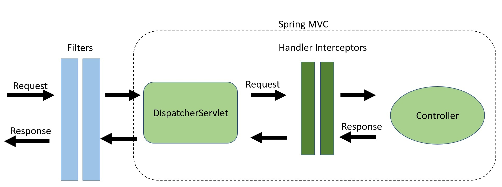

# 스프링 MVC

*출처 : 제로베이스 백엔드 스쿨*

## 스프링 MVC - 필터, 인터셉터

> #### 나쁜 요청들을 필터링하는 것

#### 필터와 인터셉터

- 웹 쪽에 집중해서, URL 주소 또는 프로토콜을 확인하고, 필터 또는 인터셉트를 한다

#### AOP

- 자바에 관련된 페키지, 어노테이션, 메서드 명을 확인한다 (더 섬세하다)

- **필터**
  - 웹에 들어오는 거의 모든 요청을 받고 필터링을 한다
  - 특정 URL에 필터링을 하고 싶을 떄
  - 복잡한 것은 필터링을 하기 어렵다
- **인터셉터**
  - **Handler Mapping**을 한 후 **Controller**에 요청을 넘길 때에 **인터셉터** 또는 **AOP**를 통해서 넘겨진다
  - 좀 더 상세한 조건식과, 세부적인 스펙을 확인한다

## 스프링 MVC 예외처리

#### 프로그래밍을 할 때에 어디서든 오류가 발생할 수 있다

#### 예외는 예상치 못 한 상황에서 오류를 발생하는 것 (throw new Exception())

#### 스프링 MVC에서 예외처리

- **@ExceptionHandler**

  - 컨트롤러 기반 예외 처리
  - **@ResponseStatus** 와 **ResponseEntity** 를 지정해서 HTTP Status code를 변경할 수 있다
  - 예외 처리에서는 우선순위가 있다

  

- **@RestControllerAdvice**

  - 어플리케이션의 전역적 예외 처리
  - 스프링 백엔드 개발에서 현재 가장 많이 활용되는 기술
