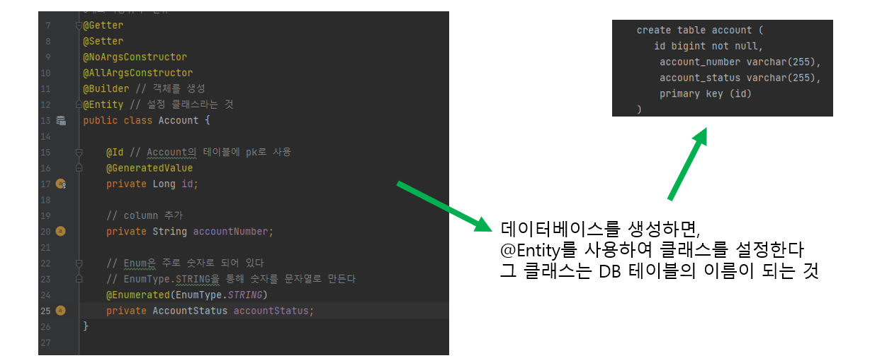

# 스프링 MVC

*출처 : 제로베이스 백엔드 스쿨*


 ## Lombok


#### 매번 기계적, 같은 코드를 작성하는 것을, 자동화해주는 라이브러리다


- **@Setter**, **@Getter** : Java Bean 규약에 있는 setter, getter를 자동으로 생성해준다

- **@ToString** : Object에 기본 구현되 ToString 대신 객체의 데이터를 보여주는 ToString을 자동으로 생성해준다
  - 객체가 담고 있는 값들을 쉽게 출력할 수 있도록 도와준다
- **@NoArgsConstructor**, **@AllArgsConstructor**, **@RequiredArgsConstructor** : 객체 생성자를 자동으로 생성
  - @RequiredArgsConstructor : final 타입이 있으면, 생성자가 필수적으로 있어야 한다
- **@Data** : Getter, Setter, ToString, Equals, hasCode 등 다양한 기능을 모두 제공해준다
- **@Builder** : 빌더 패턴을 자동 생성하여 제공해준다
- **@Slf4j** : 해당 클래스의 logger를 자동으로 생성해준다
- **@UtilityClass** : static method만 제공하는 유틸리티 성격의 클래스들의 생성자를 private으로 만들어서 객체 생성을 할 수 없도록 한다


```java
@Getter
@Setter
@ToString
@NoArgsConstructor			// 생성자가 없어도 됨 (기본이라서 사용 안 해도 된다)
@AllArgsConstructor			// 생성자가 다 있어야 함
@RequiredArgsConstructor	// 필수적으로 생성자가 있어야 한다
@Slf4j						// logger를 쉽게 사용할 수 있다
public class Practice {
    private String name;
    private String nickName;
    private int number;
    
    public void log() {
        log.error("currently under error");
    }
}

// Getter와 Setter가 Lombok으로 통해서 자동으로 만들어졌다
// getName, setName, getNickName, setNickName, getNumber, setNumber
// 위와 같이 getter와 setter를 불러온다

// ToString을 사용하면 나중에 .toString()을 사용하면, 제대로 출력을 해준다


@AllArgsConstructor	
@Data
public class Practice {
    private String name;
    private String nickName;
    private int number;
}
// Data에 위에 있는 내용 모두 포함이 된다
```


## H2 DB

#### MySQL 과 Oracle과 비슷하지만, 조금 다르다

- 설치할 때에 덜 부담스럽다 (설치 안 하고, 쉽게 사용할 수 있다)
- 메모리/파일 관계형 DB이고 가볍고 빠르기 때문에 개발 단계에 활용하거나 테스트 코드에도 자주 활용이 된다


#### application.yml (H2 설치하기)

```
spring:
  datasource:
    url:  jdbc:h2:~/test
    username: sa
    password: 
    driverClassName: org.h2.Driver
  h2:
    console:
      enabled: true
  jpa:
    defer-datasource-initialization: true
    database-platform: H2
    hibernate:
      ddl-auto: create-drop
    open-in-view: false
    properties:
      hibernate:
        format_sql: true
        show_sql: true
```





## 트랜잭션

#### ACID

- **Atomic (원자성)**
  - 모든 작업이 실행되거나, 모두 실행되지 않아야 한다
- **Consistency (일관성)**
  - 트랜잭션이 종료된 후에는 DB의 제약조건을 모두 지키고 있는 상태가 되어야 한다
- **Isolation (격리성)**
  - 트랜잭션은 다른 트랜잭션과 독립적으로 동작해야한다
  - A 트랜잭션이 하는 일을 B 트랜잭션은 모르게 해야 한다
- **Durability (지속성)**
  - commit을 하게 되면 지속(저장)이 꼭 된다


## Redis


#### 싱글 스레드 기반의 NoSQL과 비슷한 개념

- 기본적으로 메모리 DB를 사용한다
- 빠른 성능을 가지고 있다 (용량은 적다)


## JUnit, Spring Boot, Mockito

> #### 테스트
>
> - 셀프 코드 리뷰를 할 수 있다
> - 리팩토링도 할 수 있게 된다
>   - 코드를 향상 시킬 수 있다는 것


#### JUnit (ctrl + shift + t)

- Java용으로 개발된 유닛테스트 프레임워크
- 단위테스트를 실행하고 결과를 검증해서 전체 결과를 리포트 해준다
- spring-boot-starter-test에 기본적으로 Junit5가 포함된다
- 사용자가 직접 동작시킬 수도 있고, Gradle이나 Maven 등을 통해 빌드하면서 테스트가 가능하다

 

```java
import org.junit.jupiter.api.Test;
import static org.junit.jupiter.api.Assertions.*;

class Test {
    @Test
    void testSomething() {
        String something = "Hello" + "world";
        
        assertEquals("Hello World", something);
    }
}
```

- **assertEquals(예상한 값, 나오는 값)**
  - 실행하면, 나오는 값이 예상한 값과 같은지 확인을 해준다


📌**테스트를 할 때에, 사전에 데이터를 미리 저장하고, 그 데이터를 기반으로 테스트를 해야 한다 (귀찮을 수도 있음)**


#### Mockito

- Mock (가짜)를 만들어서 개발자가 원하는 방식으로 동작하게 만들기
  - Mockito 라이브러리 활용


```java
@ExtendWith(MockitoExtension.class)
class AccountServiceTest {

    // 가짜 repository만들기
    @Mock
    private AccountRepository accountRepository;

    // 위에서 만든 Mock을 accountService에 Inject해준다
    // AccountService는 AccountRepository를 파라미터로 받고 있다
    @InjectMocks
    private AccountService accountService;

    @Test
    @DisplayName("계좌 조회 성공")
    void testMock() {
    //given
        given(accountRepository.findById(anyLong()))
                .willReturn(Optional.of(Account.builder()
                        .accountStatus(AccountStatus.UNREGISTERED)
                        .accountNumber("65789")
                        .build()));
    //when
        Account account = accountService.getAccount(4555L);
    //then
        assertEquals("65789", account.getAccountNumber());
        assertEquals(AccountStatus.UNREGISTERED, account.getAccountStatus());
    }
}
```


##### Mockito에는 when().thenReturn() 이 있고, BddMockito를 사용할 때에는 given().thenReturn()을 사용한다

- BDDMockito는 Mockito 프레임워크를 상속하고 있으며, 기능도 같다 (쉽게 읽힐 수 있도록 도와주는 것)
- **given**이라는 상태가 주어졌을 때, **thenReturn** 어떤 결과가 되는지 테스트 해주는 것


