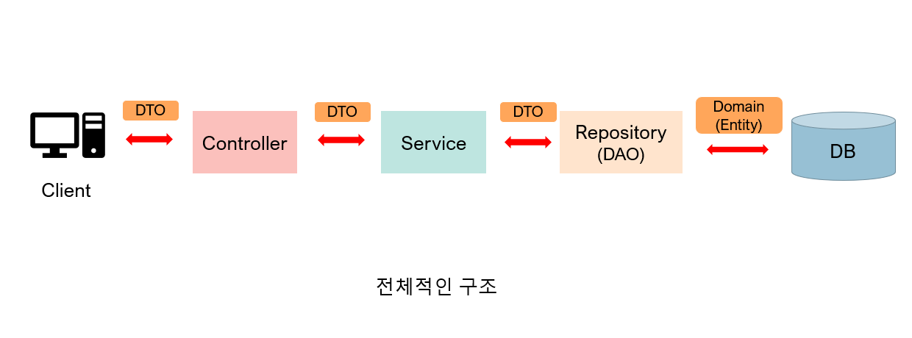

# 스프링 패키지 구조

#### 일반적인 패키지 구조

- **aop**
  - AOP 관련된 부분 - 핵심적인 관점, 부가적인 관점으로 나누어 보고 그 관점을 기준을 각각 모듈화 하는 것
- **config**
  - 각종 configuration 클래스로 구성이 되어 있다
- **controller**
  - HTTP 요청과 응답을 위한 클래스다
  - @Controller 어노테이션을 통하여 Bean에 등록되고 스프링에서 관리된다
  - Controller는 클라이언트의 요청을 받아 Service의 기능을 호출하고, 적절한 응답을 DTO의 형태를 반환한다
  - Request와 Response를 관리하는 계층이
- **domain**
  - entity 클래스들로 구성이 되어 있다 (데이터베이스 테이블을 만든다)
  - JPA를 사용할 때에 Entity 클래스의 수정을 통해 DB데이터에 작업을 한다
    - JPA는 반복적인 CRUD SQL을 처리해준다
- **dto** (data transfer object)
  - Request, Response 객체들로 구성되어 있다
- **exception**
  - 해당 도메인이 발생시키는 Exception으로 구성되어 있따
- **repository (DAO, Data Access Object)**
  - DAO는 실제 DB에 접근하는 객체다
  - 즉 데이터를 DB에서 꺼내오거나 넣는 역할을 한다
  - JPA의 경우 Repository가 DAO 역할을 한다
- **service**
  - 비즈니스 로직을 담는 클래스 패키지다
- **type**
  - 생태타입, 에러코드, 거래종류 등의 다양한 enum class들의 패키지

