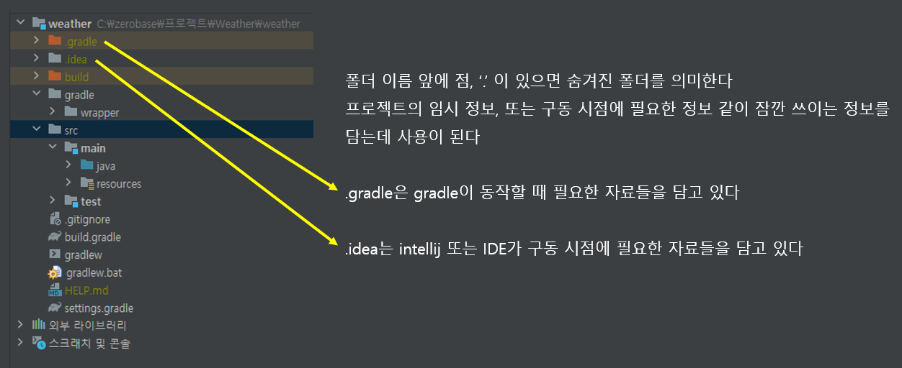
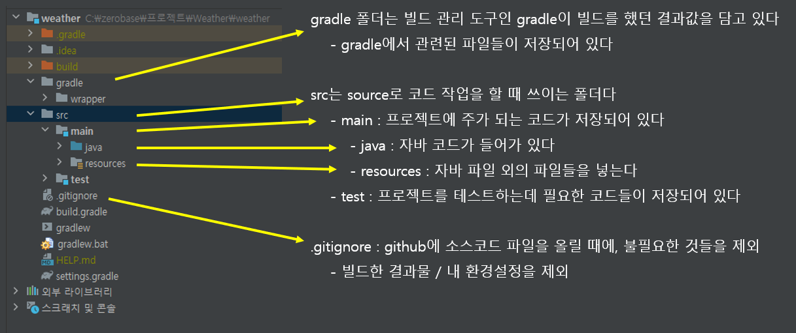
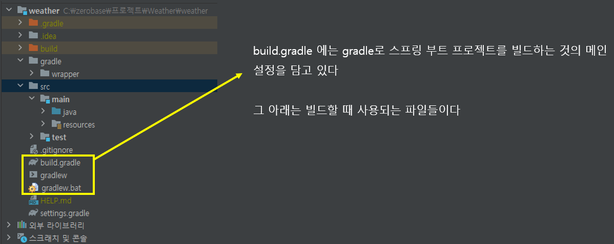

# 스프링 구동시키기


#### build.gradle

- 빌드 관리 도구로서, maven 또는 gradle을 선택할 수 있다 (gradle 더 최신)
- build.gradle은 빌드 구성 스크립트다
- gradle에서 어떻게 빌드를 할지, 미리 써 놓은 스크립트다
  - **build.gradle은 전에 선택한 의존성 (Dependency)와 같은 스프링 부트 프로젝트의 빌드와 관련된 설정 정보를 담고 있다**
  - IDE는 이것을 읽어서, 스프링 부트 프로젝트를 설정한다


#### WeatherApplication에 들어간다

```java
@SpringBootApplication
public class WeatherApplication {

	public static void main(String[] args) {
		SpringApplication.run(WeatherApplication.class, args);
	}

}
```

- 위를 실행하면, 해당 스프링 부트 어플리케이션이 실행된다
- port: 8080 으로 스프링부트 어플리케이션이 실행되었다는 것을 볼 수 있다 (성공했을 때)
- 만약 에러가 뜬다면?
  - **Cause: error: invalid source release: 17** -> 처음 선택 했던 자바 버전이 컴퓨터에 없다는 것
    - 인텔리제이 또는 인터넷을 찾아서 해당 자바 버전을 찾아 다운로드 받으면 된다


### 프로젝트 폴더/파일 알아보기








### build.gradle 자세히 보기

- 스프링 initializer에서 선택했던 옵션들이 모두 들어가 있다

```java
plugins {
    // 선택했던 언어
	id 'java'
        
    // 선택했던 스프링 부트 프레임워크 버전
	id 'org.springframework.boot' version '2.7.15'
        
	id 'io.spring.dependency-management' version '1.0.15.RELEASE'
}

// 그룹 이름
group = 'com.zerobase'
    
// weather라는 스프링 부트 어플리케이션의 버전이다
version = '0.0.1-SNAPSHOT'

java {
    // 자바 소스의 버전 (자바 8버전은 1.8이라고도 한다)
	sourceCompatibility = '1.8'
}

configurations {
	compileOnly {
		extendsFrom annotationProcessor
	}
}

repositories {
    // 의존성 라이브러리들을 다운 받아온 저장소
    // 빌드는 이 저장소에 들어가서 라이브러리들을 다운로드 받는다
	mavenCentral()
}

// 선택했던 의존성 라이브러리다
dependencies {
    // 모든 것을 할 때 사용이 된다
	implementation 'org.springframework.boot:spring-boot-starter-web'
        
    // 코드를 컴파일 할 시점에만 사용이 되는 것이다
	compileOnly 'org.projectlombok:lombok'
	annotationProcessor 'org.projectlombok:lombok'
        
    // 테스트 하는 시점에만 사용한다
	testImplementation 'org.springframework.boot:spring-boot-starter-test'
}

tasks.named('test') {
	useJUnitPlatform()
}
```

