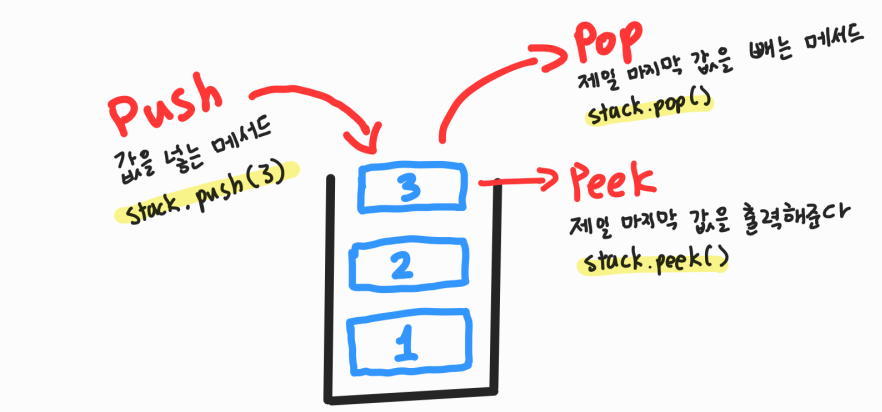

# [Java] Queue





#### Stack은 Last In First Out, 후입선출이다

- 즉 제일 늦게 stack에 들어간 값이, 제일 먼저 나오게 된다

- 책을 쌓아뒀다고 생각하면 된다
  - 책을 쌓아두게 되면, 제일 위에 있는 책을 먼저 꺼낸다


#### 자바에는 스택 클래스가 존재한다

```java
import java.util.Stack;

Stack stack = new Stack();
```


#### Stack에 값 넣기

```java
stack.push(value);
```


#### stack에서 값을 빼기, 무조건 제일 늦게 추가된 값이 빠지게 된다

```java
stack.pop()
```


#### 조회를 할 때에는 제일 늦게 들어간 값을 조회한다

```java
stack.peek();
```


#### 그 외

```java
// 값이 있는지 확인
stack.contains(1);

// 스택의 사이즈 출력
stack.size();

// 스택 안에 값이 있는지 없는지 확인
stack.empty();

// 스택을 초기화
stack.clear();
```


#### 시간 복잡도

- 삽입 : O(1)
- 삭제 : O(1)
