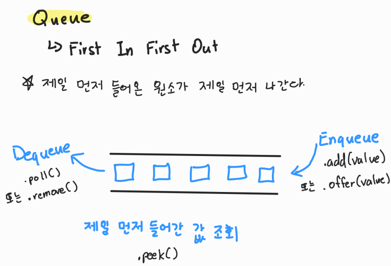

# [Java] Queue





#### Queue는 선입선출, FIFO (First In First Out)으로 제일 먼저 들어간 값이, 제일 먼저 나오는 자료구조다

- 식당 줄을 서서 기다리는 것과 같다 (제일 먼저 와서 기다린 사람이, 제일 먼저 들어간다)


#### Queue 클래스를 이용하여 사용할 수 있다

```java
import java.util.LinkedList;
import java.util.queue;

Queue queue = new LinkedList();
```


#### Enqueue 는 값을 큐에 넣는 것이다

```java
// enqueue 메서드
queue.add(value);
queue.offer(value);
```


#### Dequeue는 값을 큐에서 빼는 것이다 (위에 설명과 같이, 제일 먼저 들어온 값이 제일 먼저 빠진다)

```java
// dequeue 메서드
queue.remove();
queue.poll();
```


#### 조회를 할 때에는 제일 먼저 들어간 값을 조회할 수 있다

```java
queue.peek();
```


#### 그 외

```java
// 특정 값의 유무 확인
queue.contains(1);

// 큐 크기 출력
queue.size();

// 큐에 값이 있는지 없는지 확인
queue.isEmpty();

// 큐 안에 있는 값을 모두 삭제하기
queue.clear()
```


#### 시간 복잡도

- 삽입 : O(1)

- 삭제 : O(1)

  
