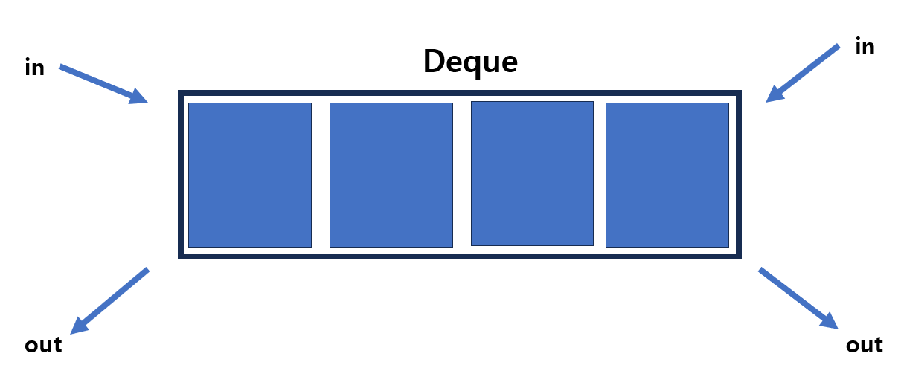

# [Java] Dequeue





#### Deque는 Double-Ended Queue의 줄임말이다


#### 양쪽에서 데이터를 추가, 삭제, 조회를 할 수 있는 자료구조이다

- Stack과 Queue를 합친 상태다


#### Deque의 메서드들

```java
// ========== 삽입 =============

// 덱 앞에 값을 넣는다
// 덱에 용량 제한이 있고, 초과하면 예외를 발생한다
deque.addFirst(value);
deque.push(value);

// 덱 앞에 값을 넣는다
// 덱에 용량 제한이 있고, 초과하면 false를 반환한다
deque.offerFirst(value);

// Deque, 제일 뒤에 값을 넣는다
// 덱에 용량 제한이 있고, 초과하면 예외를 발생한다
deque.add(value);
deque.addLast(value);

// 덱 제일 뒤에 값을 넣는다
// 덱에 용량 제한이 있고, 초과하면 false를 반환한다
deque.offer(value);
deque.offerLast(value);


// ========== 삭제 =============

// 덱 제일 앞의 값을 빼낸다
// 덱이 비어 있으면 예외가 발생한다
deque.removeFirst();
deque.remove();

// 덱 제일 앞의 값을 빼낸다
// 덱이 비어 있으면 null을 반환한다
deque.poll();
deque.pollFirst();

// 덱 제일 위의 값을 빼낸다
// 덱이 비어 있으면 예외가 발생한다
deque.pop();
deque.removeLast();

// 덱 제일 뒤의 값을 빼낸다
// 덱이 비어 있으면 null을 반환한다
deque.pollLast();


// ========== 조회 =============

// 덱에 제일 앞의 값을 반환한다
// 덱이 비어있으면 예외가 발생한다
deque.getFirst();

// 덱에 제일 앞의 값을 반환한다
// 덱이 비어있으면 null을 반환한다
deque.peek();
deque.peekFirst();

// 덱에 제일 뒤의 값을 반환한다
// 덱이 비어있으면 예외가 발생한다
deque.peekLast();

// 덱에 제일 뒤의 값을 반환한다
// 덱이 비어있으면 null을 반환한다
deque.getLast();


// value가 덱에 있는지 확인해준다
deque.contains(value);
```

