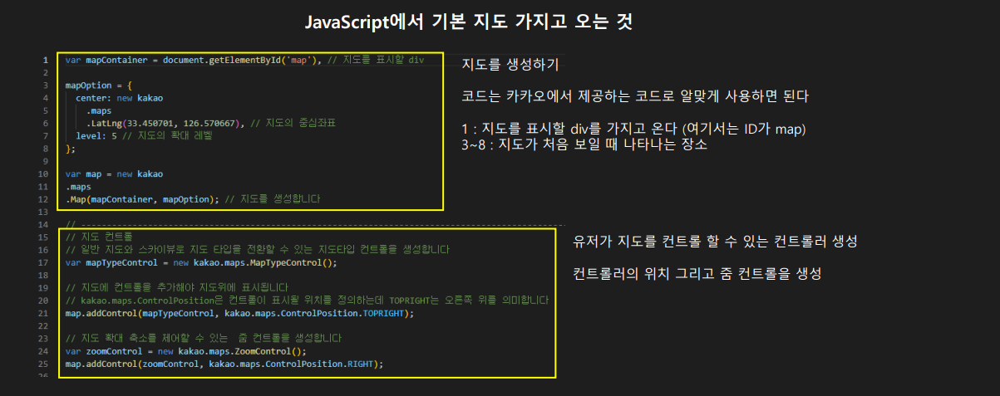
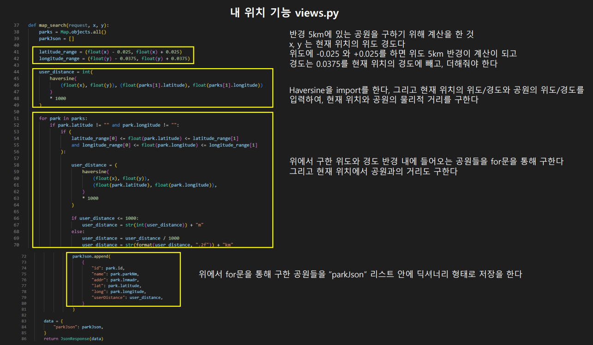
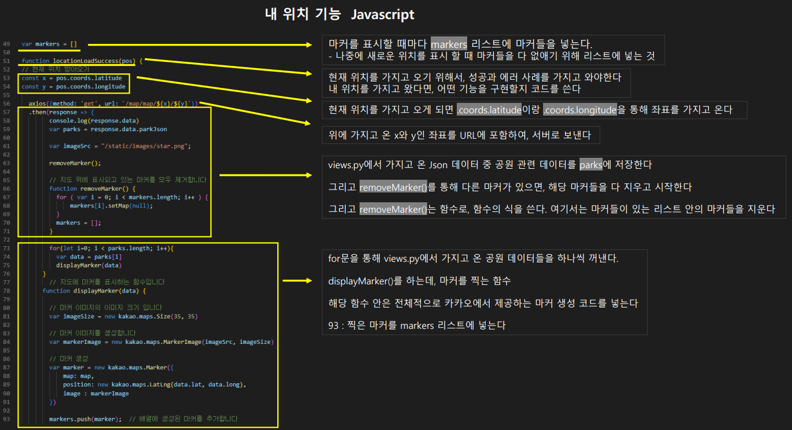
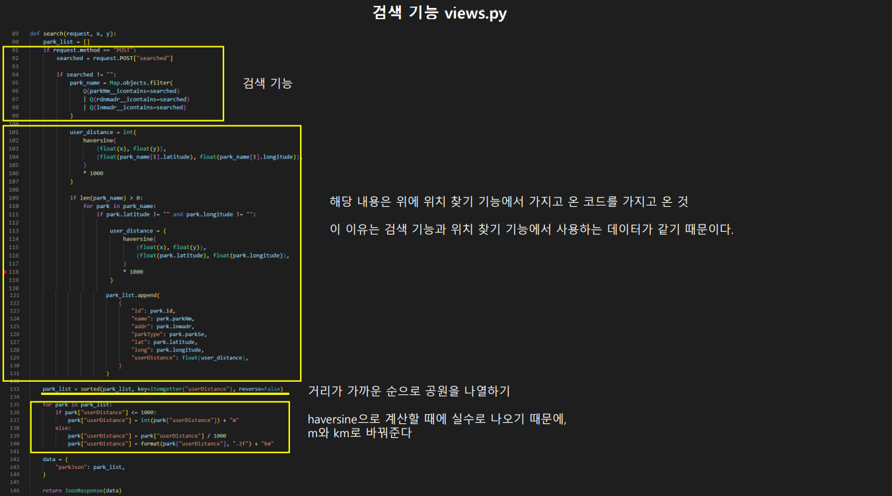
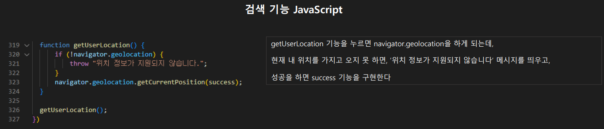

# 🧑‍💻 Semi-PJT 2

#### Category

[레이아웃 설계](#%EF%B8%8F-레이아웃-설계)

[최종 기능 설명](#%EF%B8%8F-최종-기능-설명)

## 후기

새로운 것을 시도할 수 있는 시간이었던 것 같다. 지도에 집중하겠다는 생각으로 다른 기능들은 다른 팀원들에게 많이 맡겼다. 중간중간에 에러나 나오고 잘 안 되어도, 잘 될때마다, 내가 성공했다는 생각에 너무 기뻤다. 무언가 하루종일 힘들게 코딩을 했지만, 그래도 마지막에 기능이 작동하는 성취감은 대단했다.

그리고 두번째로 배운 것은, 일단 팀원들을 더 잘 알고 프로젝트를 진행해야 할 것 같다고 생각했다. 모든 것을 할 수 있다는 생각에, 너무 지도에 집중하다보니, 다른 기능에서 웹 서비스가 완벽하게 돌아가지 않았다. 

어떻게든 끝은 냈지만, 완성도 측면에서는 굉장히 아쉬웠던 프로젝트였다. 그래도 완성하지 못 해서, 한번 더 느끼고 배울 수 있었다.

### Who?

- 최준혁 https://github.com/kimbap918
- 간정진 https://github.com/JeongJinGan
- 김다솔 https://github.com/solightnsalt
- 신우철 https://github.com/woocheolll
- 이제준 https://github.com/jejoonlee

### What?

산책할 수 있는 공원을 찾아주고, 같이 산책을 할 친구를 찾는 웹 서비스

## ✍️ 레이아웃 설계

#### 1️⃣ 초기화면

- 기본적으로 이 웹 서비스를 사용하기 위해서는 유저들은 로그인을 해야한다

#### 2️⃣ 회원가입

- 회원가입 후, 유저들을 바로 메인 페이지로 들어간다

#### 3️⃣ 메인화면

- 메인 페이지에는 카루셀로, 인기 많은 공원별로 사진을 띄어 놓는다
- 검색창을 만들어, 유저 닉네임, 공원 MBTI 별로 찾을 수 있도록 한다
- 날씨 관련해서 크롤링한 후, 산책하기 좋은 날씨를 알려준다

#### 4️⃣ 유저 디테일 페이지

- 유저 페이지에는 유저에 대한 정보를 넣는다
- 매너 온도를 넣어, 해당 유저의 신뢰성을 판단해준다
- 이 페이지에, 팔로우 팔로잉 기능 / 회원 수정 기능 등을 넣어줄 예정

#### 5️⃣ 작성 페이지

- 산책 메이트 구하기 페이지가 띄어지기 전, 이곳에서 정보들을 적는다
- 지도를 사용하여 어디에서 산책을 할지 보여준다

#### 6️⃣ 전체 리스트 페이지

- 모든 산책 메이트 구하기 페이지들을 리스트로 해서 보여주는 페이지
- 최신글부터, 공원별 또는 유저 온도별로 정렬을 할 수 있도록 한다

#### 7️⃣ 검색 페이지

- 검색한 결과에 따른 산책 메이트 구하기 페이지들을 보여주는 페이지
- 최신글부터, 공원별 또는 유저 온도별로 정렬을 할 수 있도록 한다

#### 8️⃣ 산책 메이트 구하기 페이지

- 유저들이 이 페이지를 만들고, 유저들이 보면서, 댓글도 쓸 수 있고, 채팅도 할 수 있도록 한다

## ✍️ 모델 설계

#### ▶️ 초기 모델 설계

- 제일 간단하게 레이아웃을 기반으로 모델 설계를 진행
- **사용자**
  - 사용자 모델에는 주로 사용자에 관련된 필드들을 설정했다
- **유저 선택**
  - 유저가 주로 같이 산책하고 싶은 대상을 선택하는 모델
- **게시판**
  - 같이 산책을 할 사람을 찾기 위한 모델
  - 공원 위치와 연결하여, 어디에서 산책을 할지 설정을 할 수 있도록 한다
- **댓글**
  - 게시판 안에 댓글 기능 추가
  - 댓글을 써서 같이 산책 하고 싶다고 작성
- **공원정보**
  - 공원 API를 가져올 예정으로, 공원 관련 위도/경도, 그 외 공원 정보를 넣을 예정
- **채팅**
  - 채팅 추후에 기능 추가 예정 

## ✍️ 최종 기능 설명 (내가 해봤던 새로운 기능 위주)

> 시간이 너무 부족한 이유로 채팅 기능, 대댓글 기능 등 최대한 뺄 수 있는 기능들은 다 뺐다.
>
> 제일 주요한 기능으로는 MAP이 있다

### 지도 기능 설명

- 공공 데이터 포털에서 도시공원 정보를 CSV 파일로 다운로드 받았다
  - 받고 난 후, 로컬 DB에 저장을 하여 공원 정보와 카카오 map API를 연결시켰다

- '내 위치'를 누르면, 현재 내가 있는 주소의 IP 주소를 트래킹하여 나의 위치를 가지고 온다
  - 그 위치를 기반으로 5km 반경에 있는 공원들을 표시한다
- 공원 검색 기능은, 공원 이름 또는 주소 기반으로 검색을 한다
  - 검색을 하면 내 위치로 기본적으로 이동하고, 내 위치에서 제일 가까운 순으로 나열이 된다
- 공원 마커 클릭
  - 마커를 클릭하게 된다면 마커 위에 해당 공원에 대한 정보가 간략하게 나온다
  - 그리고 마커에서 '산책하기' 를 클릭하면, 해당 공원의 좌표와 함께 `산책하기 모집` 생성 페이지로 간다

#### Kakao Map API 에서 공원 가지고 오기 (HTML & JavaScript)

> Kakao Map API에서 친절하게 설명을 해줘서, 크게 문제되는 것은 없다

[⏫위로 가기](#category)

#### 내 위치 기능 w/ 5km 반경 공원들

> views.py에서 내 위치에서 5km 반경엔 있는 공원들을 찾아서 Json 파일로 JavaScript로 보낸다
>
> Javascript로 데이터를 처리하는 속도가 데이터가 너무 많게 되면, 속도가 많이 느려진다 
>
> 그래서 python으로 데이터를 왠만해서 많이 처리한 후, Javascript으로 마커를 표시하기만 했다
>
> #### 📌 **내 위치를 가지고 올 때에는, 내 위치를 찾았을 때와 못 찾았을 때의 상황을 가지고 와야 한다**
>
> - 내 위치를 가지고 오는 코드는 `navigator.geolocation.getCurrentPosition()` 이다

[⏫위로 가기](#category)

#### 검색 기능 

> 검색 기능도 내 위치 기능과 동일하다
>
> Python으로 데이터를 나눈 후, Javascript로 데이터를 나뉜 데이터들을 표시하게 끔 만들었다

[⏫위로 가기](#category)

