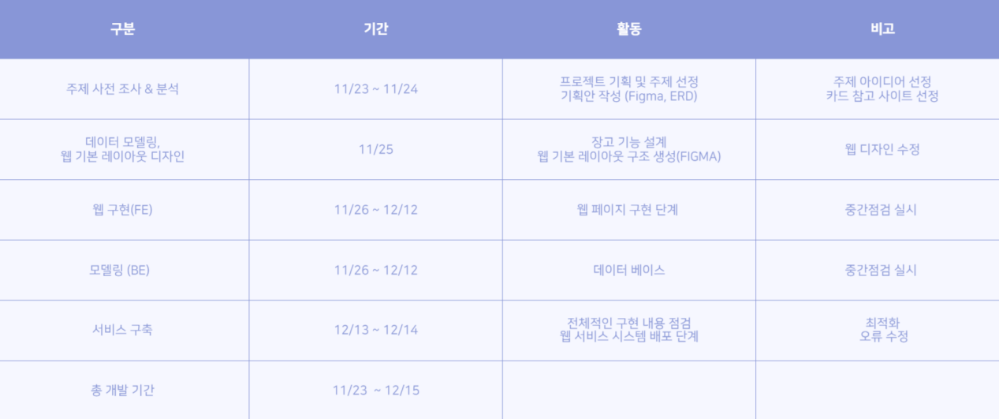
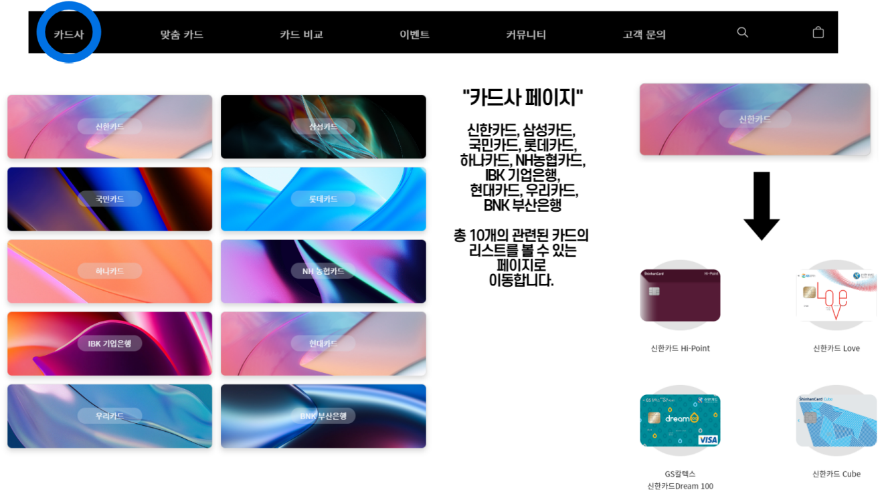
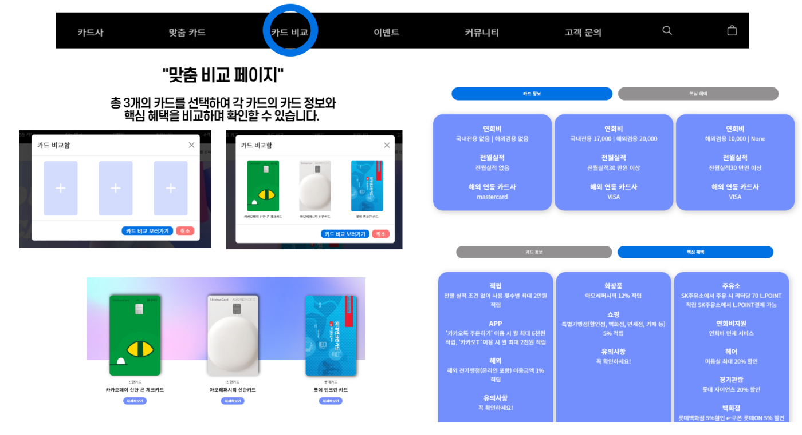
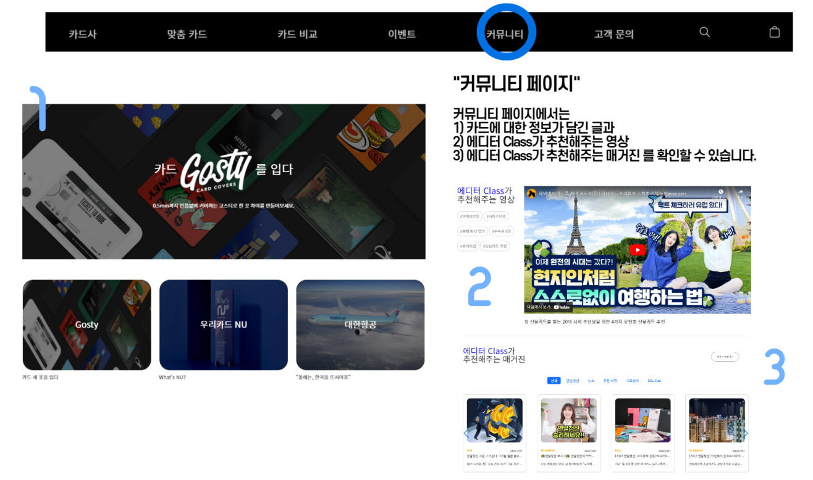
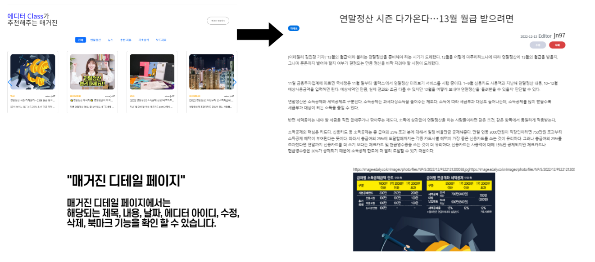
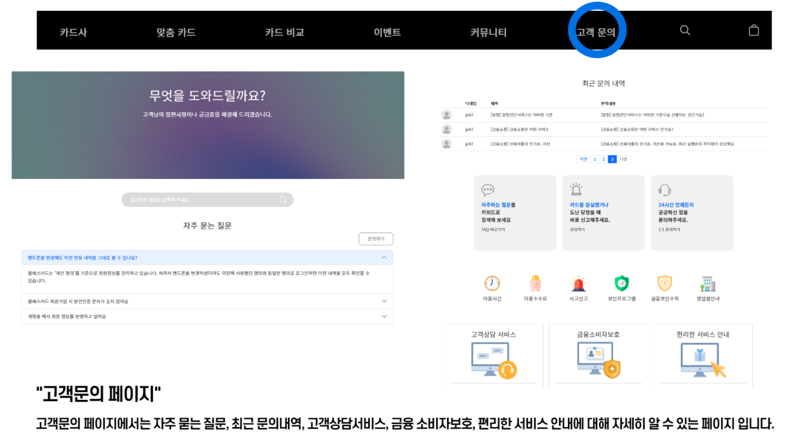
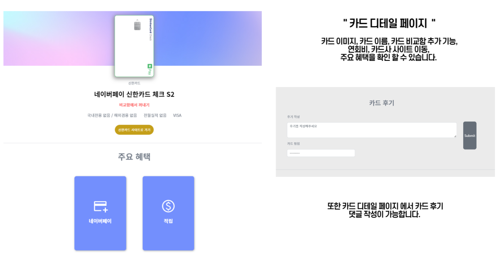
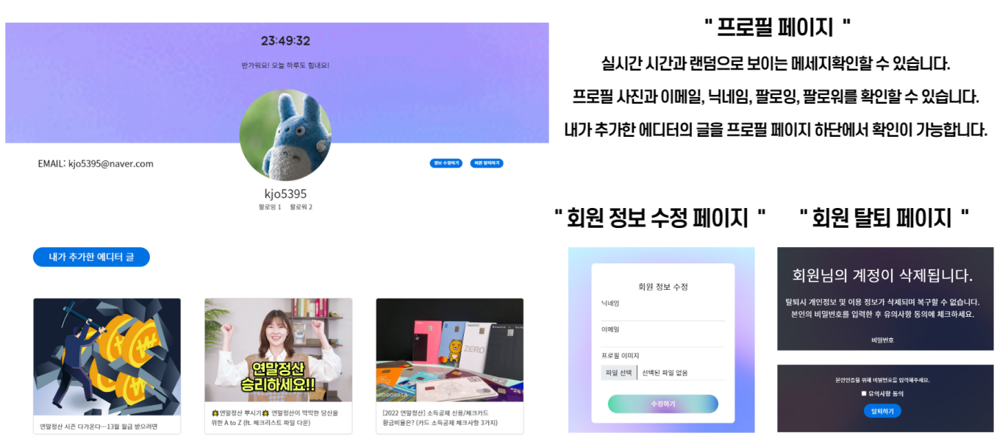
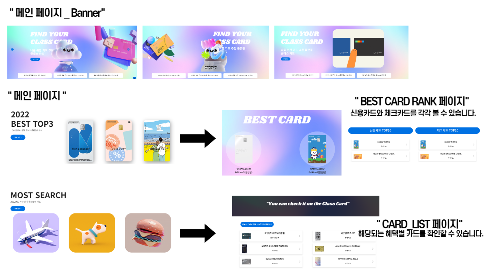
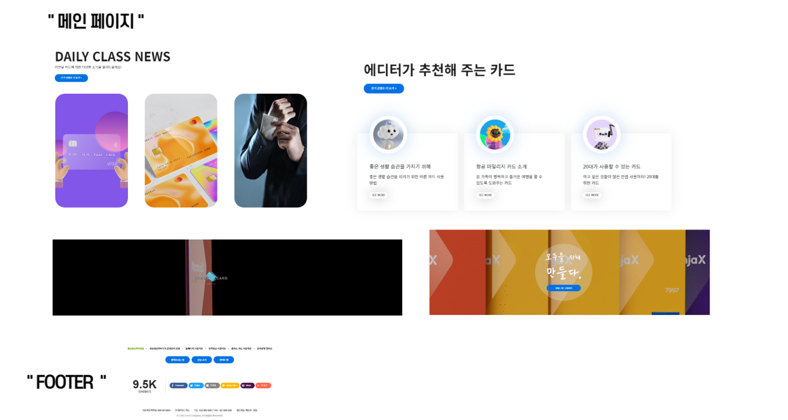

# 🧑‍💻 Semi-PJT 3

[사이트 보러가기](http://classcard2-env.eba-5zup7z28.ap-northeast-2.elasticbeanstalk.com/)

#### Category

[프로젝트 수행 절차 및 방법](#%EF%B8%8F-프로젝트-수행-절차-및-방법)

[레이아웃 설계](#%EF%B8%8F-레이아웃-설계)

[모델 설계](#%EF%B8%8F-모델-설계)

[Selenium을 통한 크롤링](#%EF%B8%8F-Selenium을-통한-크롤링)

[최종 기능 설명](#%EF%B8%8F-최종-기능-설명)

[소감](#%EF%B8%8F-소감)

### Who?
#### 👑[김나현](https://github.com/nahkim)  ROTHY (Back-end)

- 소셜 로그인 기능 구현
- 회원 관리 기능 구현
- 이메일 인증 기능 구현

#### 👩‍💻[김지연](https://github.com/jn-97) HAGRID (Front-end)

- 커뮤니티 페이지 제작
- 고객문의 페이지 제작
- 카드사 페이지 제작
- 회원가입 제작
- 로그인 페이지 제작

#### 👩‍💻[김지영](https://github.com/jiyeong99) TOTO (Back-end)

- 데이터 크롤링
- 검색 기능 구현
- 매거진 페이지 기능 구현
- 서비스 센터 기능 구현
- 배포

#### 🧑‍💻[이제준](https://github.com/jejoonlee) ALEX (Back-end, Front-end)

- 데이터 크롤링
- 카드 비교 기능 구현
- 맞춤 검색 기능 구현
- 카드 디테일 페이지 기능 구현과 페이지 제작

#### 👩‍💻[임수경](https://github.com/oiosu)  READY (Front-end)

- 메인 페이지 제작
- 이벤트 페이지 제작
- 맞춤 카드 페이지 제작
- 카드 비교 페이지 제작
- 회원 프로필 페이지 제작 

### What?

카드를 추천하는 서비스

- 사용할 수 있는 카드는 많지만, 어떤 카드가 개인적으로 잘 맞는지 추천
- 사회 초년생, 대학교 새내기 등, 어느 순간에 꼭 카드가 필요한 시기가 있다.
  - 그럴때 아무 카드가 아닌, 나에게 정말 맞는 카드를 찾는 것도 중요하다
  - 예) 개인적으로 축구를 굉장히 좋아하여, K리그 하나은행 축덕카드가 있음

크롤링을 통해 카드 정보를 가지고 올 것

- 카드고릴라 (카드 비교 사이트)에서 크롤링을 통해 카드 정보를 끌어올 것

단순히 카드 정보만 제공하는 것이 아닌, 유저에게 맞는 카드를 추천해주고, 그 외에도 설문 같은 기능과 칼럼을 통해 즐길 거리도 제공

- 예를 들어 뱅크셀러드의 `유전자 테스트` - 카드와 연관지을 수 있으면서, 유저들이 계속 사이트를 방문할 수 있도록 즐거움을 선사
- 카드고릴라의 POLL - 뱅크셀러드와 비슷
- 현대 카드의 SPACE (칼럼) - 카드 후기만이 아닌, 카드 관련해서 다양한 글을 쓸 수 있는 공간

#### 활용 장비
> ##### 레이아웃

  

> ##### 활용 언어

  
  
  
  

> ##### 활용 프레임워크

  

> ##### 배포

  
  

<h2 style="background-color: #7696fd; color:white;">✍️ 프로젝트 수행 절차 및 방법</h2>

<h2 style="background-color: #7696fd; color:white;">✍️ 레이아웃 설계</h2>

#### 1️⃣ 메인 화면

- 유저가 처음 홈페이지에 들어오면 인기 있는 카드 및 추천 카드들을 볼 수 있다

#### 2️⃣ 회원가입

- 유저에 대한 정보가 많이 필요하지는 않다
- **차별화 된 것은 유저가 일반 유저인가 또는 칼럼 글을 쓸 수 있는 유저인가가 나뉘어 졌다**
  - 칼럼 글쓴이들은 일반 유저가 이용할 수 있는 서비스를 모두 사용하되, 칼럼도 쓸 수 있다 

#### 3️⃣ 카드 목록 페이지 및 카드 검색 페이지

- 모든 카드들을 볼 수 있는 페이지이다
- 또는 카드를 검색하면, 유저가 검색한 카드를 볼 수 있다

#### 4️⃣ 이벤트 페이지

- 카드 관련해서 이벤트들이 모인 페이지다.
- 유저들이 카드 관련 이벤트들을 한 눈에 볼 수 있다

#### 5️⃣ 카드 비교 페이지

- 유저가, 자신이 관심 있는 카드 3개까지 선택해서, 카드들을 비교할 수 있다
- 장바구니 같이, 비교하고 싶은 카드들을 장바구니에 넣으면 된다

#### 6️⃣  카드 맞춤 페이지

- 유저만의 맞춤 카드를 선택할 수 있다

#### 7️⃣ 카드 디테일 페이지

- 카드 관련해서, 더 자세하게 볼 수 있는 페이지이다
- 댓글 기능을 통해, 카드 사용 후기를 볼 수도 또는 쓸 수도 있다

#### 8️⃣ 칼럼

- 카드 관련해서 칼럼 글쓴이들이, 글을 쓸 수 있는 공간이다
- 살짝 커뮤니티 같은 공간이다

### 📌 최종 레이아웃

> 디자인을 진행하면서 어두운 색깔보다, 더 밝은 색깔을 사용하는 것이 유저 입장에서는 더 보기 편할 것 같았다.
>
> 밝은 색깔을 통해 사이트가 더 넓고, 시각적으로 더 발전을 시켰다

- #### 그라데이션

  - 📌 다양한 카드를 다루는 사이트로써, 다양성을 의미하기 위해 그라데이션을 사용했다 📌

- #### Pastel Blue

  - 파랑색을 이용해서, 이용자들이 시각적으로 불편함 없이, 서비스를 이용할 수 있도록 색깔을 지정했다
  - 파스텔을 사용함으로, 좀 더 깔끔하면서 모던하게 사이트를 디자인 했다

<h2 style="background-color: #7696fd; color:white;">✍️ 모델 설계</h2>

#### ▶️ 초기 모델 설계

- 모델 설계는 최대한 복잡하지 않게 진행을 했다

- 제일 중요한 것은 최대한 Query문을 통해 카드들을 유저들이 볼 수 있도록 했다

- 그 외에는, 크롤링을 통해 카드 정보를 가지고 올 예정이라, 모델을 계속 바뀔 수 있다

  

### 📌 최종 모델 (중요 부분)

#### card_card

> 크롤링한 카드 기본 정보를 위주로 카드 데이터를 TABLE로 만들었다

- 카드 이미지도 URL로 가지고 와서, 카드 이미지를 활용했다

#### card_benefit

> 카드마다 주요 혜택들을 크롤링을 통해 가지고 온 TABLE

- 카드의 ID를 가지고 와서 1:N 기능을 넣어주었다.
- 각 카드의 혜택들의 정보들을 가지고 온 테이블이다

#### accounts

> AllAuth를 사용하여, 소셜 로그인 기능까지 더 쉽게 구현할 수 있도록 초반부터 사용을 했다

- 유저 정보는 기본적으로 AllAuth에서 제공하는 데이터를 사용했다

<h2 style="background-color: #7696fd; color:white;">✍️ Selenium을 통한 크롤링</h2>

[크롤링에 대해](https://github.com/jejoonlee/TIL-and-Coding-Test/blob/master/Python/python_%ED%81%AC%EB%A1%A4%EB%A7%81.md)

> Selenium을 이용하여 크롤링을 진행했다
>
> 카드 디테일 페이지를 하나씩 돌면서, 안에 있는 상세 정보들을 CSS_SELECTOR를 통해 가지고 왔다

<h2 style="background-color: #7696fd; color:white;">✍️ 최종 기능 설명 (매인 페이지 기준)</h2>

> ### 카드사 페이지

- 대중적으로 많이 알려진 카드사 기준으로 카드를 찾을 수 있다
- 각 카드의 정보안에 있는 카드사들을 필터링을 통해, 카드를 찾는다

> ### 맞춤 카드 페이지

- 쿼리에서 필터링과 for문을 주요하게 사용하였다
  - 연령대별로 어느 나이 대에 사람들이 카드의 어떤 혜택을 중요하게 생각하는지 생각하며 혜택들을 나누었다
- 카드 맞춤 검색에는 추가로 검색한 카드를 카드사 별로 볼 수 있도록, 추가로 필터링이 가능하도록 했다.
- 📌 `request.GET.get `를 통해서 URL을 통해 어떤 정보를 위주로 필터링할지 가져온 후, 그 정보를 가지고 for문이나 필터 쿼리를 사용하였다

>### 카드 비교 페이지

- 로그인을 한 사람들을 위주로 카드를 장바구니에 넣는 것 처럼 카드 비교함에 넣을 수 있도록 했다
  - 여기서 카드는 한 계정 당, 최대 3개를 넣을 수 있다
- 카드 비교 페이지에서는 카드 비교함에 있던 카드 정보들을 끌어와서, 유저들이 카드들을 한 눈에 비교할 수 있도록 만들었다

> ### 이벤트 페이지

- 카드 이벤트는 정보를 가지고 온 것보다는, 수작업으로 이벤트들을 작성했다

> ### 커뮤니티 페이지

- 차별화는 둔 페이지다
- 유저들이 카드에 대해서 소통을 할 수 있는 공간이다
- 대신, 메거진은 메거진을 쓸 수 있는 권한을 가진 사람들만 작성을 할 수 있다

- 유저들은 글들을 북마크를 통해서, 각 유저들의 페이지에 저장을 할 수 있다

> ### 고객 문의 페이지

- 고객들이 자주 묻는 질문을 넣었다
- 유저들이 문의도 할 수 있다
- 검색을 통해 다른 유저들이 문의한 내용들을 검색을 통해 볼 수 있는 페이지

> ### 검색 기능

- 네브바에 돋보기를 누르면 카드 카드를 검색할 수 있는 기능이 구현되어 있다
- 카드 이름, 카드사 등을 위주로 검색을 통해 카드를 검색할 수 있다

> ### 카드 디테일 페이지

- 카드들의 정보를 한눈에 볼 수 있는 공간이다
- 카드 비교함에 넣거나 뺄 수 있다
- 노란색 버튼을 누르게 되면, 해당 카드사의 페이지로 넘어간다
- 주요 혜택의 카드들을 호버하면, 주요 혜택에 관련된 혜택 정보를 모달을 통해 볼 수 있다
- 후기를 통해 카드에 대한 유저들의 의견을 읽을 수 있다
- 여기서 비교함 넣기/빼기 + 카드 후기는 모두 비동기 처리를 했다

> ### 프로필 페이지

- 프로필 페이지는 유저들의 정보를 간단하게 볼 수 있는 페이지이다
- 타 유저 팔로우를 할 수 있고, 북마크를 통해 저장한 글들을 다시 볼 수 있다
- 회원 정보를 수정 또는 탈퇴를 할 수 있다
- 그 외 회원가입 기능 같은 경우, 이메일 인증을 해야 최종적으로 회원가입이 가능하다

> ### 메인 페이지

<h2 style="background-color: #7696fd; color:white;">✍️ 소감</h2>

#### Rothy (김나현)

소셜로그인 부분을 사용봤는데 이해하고 사용하는데 시간이 많이 걸려서 코드를 많이 짜지못해 아쉽고 프로젝트를 하면서 팀원들에게 많이 배웠습니다! 다들 약 3주간 고생하셨습니다!

#### Hagrid (김지연)

최종 프로젝트인 만큼 사실 능력있는 팀원보다는 좋은 팀원들을 만나면 좋겠다고 생각했었는데 정말 좋은 팀원들을 만나서 오류 해결도 문제없이 잘 해결했고, 프로젝트도 처음 기획한 만큼 100% 완성하진 못했지만 그래도 구현하고자 하는 기능들은 전부 구현했기 때문에 그만큼 아쉬움이 없던 프로젝트였습니다. 처음으로 깃허브에서 칸반보드를 썼는데, 처음에는 굳이 이 번거로운걸 왜할까라는 생각이 들었지만 나중에는 오히려 더 편리해졌습니다! 또 프로젝트 기간동안 새로운 시도를 많이 했던 것 같아 뿌듯하고 만족스러운 프로젝트였습니다.

#### Toto (김지영)

크롤링, 서머노트에디터, 배포 등 새로운 시도를 많이 해본 유익한 시간이었습니다. 팀원분들 모두 고생하셨습니다.

#### Alex (이제준)

새로운 기능들을 시도하면서, 더 많은 것을 배운 프로젝트였습니다. 혼자서 난리 치면서 개발을 했지만, 그거 다 받아준 팀원들 감사합니다 ㅎㅎㅎ 정말 어이없이 행코 했습니다 🙂 

#### Ready (임수경)

최종프로젝트를 진행하면서 디자인 부분이 가장 어려웠습니다. 기본적인 서비스의 컨셉과 계획했던 웹 구조를 잘 만들어 간다고 생각하지 못했던 부분에 대해서 많은 시간을 소요했던 것 같습니다. 하지만 디자이너분의 도움을 받아 차근차근 웹의 구조와 컨셉을 다시 만들어 갈 수 있었습니다. 각 페이지마다의 요구사항도 팀원들과 함께 많은 시간동안 하나씩 채워가는 재미와 뿌듯함을 느낄 수 있었습니다.

애플 아이패드 반응형 웹사이트 클론 코딩을 하면서 다시 복습한 transform-origin으로 회전하는 스타일링과 자바스크립트의 이벤트 버블링을 공부할 수 있었습니다. 또한 애플 사이트에서 영감을 많이 받아 인터렉션을 구현하고자 노력했습니다. 기간이 긴 만큼 팀원들과 많은 시간과 코드를 공유하며 더 많은 것을 배울 수 있었습니다.  모두 고생하셨습니다!