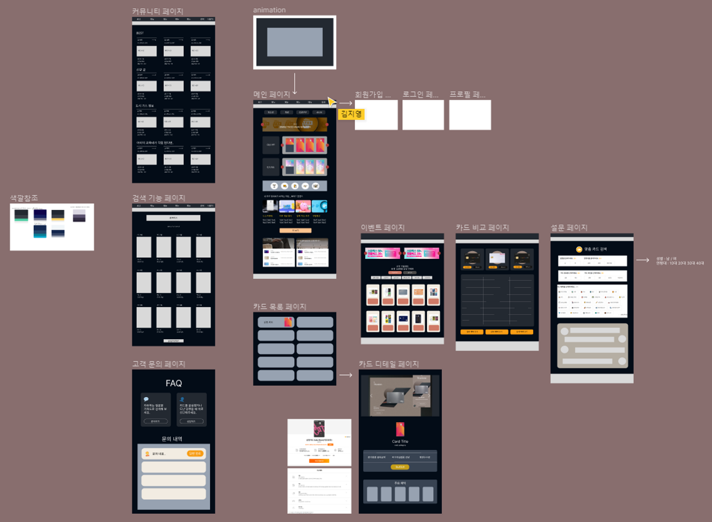
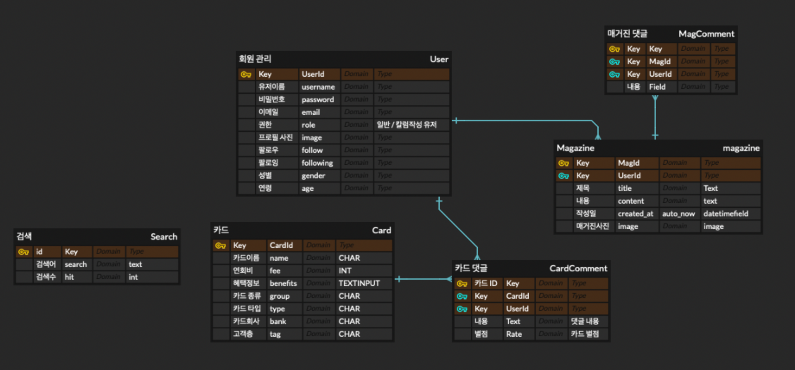

# 🧑‍💻 Semi-PJT 2

#### Category

[레이아웃 설계](#%EF%B8%8F-레이아웃-설계)

[최종 기능 설명](#%EF%B8%8F-최종-기능-설명)

### Who?

- 김나현 https://github.com/nahkim
- 김지연 https://github.com/jn-97
- 김지영 https://github.com/jiyeong99
- 이제준 https://github.com/jejoonlee
- 임수경 https://github.com/oiosu

### What?

카드를 추천하는 서비스

- 사용할 수 있는 카드는 많지만, 어떤 카드가 개인적으로 잘 맞는지 추천
- 사회 초년생, 대학교 새내기 등, 어느 순간에 꼭 카드가 필요한 시기가 있다.
  - 그럴때 아무 카드가 아닌, 나에게 정말 맞는 카드를 찾는 것도 중요하다
  - 예) 개인적으로 축구를 굉장히 좋아하여, K리그 하나은행 축덕카드가 있음

크롤링을 통해 카드 정보를 가지고 올 것

- 카드고릴라 (카드 비교 사이트)에서 크롤링을 통해 카드 정보를 끌어올 것

단순히 카드 정보만 제공하는 것이 아닌, 유저에게 맞는 카드를 추천해주고, 그 외에도 설문 같은 기능과 칼럼을 통해 즐길 거리도 제공

- 예를 들어 뱅크셀러드의 `유전자 테스트` - 카드와 연관지을 수 있으면서, 유저들이 계속 사이트를 방문할 수 있도록 즐거움을 선사
- 카드고릴라의 POLL - 뱅크셀러드와 비슷
- 현대 카드의 SPACE (칼럼) - 카드 후기만이 아닌, 카드 관련해서 다양한 글을 쓸 수 있는 공간

## ✍️ 레이아웃 설계

[피그마 링크](https://www.figma.com/file/OyeNCX6aXnbu9scZTOeR2T/클라스-카드?t=XaLZaMnclTCtIvdm-0)

#### 1️⃣ 메인 화면

- 유저가 처음 홈페이지에 들어오면 인기 있는 카드 및 추천 카드들을 볼 수 있다

#### 2️⃣ 회원가입

- 유저에 대한 정보가 많이 필요하지는 않다
- **차별화 된 것은 유저가 일반 유저인가 또는 칼럼 글을 쓸 수 있는 유저인가가 나뉘어 졌다**
  - 칼럼 글쓴이들은 일반 유저가 이용할 수 있는 서비스를 모두 사용하되, 칼럼도 쓸 수 있다 

#### 3️⃣ 카드 목록 페이지 및 카드 검색 페이지

- 모든 카드들을 볼 수 있는 페이지이다
- 또는 카드를 검색하면, 유저가 검색한 카드를 볼 수 있다

#### 4️⃣ 이벤트 페이지

- 카드 관련해서 이벤트들이 모인 페이지다.
- 유저들이 카드 관련 이벤트들을 한 눈에 볼 수 있다

#### 5️⃣ 카드 비교 페이지

- 유저가, 자신이 관심 있는 카드 3개까지 선택해서, 카드들을 비교할 수 있다
- 장바구니 같이, 비교하고 싶은 카드들을 장바구니에 넣으면 된다

#### 6️⃣  설문 페이지

- 유저만의 맞춤 카드를 선택할 수 있다

#### 7️⃣ 카드 디테일 페이지

- 카드 관련해서, 더 자세하게 볼 수 있는 페이지이다
- 댓글 기능을 통해, 카드 사용 후기를 볼 수도 또는 쓸 수도 있다

#### 8️⃣ 칼럼

- 카드 관련해서 칼럼 글쓴이들이, 글을 쓸 수 있는 공간이다
- 살짝 커뮤니티 같은 공간이다

## ✍️ 모델 설계

#### ▶️ 초기 모델 설계

- 모델 설계는 최대한 복잡하지 않게 진행을 했다
- 제일 중요한 것은 최대한 Query문을 통해 카드들을 유저들이 볼 수 있도록 했다
- 그 외에는, 크롤링을 통해 카드 정보를 가지고 올 예정이라, 모델을 계속 바뀔 수 있다

## ✍️ 최종 기능 설명 (내가 해봤던 새로운 기능 위주)

> 
