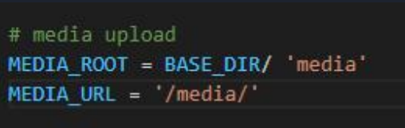
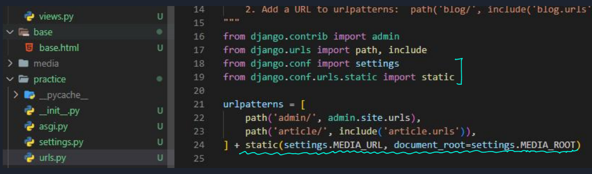
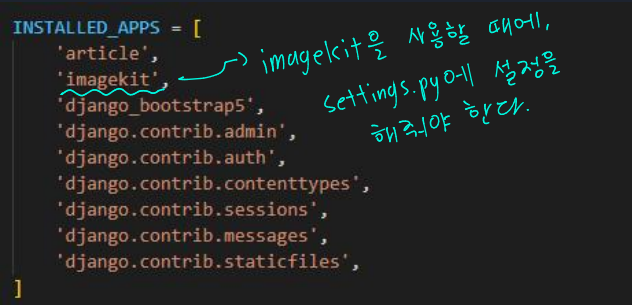
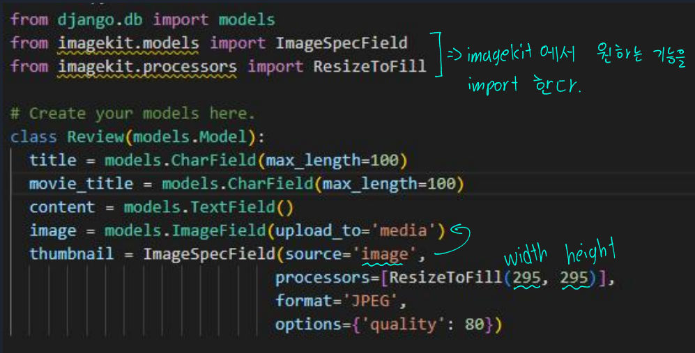

# 📋Django 13

#### Category

[사진 업로드](#%EF%B8%8F-사진-업로드)

[imagekit](#%EF%B8%8F-imagekit)

[사진 파일 자동 삭제](#%EF%B8%8F-사진-파일-자동-삭제)


## ✔️ 사진 업로드

#### 1. models.py 에 model을 imagefield로 생성

- DB에 필드 추가


#### 2. HTML의 `<form>` 에 enctype=multipart/form-data 를 추가한다

- Form이 저장되면, 위의 'enctype'을 통해 따로 이미지 파일을 생성한다


#### 3. views.py에 request.POST 와 request.FILES을 설정한다

- 그 전에는 request.POST만 넣었는데, enctype을 통해 파일을 따로 생성했으므로, `request.FILES`도 같이 해준다
- DB에는 파일의 경로만 저장이 되어 있다


> 여기까지는 서버에서만 image가 저장되어 있다

#### 4. settings.py 에 해당 내용을 설정한다

- `MEDIA_ROOT = BASE_DIR / '파일이 저장될 폴더 이름'`
- `MEDIA_URL = '/media/'`

이미지를 (또는 파일을) 서버에서 보여주는 방법이다



#### 5. 파일을 가지고 오는 것

```python
# settings.py가 있는 폴더의 urls.py
from django.conf import settings
from django.conf.urls.static import static

urlpatterns = [
  # path 경로들
] + static(settings.MEDIA_URL, document_root = settings.MEDIA_ROOT)
```

- static 파일을 settings.py에서 설정한 MEDIA_URL에서 지정한 media 디렉토리에서 가져오겠다는 것




## ✔️ imagekit

>  https://github.com/matthewwithanm/django-imagekit 참고
>
> 이미지 용량을 줄이거나, 적절한 사이즈로 변경하는 등
>
> imagekit 라이브러리를 다운로드 받고 models.py에서 사용한다
>
> - 이미지를 입력 받게 되면, 원하는 용량 또는 사이즈로 imagekit을 통해 변환해준다

1. `pip install django-imagekit`






## ✔️ 사진 파일 자동 삭제

> 사진을 업로드한 후, 해당 게시물을 삭제하게되면 사진 파일은 로컬에 남게 된다
>
> 그럴 때에, 자동으로 파일을 삭제하는 기능이 있다

```python
# 터미널
pip install django-cleanup

# settings.py
INSTALLED_APPS = (
    ...,
    'django_cleanup.apps.CleanupConfig',
)
```

- 터미널에 `django-cleanup`을 설치해준다
  - `django-cleanup`은 ImageField만 아닌 FileField에도 똑같이 적용이 된다
- 그리고 INSTALLED_APPS, 맨 마지막에 위에 코드를 넣어준다
  - 파이썬 특성상, 위에 있으면, 겹칠 수 있게되어, 그냥 편안하게 맨 마지막에 넣어준다
