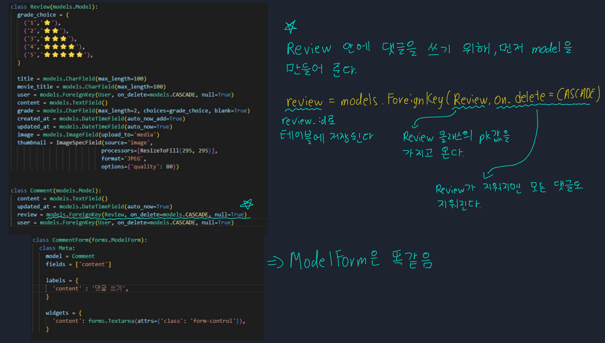
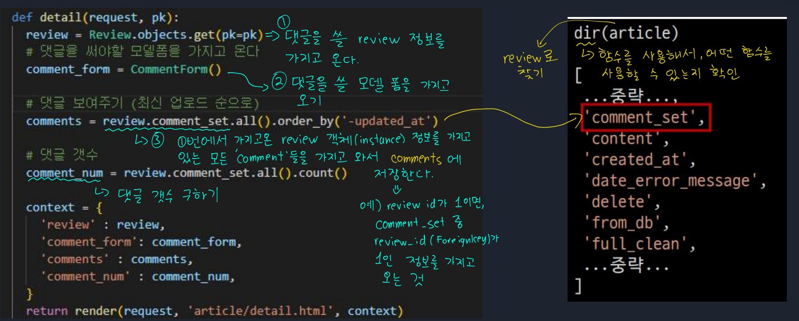
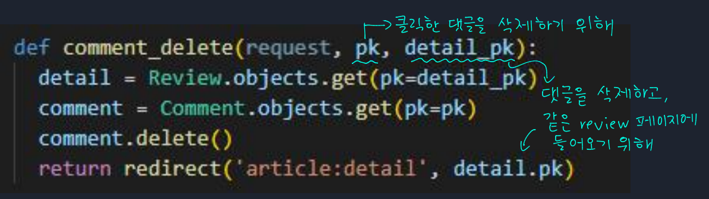

# 📋Django 14

#### Category

[댓글 생성](#%EF%B8%8F-댓글-생성)

[댓글 보기](#%EF%B8%8F-댓글-보기)

## ✔️ 댓글 생성

> models.py

> views.py

- 댓글을 생성하기 위해서는, 여기서는 따로 url을 urls.py에서 만들어야 한다!!! (이미 배웠던 내용)

## ✔️ 댓글 보기

> views.py
>
> 여기서 제일 중요한 것은 `review.comment_set.all()` 통해 역참조를 하는 것이다

## ✔️ 댓글 삭제

> views.py
>
> url을 통해 두 개의 pk 값을 가지고 온다

