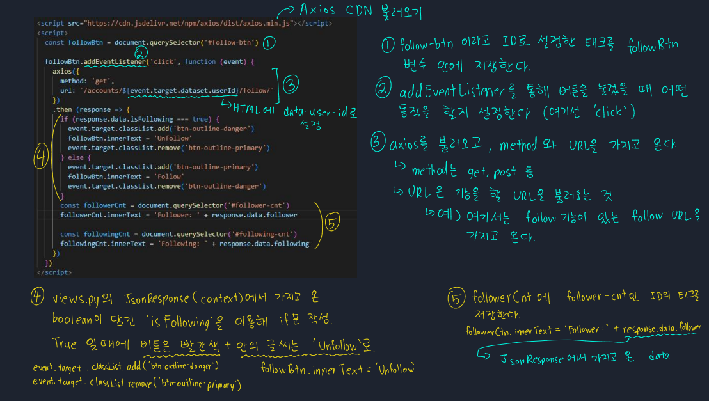

# 📋Django 19 (AJAX)

#### Category

[AJAX](#%EF%B8%8F-AJAX)

## ✔️ AJAX

> Asynchronous JavaScript And XML (JSON)
>
> 페이지 전체를 reload(새로고침)하지 않아도 데이터를 받아올 수 있다

#### 비동기 (자바스크립트의 특성)

- 요청을 보낸 후 응답을 기다리지 않고 다음 동작이 이루어짐 (Non-blocking)
  - 요청을 하고 나서, 응답을 받을때까지, 다른 동작을 하는 것
- 즉 요청한 데이터를 기다리지 않고, 해당 사이트 내에서 다른 일들을 할 수 있다.

## ✔️ Axios

> 'Promise based HTTP client for browser and Node.js'
>
> 브라우저를 위한 Promise 기반의 클라이언트
>
> 도착하면 실행을 시키는 약속

- Axios CDN 가지고 오는 것

Axios는 URL로 요청을 보내주고, 처리가 완료되면 실행을 시켜주겠다는 약속

- 성공적이면 `then`, 실패하면 `catch`

### 비동기 처리할 때

1. 어떤 이벤트일 때 요청을 보낼지
   - form을 작성하면
   - 특정 URL로 요청을 보내고
2. 서버에서 어떤 응답을 JSON으로 보내서
   - 댓글 정보를 보내서 
3. DOM 조작을 어떻게 할지
   - 댓글 목록에 추가해준다

> ### Promise

`.then` : 성공(이행)에 대한 약속

`.catch` : 실패(거절)에 대한 약속

### 비동기 처리 (get)

