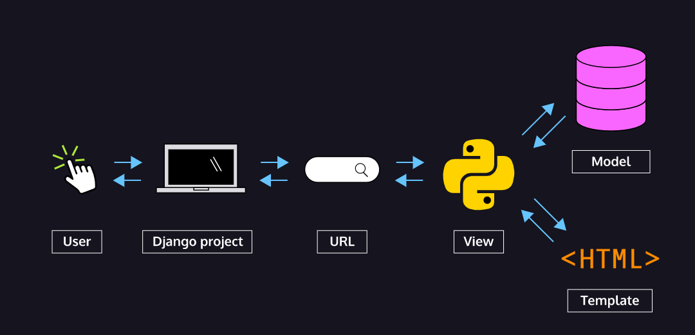
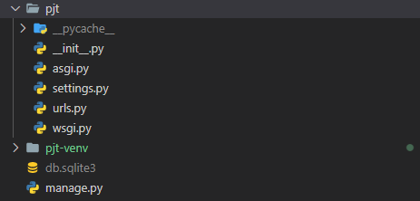
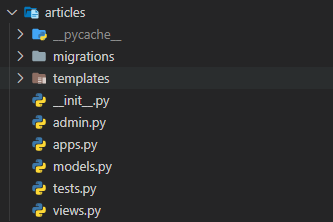

# 📋Python 2

#### Category

[MTV](#%EF%B8%8F-MTV)

[기본 설정](#%EF%B8%8F-기본-설정)

[요청과 응답](#%EF%B8%8F-요청과-응답)

[오늘 실습](#%EF%B8%8F-오늘-실습)


## ✔️ MTV

> Model | Template | View

- **Model** : deals with data and databases. It can retrieve, store and change data in database
- **Template** : How the data looks on a web page (HTML document)
- **View** : Describes the data to be presented and passes this information to the template




## ✔️ 기본 설정

`django-admin startproject [프로젝트 이름]`을 통해 프로젝트를 만들 때 만들어지는 파일



> 위에 `pjt` 파일, `db.sqlite3`, `manage.py` 파일들이 생성이 된다

- `__init__.py` : 현제 디렉토리가 하나의 Python 패키지로 다루도록 지시한다
  - 이 파일에는 코드를 작성하지 않는다
- `asgi.py` : Asynchronous Server Gateway Interface
  - Django 어플리케이션이 비동기식(여러 작업이 이루어지는 것) 웹 서버와 연결 및 소통하는 것을 도와준다
  - 배포시에 사용된다
- `settings.py` : Django의 프로젝트 설정을 관리한다 
  - 예를 들어 어플리케이션을 만들게 되면 `INSTALLED_APPS`에 어플리케이션 폴더 이름을 넣어서 프로젝트와 어플리케이션을 연결한다
- `urls.py` : 사이트의 url과 적절한 views의 연결을 지정한다
  - 여기서 views는 어플리케이션을 만들 때 생성된다
- `wsgi.py` : Web Server Gateway Interface
  - Django 어플리케이션이 웹서버와 연결 및 소통하는 것을 도와준다
- `manage.py` : Django 프로젝트와 다양한 방법으로 상호작용 하는 커맨드 라인 유틸리티


`python manage.py startapp articles` 를 통해 어플리케이션을 만든다



- `admin.py` : 관리자용 페이지를 설정하는 곳이다
- `apps.py` : 앱의 정보가 작성되는 곳이다
- `models.py` : 애플리케이션에서 사용하는 Model을 정의하는 곳
- `tests.py` : 프로젝트의 테스트 코드를 작성하는 곳
- `views.py` : view 함수들이 정의 되는 곳
  - `templates` 안에는 `html` 같은 문서를 저장해 놓고, `views.py` 안에 있는 함수를 `html` 문서에 `{{}}` 같은 기호를 이용해서 사용한다.  

#### Project

> 어플리케이션의 집합체이다
>
> 여러 어플리케이션이 프로젝트 안에 있고, 여러 프로젝트에 어플리케이션이 있다

#### Application

> 기능들 (예. 게시글 기능, 로그인 기능 등)


## ✔️ 요청과 응답

> 웹서비스는 클라이언트가 `요청`을 하고 서버에서 `응답`을 한다

### `URL → VIEW → TEMPLATE`

1. **주문서를 정의한다** : **클라이언트**가 요청한 주문서를 정의 하는 것 (`urls.py`에서 path를 만든다)
2. **로직을 구현한다** : `views.py` 에서 함수를 통해 로직을 구현하여, 요청을 받은 것에서 어떻게 응답할지 구현을 한다
3. **HTML 페이지 구성을 한다** : `templates` 파일에 있는 `html` 문서에 로직을 넣어, 다시 클라이언트에게 응답을 한다


#### `Views`

```python
def index(request):
    return render(request, 'index.html', context)
		# url, view, HTML파일에 넣을 정보 (주로 딕셔너리 형태)
```

- `render()` : 주어진 템플릿을 주어진 컨텍스트 데이터와 결합하고 렌더링 된 텍스트와 함께 HttpResponse(응답) 객체를 반환하는 함수


#### `Templates`

- 실제 내용을 보여주는데 사용되는 파일이다

```html
{{ name }}
<!-- views.py의 context에 저장되어 있는 key를 가지고 오면, value를 응답한다 -->


<!-- 출력 텍스트를 만들거나, 반복 또는 논리를 수행하여 제어 흐름을 만드는 등 변수보다 복잡한 일들을 수행 -->


<!-- for문은 endfor로 끝낸다 -->

 
```


## ✔️ 오늘 실습


### `urls.py`

```python
from django.contrib import admin
from django.urls import path
from articles import views

urlpatterns = [
    path('admin/', admin.site.urls),
    path('today-eat/', views.eat),
    path('lotto/', views.lotto)
]
```

- `from articles import views` 를 통해 views를 가지고 와서
  - `path('lotto/', views.lotto)` 와 `path('today-eat/', views.eat),` 에 넣었다
    - 여기서 `lotto` 와 `eat`은 `views.py`에서 만든 함수다


### `views.py`

```python
def eat(request):

  foods = ['삼겹살', '냉면', '치킨', '떡볶이', '라면', '김밥', '스파게티',] 
  idx = random.randrange(len(foods))

  food_img = [
    'http://samda.com/shopimages/samdacom1/0200020000012.jpg?1599823022',
    'https://diadiemhanquoc.com/wp-content/uploads/2020/06/M%C3%B3n-mi%E1%BA%BFn-l%E1%BA%A1nh-H%C3%A0n-Qu%E1%BB%91c-thanh-m%C3%A1t-c%E1%BA%A3-n%C6%B0%E1%BB%9Bc-s%C3%BAp-%EA%B5%AD%EB%AC%BC%EA%B9%8C%EC%A7%80-%EC%8B%9C%EC%9B%90%ED%95%9C-%EB%83%89%EB%A9%B4.jpg',
    'https://img.hankyung.com/photo/202202/99.11408152.1.jpg',
    'https://desion.kr/web/product/tiny/202101/7b8394ed298eafcde0ad47a0bc64de83.jpg',
    'http://res.heraldm.com/content/image/2022/01/07/20220107000641_0.jpg',
    'https://upload.wikimedia.org/wikipedia/commons/0/0e/Gimbap_%28pixabay%29.jpg',
    'https://mblogthumb-phinf.pstatic.net/MjAxNzA4MTVfMTcy/MDAxNTAyNzg4NjkwNzY3.9ia3sQyIwubuRt26dLRoZIfFY0o-vkICMgsAEt2iUCog.VcoA1clnb5t27z01QWQl1OAoI3iCmCCnxkAl8e4DsE4g.JPEG.pyoun0181/%ED%86%A0%EB%A7%88%ED%86%A0%EC%8A%A4%ED%8C%8C%EA%B2%8C%ED%8B%B0DSC04185-022.jpg?type=w800',
  ]

  context = {
    'food' : foods[idx],
    'image' : food_img[idx],
  }

  return render(request, 'index.html', context)
```

- 리스트를 두 개를 만들었다
  - 하나는 음식 이름 리스트, 하나는 음식 이미지 URL 리스트다
  - 음식 이름과 음식 이미지는 순서마다 같다
- `idx = random.randrange(len(foods))`
  - 음식 리스트의 개수를 range로 잡고, 그 중 랜덤으로 값을 `idx`로 저장했다
- context 딕셔너리에 음식 이름과 음식 이미지를 넣었고, 같은 `idx`로 지정하면, 같은 결과가 HTML 문서에서 나오게 된다


```python
def lotto(request):
  num1 = random.sample(range(1, 46), 6)
  num2 = random.sample(range(1, 46), 6)
  num3 = random.sample(range(1, 46), 6)
  num4 = random.sample(range(1, 46), 6)
  num5 = random.sample(range(1, 46), 6)

  last_week = random.sample(range(1, 46), 7)

  cnt = [0, 0, 0, 0, 0]

  print(last_week)
  for num in range(len(last_week)):
    # 6개가 연속해서 있다면, 1등
    if num != 6:
      if last_week[num] in num1:
        cnt[0] += 1
        if cnt[0] == 6:
          cnt[0] = '1등!!!!!'

      if last_week[num] in num2:
        cnt[1] += 1
        if cnt[1] == 6:
          cnt[1] = '1등!!!!!'

      if last_week[num] in num3:
        cnt[2] += 1
        if cnt[2] == 6:
          cnt[2] = '1등!!!!!'

      if last_week[num] in num4:
        cnt[3] += 1
        if cnt[3] == 6:
          cnt[3] = '1등!!!!!'

      if last_week[num] in num5:
        cnt[4] += 1
        if cnt[4] == 6:
          cnt[4] = '1등!!!!!'
    
    # 그외는 2등 아래
    else:
      if last_week[num] in num1:
        cnt[0] += 1

      if last_week[num] in num2:
        cnt[1] += 1

      if last_week[num] in num3:
        cnt[2] += 1

      if last_week[num] in num4:
        cnt[3] += 1

      if last_week[num] in num5:
        cnt[4] += 1

  print(cnt)

  for i in range(len(cnt)):
    if cnt[i] == 0:
      cnt[i] = '꽝! 같은 숫자 0개'
    elif cnt[i] == 1:
      cnt[i] = '꽝! 같은 숫자 1개'
    elif cnt[i] == 2:
      cnt[i] = '꽝! 같은 숫자 2개'
    elif cnt[i] == 3:
      cnt[i] = '5등! 같은 숫자 3개'
    elif cnt[i] == 4:
      cnt[i] = '4등! 같은 숫자 4개'
    elif cnt[i] == 5:
      cnt[i] = '3등!! 같은 숫자 5개'
    elif cnt[i] == 6:
      cnt[i] = '2등!!! 같은 숫자 6개'
    

  context = {
    'lotto1' : num1,
    'lotto2' : num2,
    'lotto3' : num3,
    'lotto4' : num4,
    'lotto5' : num5,

    'lastWeek' : last_week[:6],
    'bonus' : last_week[6],
    'cnt1' : cnt[0],
    'cnt2' : cnt[1],
    'cnt3' : cnt[2],
    'cnt4' : cnt[3],
    'cnt5' : cnt[4],
  }

  return render(request, 'lotto.html', context)
```

- 로또는 조금 많이 길었다
- 먼저 6개의 1부터 45번 중 랜덤으로 고른 숫자, 5세트를 만든다
- 그리고 저번주 나온 로또 번호, 보너스 까지 합쳐서 7개를 가지고 온다
  - 그러면 초반에 6개의 리스트가 있다
- cnt 리스트는 `last_week` 리스트를 순회하면서, 해당 숫자가 각각의 `num`으로 시작하는 리스트에 안에 같은 숫자가 있으면 cnt 안에 1씩 누적하는 것이다
- 연속으로 0부터 5까지 모든 숫자가 같으면 1등이 되서, 해당 cnt 인덱스에 '1등'을 저장한다
- 그게 아니면 끝까지 `last_week`을 순회한다
- 그리고 마지막으로 cnt 리스트를 순회한다
  - 순회하면서, 맞춘 갯수를 기준으로 꽝인지 또는 몇 등인지 표현해준다
