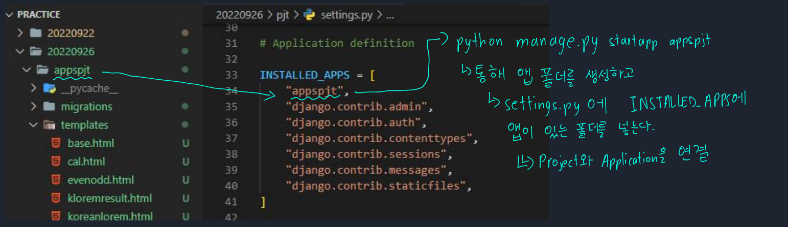
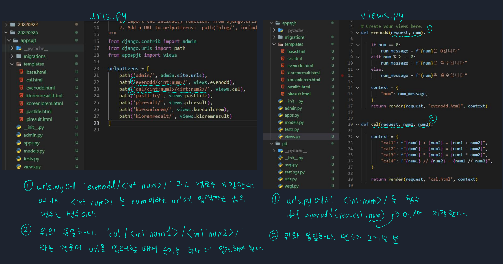

# 📋Django 2

#### Category

[Variable Routing](#%EF%B8%8F-variable-routing)

[Sending and Retrieving form data](#%EF%B8%8F-Sending-and-Retrieving-form-data)

[실습 설명](#%EF%B8%8F-실습-설명)

## 📌📌 Django 란?

- **URL로 요청이 오면, 내가 원하는 문서로 응답하는 것**

- **웹 서비스, 파이썬 기반 웹 프레임워크**

## ✔️ Variable Routing

> url 주소를 변수로 사용하는 것이다
>
> url의 일부를 변수로 지정하고, views.py에 함수의 인자로 넘길 수 있다

- 변수는 `<>` 에 정의한다
  - `<str: name>`
  -  `<int: number>`

## ✔️ Sending and Retrieving form data

>HTML Form element를 통해 사용자와 애플리케이션 간의 상호작용 이해

### Send

- 데이터를 어디 (action)로 어떤 방식 (method)으로 보낼지
  - 입력 데이터가 전송될 URL을 지정
  - 데이터를 어떻게 보낼 것인지를 정의 (HTML form 데이터는 GET 방식과 POST 방식으로 전송 가능)

### Retrieve

- 데이터 가져오기 (검색하기)
- 서버는 클라이언트로 받은 key-value 쌍의 목록과 같은 데이터를 받게 된다

## ✔️ 실습 설명

> ### 앱 설정

> ### urls.py

> ### Variable Routing

> ### Sending and Retrieving form data

> ### base.html

