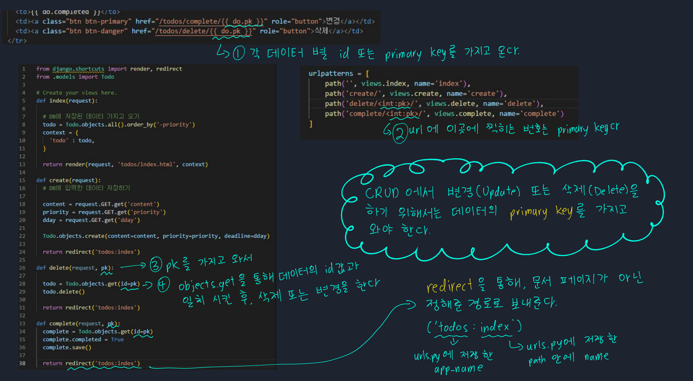

# 📋Django 5

#### Category

[urls.py](#%EF%B8%8F-urls.py)

[CRUD](#%EF%B8%8F-crud)

## 📌📌 Django 란?

- **URL로 요청이 오면, 내가 원하는 문서로 응답하는 것**

- **웹 서비스, 파이썬 기반 웹 프레임워크**

## ✔️ urls.py

> HTML에 URL 주소를 입력하는 것이 아닌, Django에서 만든 URL 코드를 쓸 수 있다
>
> ``
>
> path 이름만 사용할 수 있지만, 다른 어플리케이션과 겹치게 되면, 원하는 화면이 안 나올 수 있다
>
> 그래서 `urls.py`에 `app_name` 에 어플리케이션 이름을 설정하여, 어플리케이션 내 path의 이름으로 갈 수 있도록 한다 

## ✔️ CRUD

> 변경 또는 삭제를 하기 위해서는 하나의 데이터를 가지고 와야한다
>
> ORM에서 하나의 데이터 셋을 가지고 오는 코드는 `class이름.objects.get()`이다
>
> 즉, id 값을 가지고 와서 데이터 셋을 삭제 또는 변경을 하게 한다
>
> `redirect`를 통해서 원하는 페이지로 바로 갈 수 있도록 만든다. 삭제 또는 변경 같은 경우, 새로운 HTML문서를 보여줄 필요가 없다
>
> - delete, update, create 페이지를 만들되, redirect을 통해 `index` 페이지에 남게 할 수 있다

