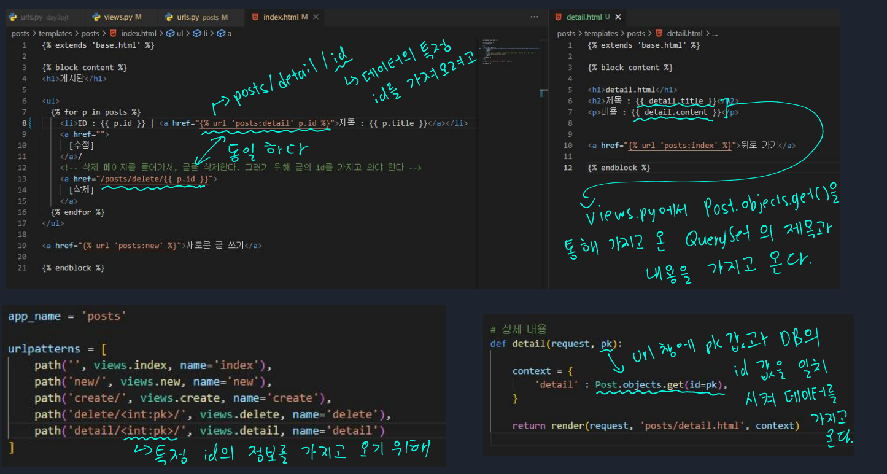
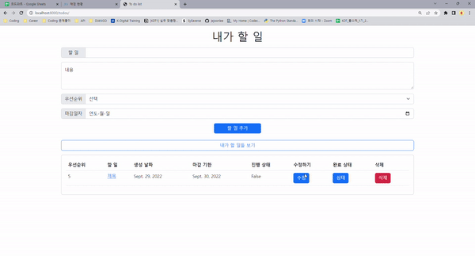

# 📋Django 6

[프로젝트 결과물](#%EF%B8%8F-프로젝트-결과물)

#### Category

[CRUD Detail Page](#%EF%B8%8F-crud-detail-page)

[Update](#%EF%B8%8F-update)

## 📌📌 Django 란?

- **URL로 요청이 오면, 내가 원하는 문서로 응답하는 것**

- **웹 서비스, 파이썬 기반 웹 프레임워크**

## ✔️ CRUD detail page

> CRUD 중 Read에 속한다
>
> 제목을 클릭하면 상세 페이지로 들어가는 기능
>
> 특정 데이터의 PK 또는 ID를 URL로 가져와야 한다
>
> 그 PK 또는 ID를 views.py에서 DB의 id 값과 일치시켜 해당 QuerySet의 정보를 가지고 와야 한다

## ✔️ Update

> ID 또는 PK 값을 활용하는게 제일 중요하다!
>
> 같은 ID 값을 통해, 해당 데이터를 가져와서 수정하기 때문이다.
>
> 1. `edit/` 에서는 특정 ID의 데이터를 수정하는 것이 아니라, 데이터를 입력하는 역할을 한다
> 2. `update/` 에 넘어가면서 입력한 데이터들은 `<input>`의 `name` attribute을 통해 전달이 된다
> 3. 그 `name` 정보들을 `request.Get.get()` 을 통해 views.py로 가지고 온다
> 4. 여기서도 똑같은 ID 값을 가지고 오고, 3번에서 가지고 온 데이터들을 ID의 데이터에 넣고 save를 한다

## ✔️ 프로젝트 결과물

>데이터 추가하기 기능 (Create)
>
>데이터 읽기 기능 (Read)
>
>- 내가 할일 목록

>삭제 기능 (Delete)
>
>완료 상태 - True면 글에 밑줄

>제목을 클릭하면, 안에 내용 보기
>
>해당 페이지에서, 내용 변경 기능으로 이동 가능하다

>데이터 수정 (Update)

