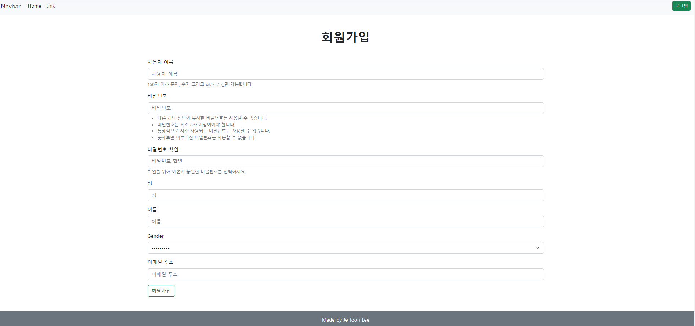
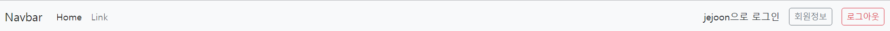
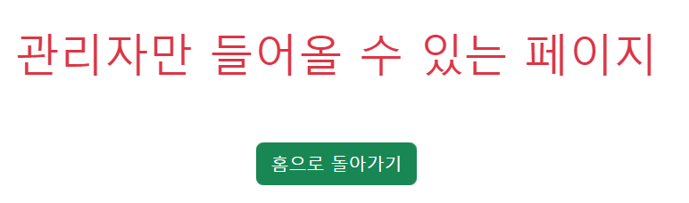
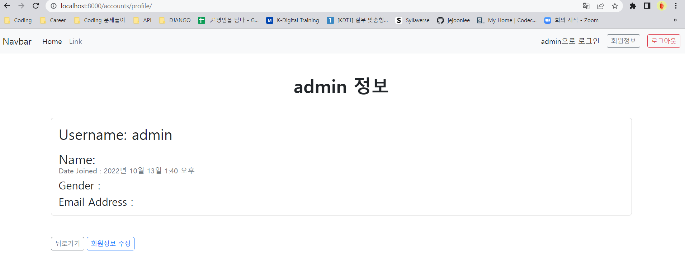
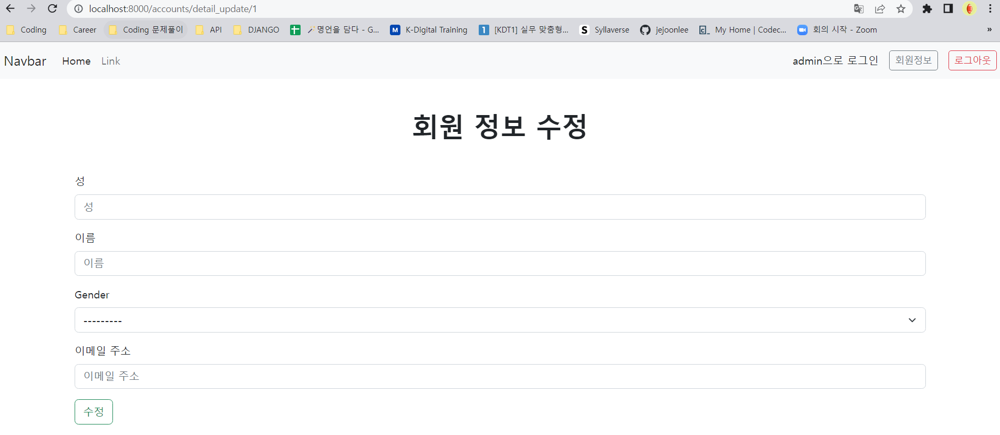
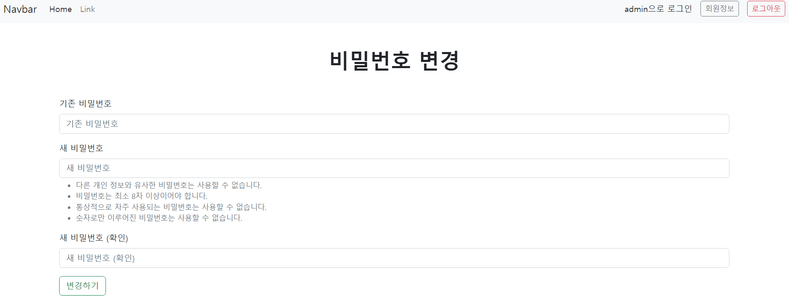

# 📋Django 12

> 이번주에 배운 내용을 토대로, 회원가입, 로그인, 로그아웃, 회원 정보 수정, 회원 탈퇴 등을 구현했다


#### Category

[회원가입](#%EF%B8%8F-회원가입)

[로그인](#%EF%B8%8F-로그인)

[로그아웃](#%EF%B8%8F-로그아웃)

[회원 목록](#%EF%B8%8F-회원-목록)

[회원 정보](#%EF%B8%8F-회원-정보)

[회원 정보 수정](#%EF%B8%8F-회원-정보-수정)

[회원 탈퇴](#%EF%B8%8F-회원-탈퇴)

[비밀번호-변경](#%EF%B8%8F-비밀번호-변경)


## ✔️ 회원가입



```python
def register(request):
  if request.method == 'POST':
    register_form = CustomUserForm(request.POST)
    
    if register_form.is_valid():
      user = register_form.save()
      auth_login(request, user)
      return redirect('articles:index')

  else:
    register_form = CustomUserForm()
  
  context = {
    'register_form': register_form,
  }

  return render(request, 'accounts/register.html', context)
```

> `forms.py`에서 CustomUserForm을 만들어준다. 여기서 `UserCreationForm`을 사용한다

- CustomUserForm은 커스텀으로 만든 유저 모델 (get_user_model())을 모델로 사용한다
- 주어진 Form에 입력한 내용이 유효하면 해당 Form을 저장한다
- 회원가입 시, 바로 로그인이 될 수 있도록 `auth_login`에 request의 user를 불러온다
  - 여기서 `auth_login`은 `from django.contrib.auth import login as auth_login`이다


## ✔️ 로그인


```python
def login(request):
  if request.method == 'POST':
    login_form = AuthenticationForm(request, data=request.POST)
    if login_form.is_valid():
      auth_login(request, login_form.get_user())
      return redirect(request.GET.get('next') or 'articles:index')

  else:
    login_form = AuthenticationForm()

  context = {
    'login_form': login_form,
  }

  return render(request, 'accounts/login.html', context)
```

> `AuthenticationForm` 을 `from django.contrib.auth.forms` 에서 가지고 온다
>
> 코드는 Create와 똑같다

- `AuthenticationForm`을 통해 입력한 정보에 대한 유저가 존재하는지 확인 한다
- 유저가 존재하고, 해당 정보가 유효하다면 `auth_login`을 통해 유저의 정보를 `session` 데이터베이스에 저장한다
- 로그인 후 `request.user`를 사용할 수 있다 (로그인한 유저의 정보를 불러오는 것)


## ✔️ 로그아웃



```python
def logout(request):
  auth_logout(request)
  return redirect('articles:index')
```

> 로그인을 했으면 원래 로그인 버튼이었던 곳에 `회원정보`와 `로그아웃`을 넣게 했다
>
> - base.html에서 if문으로 처리했다
> - if 문에 ``를 넣은다

- 로그아웃은 `from django.contrib.auth import logout as auth_logout` 을 가지고 온다
- 그리고 `auth_logout`을 통해 로그아웃을 시켜준다


## ✔️ 회원 목록



```python
from django.contrib.auth.decorators import login_required

@login_required
def index(request):
  if request.user.is_superuser:
    context = {
      'users' : get_user_model().objects.all()
    }
    return render(request, 'accounts/index.html', context)
  else:
    return redirect('accounts:warning')
```

> 회원 목록은 Super User만 들어올 수 있도록 만들었다.
>
> 당연히 해당 목록은 로그인을 해야해서 `@login_required`를 추가했다

- 슈퍼유저가 아닐 경우, 위에 있는 그림처럼 창이 나온다
- 밑에는 슈퍼유저일 경우 (admin), 회원 목록 페이지가 나온다


## ✔️ 회원 정보



```python
@login_required
def profile(request):
  return render(request, 'accounts/profile.html')
```

> 일반 회원들도 들어갈 수 있는 페이지
>
> 오른쪽 상단에 `회원정보`를 누르면 들어갈 수 있음
>
> - accounts/profile/

- 일반 회원들도 자신의 정보를 볼 수 있도록, `회원정보`를 누르면 볼 수 있는 프로필 페이지다


```python
@login_required
def detail(request, pk):
  if request.user.is_superuser:
    user = get_user_model().objects.get(pk=pk)
    context = {
      'user' : user,
      'num' : user.pk,
    }
    return render(request, 'accounts/detail.html', context)
  else:
    return redirect('accounts:warning')
```

> 회원 목록, 즉 슈퍼유저만 볼 수 있는 프로필 페이지다
>
> 슈퍼유저는 회원 목록을 통해, 모든 유저들의 프로필 페이지를 볼 수 있다

- URL을 보면 `accounts/1/detail`이다.
  - 유저들이 저장된 DB에서 pk값을 통해 보고 싶은 유저의 디테일 페이지에 들어가는 것이다
- 위에 있는 `profile` 페이지와 다르다. HTML문서도 각각 존재하고, `profile` 페이지는 `request.user` 정보를 통해 들어가는 페이지다


## ✔️ 회원 정보 수정



```python
def detail_update(request, pk):
  if request.user.is_superuser:
    user = get_user_model().objects.get(pk=pk)
    if request.method == 'POST':
      update_form = CustomUserChangeForm(request.POST, instance=user)
      if update_form.is_valid():
        update_form.save()
        return redirect('accounts:index')
    else:
      update_form = CustomUserChangeForm(instance=user)
    context = {
      'update_form' : update_form,
    }
    return render(request, 'accounts/detail_update.html', context)
  else:
    return redirect('articles:index')
```

> 이것도 슈퍼 유저만 접속할 수 있는 수정 페이지이다
>
> 위에는 주어진 정보만 수정할 수 있다
>
> 디테일 한 것은 밑에...


```python
@login_required
def update(request):
  if request.method == 'POST':
    update_form = CustomUserChangeForm(request.POST, instance=request.user)
    if update_form.is_valid():
      update_form.save()
      return redirect('accounts:profile')
  else:
    update_form = CustomUserChangeForm(instance=request.user)
  context = {
    'update_form': update_form,
  }

  return render(request, 'accounts/update.html', context)
```

> `회원정보`를 통해 들어올 수 있는 수정 페이지이다

- `forms.py`에서 `from django.contrib.auth.forms import UserChangeForm`을 통해 위에 적힌 `CustomUserChangeForm`을 모델폼으로 가지고 온다
  - `UserChangeForm`인 이유는 `UserCreationForm`과 다른 로직이 들어있다. 일단 비밀번호 같은 경우 `UserChangeForm`에서 처리할 수 없다
- 그리고 여기에서 이미 존재하는 데이터를 수정하는 것이라서 `instance`를 가지고 온다.
  - `instance`는 request.user, 즉 현재 로그인 한 유저의 정보
- 그 외에 CRUD의 Update와 똑같다


## ✔️ 회원 탈퇴


```python
def delete(request):
  request.user.delete()
  return redirect('articles:index')
```


## ✔️ 비밀번호 변경



```python
@login_required
def password(request):
  if request.method == 'POST':
    password_form = CustomPasswordChangeForm(request.user, request.POST)
    if password_form.is_valid():
      user = password_form.save()
      auth_login(request, user)
      return redirect('accounts:profile')
  else:
    password_form = CustomPasswordChangeForm(request.user)
  context = {
    'password_form' : password_form,
  }
  return render(request, 'accounts/password.html', context)
```

> `forms.py`에서 `class CustomPasswordChangeForm(PasswordChangeForm)`을 통해 비밀번호 모델폼을 만든다
>
> - `from django.contrib.auth.forms import PasswordChangeForm`을 통해 가지고 옴
