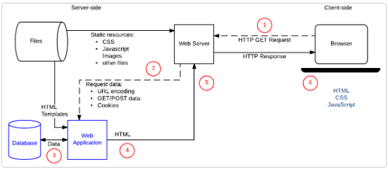

# 📋Python Basic 1

#### Category

[IP와 도메인](#%EF%B8%8F-IP와-도메인)

[클라이언트와 서버](#%EF%B8%8F-클라이언트와-서버)

[정적 웹 사이트와 동적 웹 사이트](#%EF%B8%8F-정적-웹-사이트와-동적-웹-사이트)

[HTTP](#%EF%B8%8F-HTTP)

[프레임워크](#%EF%B8%8F-프레임워크)

[Django 개발 환경 설정](#%EF%B8%8F-Django-개발-환경-설정)


## ✔️ 웹 브라우저

> 웹 기반으로 된 컨텐츠를 검색하거나 보기 위해 만들어진 응용 프로그램
>
> 예) chrome, Firefox
>
> 웹 브라우저를 통해 HTML 문서 등을 가지고 올 수 있다. (이 뜻은 웹사이트를 볼 수 있다는 것)


## ✔️ IP와 도메인

> IP : Internet Protocol

인터넷을 통해 모든 기기들이 무선 또는 유선으로 통해 연결이 되어 있다. 

인터넷을 통해 특정 서비스를 이용하려면, 이용할 서비스의 **주소** 그리고 그 서비스를 받으려는 **주소**가 있어야 한다. 

그 네트워크에 연결되어 있는 모든 디바이스들은 **IP 주소**가 있다

IP 주소는 주로 점으로 구분 된 네 개의 숫자로 구성된 주소다

그리고 도메인은 IP 주소가 숫자로 구성되어, 읽거나 기억하기 어려워, 글씨 형태로 사람들이 읽을 수 있도록 만든 이름이다. 즉 도메인에게 요청을 하면, 해당 도메인이 나의 IP 주소로, 원하는 서비스의 IP 주소를 보내준다.


> - 'My Computer' (IP: 192.168.2.10)에서 www.google.com 에게 구글의 서비스 (IP: 173.199.121.32)를 요청한다 - **Request**
> - 구글은 'My Computer'에게 구글의 IP 주소를 'My Computer' IP 주소에 보낸다 - **Response**


## ✔️ 클라이언트와 서버

> **클라이언트** : 웹 유저의 인터넷에 연결된 장치
>
> **서버** : 웹, 앱 등을 저장해 놓는 공간이다. 유저들은 이용하고 싶은 서비스를 서버를 통해 클라이언트로 받아온다. (복사본으로)

1. 유저가 브라우저에 **웹의 주소**를 쓴다 (여기서 웹의 주소는 **Domain**)
2. 그러면 **DNS (Domain Name System)** 을 통해, 브라우저는 해당 웹의 IP 주소를 찾는다
   1. 여기서 **DNS**은 '연락처' 같이, 핸드폰에 연락처에 연락할 상대방의 이름을 쓰면 나타나는 전화번호 같은 것이다. 
3. 브라우저가 IP주소를 찾으면 **HTTP(HyperText Transfer Protocol)** 요청 매세지를 서버에 보낸다
4. 해당 서버에서 요청을 수락을 하면 웹에 있는 모든 데이터를 클라이언트의 IP주소로 보내고, 클라이언트는 그 데이터를 다운받아서 사용한다


## ✔️ 정적 웹 사이트와 동적 웹 사이트

> 정적 웹 사이트 (Static WebSite)


- HTTP 요청을 통해 **정적 웹 사이트**를 가지고 오면, 이미 기본적으로 만들어진 사이트를 가지고 온다
  - HTML, CSS, JavaScript와 다른 component 요소들
- HTML 파일의 내용이 변하지 않고, 모든 사용자들은 같은 정보를 받게 된다


> 동적 웹 사이트 (Dynamic WebSite)



- 동적 웹사이트는 사용자가 입력하는 데이터에 따라 만들어지는 사이트이다
  - 예를 들면, 검색창에 검색어를 쓰면, URL을 통해 연관된 검색어가 있는 페이지에 들어간다
- 동적 웹사이트들의 코드는 서버에서 작동하여, 서버 사이드 언어를 사용해야 한다
  - Python, Java
- 위에 그림을 보면, HTML, CSS, Javascript 같이 정적인 요소들을 클라이언트에 가져온다.
- **그리고 만약 사용자가 데이터를 입력을 하였을 때에는 서버 사이드에서, 데이터 저장, 입력 등을 하고 변경된 HTML 파일을 통해 클라이언트 사이드로 다시 보낸다.**


### 둘의 차이점

- 기본적인 언어가 다르다
  - 정적 웹사이트 경우 HTML, CSS, Javascript가 기본이다
  - 반대로 동적 웹사이트는 다른 백앤드 언어를 사용한다 (Python, Node.js, Java)
- 정적 웹사이트는 클라이언트 사이드로 바로 데이터를 보낸다면, 동적 웹사이트는 주로 서버사이드에서 작동을 한다음, 클라이언트 사이드로 보낸다


## ✔️ HTTP

> HyperText Transfer Protocol
>
> 클라이언트와 서버가 소통할때 사용하는 언어다.

- HTTP를 통해 클라이언트가 서버에서 HTML 문서와 같은 리소스들을 가지고 올 수 있다
- 항상 클라이언트가 서버에게 **HTTP**를 통해 **request**를 하고, 서버에서 클라이언트에게 **HTTP**를 통해 **response**를 한다
  - 여기서 서버에서 요청을 수락하면, 클라이언트에게 HTML 문서과 같은 리소스들을 보내개 된다

`HTML --> CSS --> Javascript`


## ✔️ 프레임워크

> Framework
>
> Frame : 틀 | work : 일하다
>
> 틀을 가지고 일하는 것

개발을 하다보면, 처음부터 끝까지 모든 코드를 직접 쓰는 것은 시간이 매우 오래 걸린다.

그래서 이미 만들어진 코드들을 프레임워크에서 가지고 와서, 내가 개발하고 싶은 방향으로 개발을 한다

**즉 프레임워크는 개발을 위한 코드들을 모아놓은 곳이다**


## ✔️ Django 개발 환경 설정

```python
# 폴더를 생성한다
$ mkdir [폴더 이름]

# 폴더 안에 들어가고, *venv / 가상환경의 파일을 만든다
$ cd [폴더 이름]
$ python -m venv [가상환경 파일 이름]

# 가상환경 실행하기 / 성공하면 여기서부터 ([가상환경이름]) 이 밑에 뜬다
$ source [가상환경 파일 이름]/Scripts/activate

# 가상 환경에서 Django 3.2.13버전을 다운 받기
# 현재 컴퓨터에는 Django 4.0.6버전이다
$ pip install django==3.2.13

# 프로젝트 파일 만들기
# . 을 통해 현제 폴더에 프로젝트 파일 만들기
$ django-admin # 이걸 하면 무슨 명령을 할 수 있는지 목록이 나온다
$ django-admin startproject [프로젝트 이름] .
$ cd [프로젝트 이름]

# 프로젝트 파일 안에 있는 코드 보기
$ code .

# 파일 실행하기
$ python manage.py runserver

# localhost:8000 을 웹브라우저에 넣으면, 실행하는지 볼 수 있다

# venv 비활성화
$ deactivate
# 폴더 삭제
$ rm -r [폴더이름]
```

*venv : 가상환경을 만드는 이유는 외부의 환경을 안 받고 다른 버전의 언어 또는 프래임워크를 사용하기 위해서다.

- 예를 들면, 프로젝트를 진행하려고 할 때에 Python 버전이 현재 내 컴퓨터와 다를 수 있다
- 다른 버전의 Python으로 진행을 해야 할 때, 내 컴퓨터의 환경에 영향을 안 받기 위해, 가상의 환경 안에서 따로 Python 버전을 다운받아서 진행을 해야 한다


