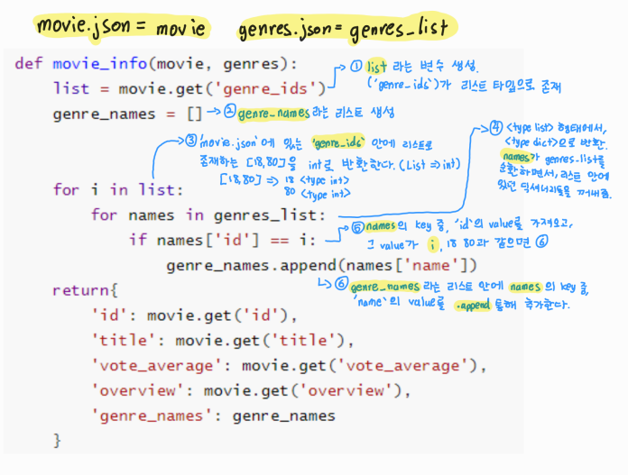
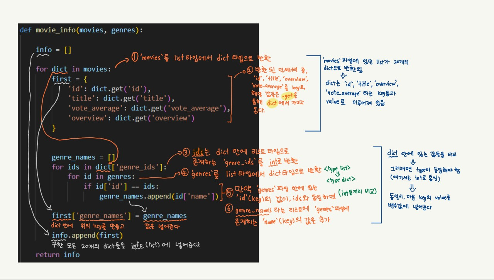

# 📋 Project 1

[00. 텍스트 데이터 출력 (연습)](#00-텍스트-데이터-출력 -연습)

[01. 텍스트 데이터 입력 (연습)](#01-텍스트-데이터-입력-연습)

[02. 텍스트 데이터 활용 - 특정 단어 추출](02-텍스트-데이터-활용-특정-단어-추출)

[03. 텍스트 데이터 활용 - 등장 횟수](#03-텍스트-데이터-활용-등장-횟수)

[04. JSON 데이터 활용 - 영화 단일 정보](#04- JSON-데이터-활용-영화-단일-정보)

[05. JSON 데이터 활용 - 영화 단일 정보 응용](#05-JSON-데이터-활용-영화-단일-정보-응용)

[06. JSON 데이터 활용 - 영화 다중 정보 활용](#06-JSON-데이터-활용-영화-다중-정보-활용)


## ✔️ 파이썬 기반 데이터 활용

### 목표

- Python 기본 문법(조건문, 반복문) 활용
- 파일 입출력을 통한 데이터 활용
- 텍스트 및 JSON 데이터의 활용


## 00. 텍스트 데이터 출력 (연습)

```python
with open('text.txt', 'w', encoding='utf-8') as f:
# with open을 통해서 'text.txt'를 만든다. 
# 여기서 'w'는 write의 줄임말, 쓰기 모드
    
    f.write('2회차 이제준\nHello, Python!\n')
    for i in range(1,6):					# range(1,6)는 1이상 6미만
        f.write(f'{i}일차 파이썬 공부 중\n')

# f.write는 'text.txt'에 어떤 내용이 쓰여야 할지 명령한다. print()와 비슷하다고 해야하나
```

- `f-string`은 문자열 가장 앞에 `f`를 붙여주고, `{}`에 어떤 값을 `{}`이 위치한 자리에 표현할지 적어두면 된다
  - 문자열 안에 변수를 넣어 준다!!!


## 01. 텍스트 데이터 입력 (연습)

```python
with open('fruits.txt', 'r', encoding = 'utf-8') as f:
# 'r'은 read, 읽기 전용
	fruits = f.read()			# f.read()는 파일의 내용 전체를 문자열로 반환
	list = fruits.split('\n')	# .split() 통해 문자열을 리스트로 반환

cnt = 0
for i in list:
    cnt += 1
print(cnt)

with open('01.txt', 'w', encoding = 'utf-8')as f:
    f.write(f'{cnt}')
```


## 02. 텍스트 데이터 활용 - 특정 단어 추출

```python
with open('./data/fruits.txt', 'r', encoding='utf-8') as f:
    fruits = f.read().split('\n')

cnt = 0
berry_list = []
final_list = []

for i in fruits:
    if i.endswith('berry'):
        berry_list.append(i)            # berry로 끝나는 단어를 berry_list에 추가한다
    for result in berry_list:           # berry_list에 있는 단어를 하나씩 꺼냄
        if result not in final_list:    # final_list에 result와 똑같은 값이 없으면,
            cnt += 1
            final_list.append(i)        # final_list에 단어를 넣는다

list = '\n'.join(final_list)			# 리스트를 한줄씩 str으로 반환

print(cnt)
print(list)

# '02.txt'라는 쓰기 모드의 파일을 만들어, 위에 출력된 결과를 넣어준다
with open('02.txt', 'w', encoding='utf-8') as f:
    f.write(f'{cnt}\n{list}')
```

- `.startswith` ~로 시작하는 / `.endswith` ~로 끝나는
- `' '.join()` 리스트를 문자열로 반환


## 03. 텍스트 데이터 활용 - 등장 횟수

```python
with open('./data/fruits.txt', 'r', encoding='utf-8') as f:
    fruits = f.read().split('\n')

    dict = {}

for i in fruits:
    if i in dict:
        dict[i] += 1               # 이미 'i'가 'dict'에 존재하면 값에 1을 더해준다
    else:
        dict[i] = 1

for x, y in dict.items():     # .item()을 사용하여 dictionary의 key와 value를 출력할 수 있다
    print(x, y)


with open('03.txt', 'w', encoding='utf-8') as f:
    for x, y in dict.items():    
        f.write(f'{x} {y}\n')   # print 대신 f.write를 f-string을 사용해서 문자열 안에 변수를 넣어 준다
```


## 04. JSON 데이터 활용 - 영화 단일 정보

```python
import json
from pprint import pprint


def movie_info(movie):
    return {                                        # return을 통해 output을 정한다
        'genre_ids': movie.get('genre_ids'),
        'id': movie.get('id'),
        'title': movie.get('title'),
        'vote_average': movie.get('vote_average'),
        'overview': movie.get('overview')
    }


# 아래의 코드는 수정하지 않습니다.
if __name__ == '__main__':
    movie_json = open('data/movie.json', encoding='UTF8')
    movie = json.load(movie_json)
    
    pprint(movie_info(movie))
```


## 05. JSON 데이터 활용 - 영화 단일 정보 응용

```python
def movie_info(movie, genres):
    list = movie.get('genre_ids')       
    genre_names = []                    


    for i in list:                     
        for names in genres_list:    
            if names['id'] == i:        
                genre_names.append(names['name'])   
    return{
        'id': movie.get('id'),
        'title': movie.get('title'),
        'vote_average': movie.get('vote_average'),
        'overview': movie.get('overview'),
        'genre_names': genre_names
    }
```



1. `list` 라는 변수 생성. ('genre_ids'가 리스트 타입으로 존재)
2. `genre_names`라는 리스트 생성
3. 'movie.json'에 있는 `genre_ids` 안에 리스트로 존재하는 [18, 80]을 `int`로 반환한다 (List → int)
4. <type 'list'>형태에서, <type 'dict'>로 반환. `names`가 `genre-list`를 순환하면서, 리스트 안에 있던 딕셔너리들을 반환
5. `names`의 key 중, 'id'의 value를 가져오고, 그 value가 `i` (18 80)과 같으면
6. `genre_names`라는 리스트 안에 `names`의 key 중, 'name'의 value를 `.append`를 통해 추가한다


## 06. JSON 데이터 활용 - 영화 다중 정보 활용

```python
import json
from pprint import pprint


def movie_info(movies, genres):
    
    info = []
    
    for dict in movies:
        first = {
            'id': dict.get('id'),
            'title': dict.get('title'),
            'vote_average': dict.get('vote_average'),
            'overview': dict.get('overview')
        }

        genre_names = []
        for ids in dict['genre_ids']:
            for id in genres:
                if id['id'] == ids:
                    genre_names.append(id['name'])

        first['genre_names'] = genre_names              

        info.append(first)

    return info
    


        
# 아래의 코드는 수정하지 않습니다.
if __name__ == '__main__':
    movies_json = open('data/movies.json', encoding='UTF8')
    movies_list = json.load(movies_json)

    genres_json = open('data/genres.json', encoding='UTF8')
    genres_list = json.load(genres_json)

    pprint(movie_info(movies_list, genres_list))
```



1. `movies`를 list 타입에서 dict 타입으로 반환
2. 반환된 딕셔너리 중 , `id`, `title`, `overview`, `vote-average`를 key로, 해당 값들은 `.get`을 통해 `dict`에서 가지고 온다
3. `ids`는 `dict` 안에 리스트 타입으로 존재하는 `'genre_ids'`를 `int`로 반환
4. `genre`를 list타입에서 dict 타입으로 반환
5. 만약 `genres`파일 안에 있는 `id` (key)의 값이, `ids`와 동일하면
6. `genre_names`라는 리스트에 `genres` 파일에 존재하는 `name` (key)의 값을 추가한다
7. 구한 모든 20개의 딕셔너리(`first`)들을 `info` (list)에 넣어준다
