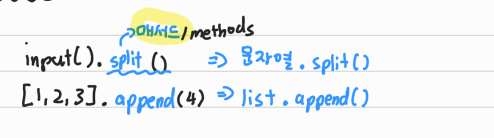
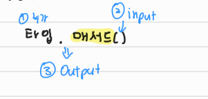

# 📋Python Methods

[Review](#%EF%B8%8F-review)

[Methods](#%EF%B8%8F-Methods-메서드)

[시퀀스](#%EF%B8%8F-시퀀스)

- [문자열 (String Type)](#문자열-string-type)
  - [문자열 탐색, 검증](#문자열-탐색-검증)
  - [문자열 변경](#문자열-변경)
- [리스트 (List)](#리스트-list)


## ✔️Review

> 변수와 타입
>
> `int`, `float`, `complex`, `bool`
>
> `str`, `list`, `tuple`, `range`
>
> `set`, `dictionary`


## ✔️ Methods (메서드)

> Methods (메서드)는 일종의 함수






## ✔️ 시퀀스


### 문자열 (String Type)

- #### 문자열 탐색, 검증

| 문법          | 설명                                                         |
| ------------- | ------------------------------------------------------------ |
| **.find(x)**  | x의 첫 번째 위치를 반환. 없으면, - 1을 반환                  |
| **.index(x)** | x의 첫 번째 위치를 반환. 없으면, 오류 발생                   |
| .isalpha()    | is alphabet (알파벳으로 이루어져있나?) / True or False       |
| .isupper()    | is upper (모두 대문자인가?) / True or False                  |
| .islower      | is lower (모두 소문자인가?) / True or False                  |
| .istitle      | is title (제목처럼, 앞의 문자가 대문자인가?) / True or False |

**.find(x)**

```python
print('apple'.find('p'))		# 1
print('apple'.find('k'))		# -1
```

**.index**

```python
print('apple'.find('p'))		# 1
print('apple'.find('k'))		# ValueError ....
```


- #### 문자열 변경

| **문법**                              | **설명**                                       |
| ------------------------------------- | ---------------------------------------------- |
| **.replace(old, new [, count])**      | **바꿀 대상 글자를 새로운 글자로 바꿔서 반환** |
| **.strip([chars])**                   | **공백이나 특정 문자를 제거**                  |
| **.split(sep = None, maxsplit = -1)** | 공백이나 특정 문자를 기준으로 분리             |
| **'seperator'.join([iterable])**      | 구분자로 iterable을 합침                       |
| .capitalize()                         | 가장 첫 번째 글자를 대문자로 변경              |
| .title()                              | '나 공백 이후 대문자로 변경                    |
| .upper()                              | 모두 대문자로 변경                             |
| .lower()                              | 모두 소문자로 변경                             |
| .swapcase                             | 대 ↔ 소문자 서로 변경                          |

**.replace(old, new [, count])**

```python
print('manchesterunited'.replace('t' , 'z'))
# mancheszerunized
print('weeeeeheee'.replace('e' , '@' , 4))
# w@@@@ehee			count를 지정하여, 해당 갯수만큼만 시행
```

**.strip([chars])**

- 특정한 문자들을 지정하면 주변 공백 제거
- 양쪽으로 제거하거나 (strip),  왼쪽을 제거하거나 (lstrip), 오른쪽을 제거(rstrip)

```python
print('     남는부분\n'.strip())				# '남는부분'
print('     남는부분\n'.lstrip())				# '남는부분\n'
print('     남는부분\n'.rstrip())				# '     남는부분'
print('     남는부분!!!!!!'.rstrip('!'))		# '     남는부분'
```

**.split(sep=None, maxsplit=-1)**

- 문자열을 특정한 단위로 나눠 리스트로 반환
  - maxsplit이 -1인 경우에는 제한이 없음

```python
print('a,b,c'.split('_'))
# ['a,b,c']
print('a,b,c'.split())
# ['a', 'b', 'c']
```

**'seperator'.join([iterable])**

- 반복가능한 (iterable) 컨테이너 요소들을 seperator(구분자)로 합쳐 **문자열 반환**
  - iterable에 문자열이 아닌 값이 있으면 TypeError 발생

```python
print(''.join(['3', '5']))
# 35
```


기타

```python
msg = 'hI! Everyone.'

print(msg)						# hI! Everyone.
print(msg.capitalize())			# Hi! everyone.
print(msg.title())				# Hi! Everyone.
print(msg.upper())				# HI! EVERYONE.
print(msg.lower())				# hi! everyone.
print(msg.swapcase())			# Hi! eVERYONE.
```


### 리스트 (List)

| 문법                      | 설명                                                         |
| ------------------------- | ------------------------------------------------------------ |
| **.append(x)**            | 리스트 마지막 항목에 x 추가                                  |
| **.insert(i,x)**          | 리스트 인덱스 i에 항목 x 삽입                                |
| **.remove(x)**            | 리스트 가장 왼쪽에 있는  항목 (첫번째) x를 제거. 항목이 존재하지 않을 경, ValueError |
| **.pop()**                | 리스트 가장 마지막에 있는 항복 반환 후 제거                  |
| **.pop(i)**               | 리스트의 인덱스 i에 있는 항목을 반환 후 제거                 |
| **.clear()**              | 모든 항목을 삭제                                             |
| .extend(m)                | 순회형 m의 모든 항목들의 리스트 끝에 추과 (+=과 같은 기능)   |
| **.index(x, start, end)** | 리스트에 있는 항목 중 가장 왼쪽에 있는 항목 x의 인덱스를 반환 |
| **.reverse()**            | 리스트를 거꾸로 정렬                                         |
| **.sort()**               | 리스트를 정렬                                                |
| **.count(x)**             | 리스트에서 항목 x가 몇 개 존재하는지 갯수를 반환             |


**.append(x)**

```python
football = ['manchesterunited', 'suwonbluewings', 'daegufc']
football.append('houstonrockets')

print(football)
# ['manchesterunited', 'suwonbluewings', 'daegufc', 'houstonrockets']
```

**.extend(iterable)**

```python
football = ['manchesterunited', 'suwonbluewings', 'daegufc']
football.extend(['suwonfc', 'realmadrid'])

print(football)
# ['manchesterunited', 'suwonbluewings', 'daegufc', 'suwonfc', 'realmadrid']
```

**.insert(i, x)**

- i 값이 리스트 길이보다 큰 경우, 맨 뒤로 삽입된다

```python
football = ['manchesterunited', 'suwonbluewings', 'daegufc']
football.insert(1, 'realmadrid')
print(football)
# ['manchesterunited', 'realmadrid', 'suwonbluewings', 'daegufc']

football.insert(10000, 'end')
print(football)
# ['manchesterunited', 'realmadrid', 'suwonbluewings', 'daegufc', 'end']
```

**.remove(x)**

```python
football = ['manchesterunited', 'suwonbluewings', 'liverpool']
football.remove('liverpool')

print(football)
# ['manchesterunited', 'suwonbluewings']

football.remove('liverpool')
# 이미 지운 상태라서, ValueError 가 뜬다
```

**.pop(i)**

- index를 지정하면, 해당 값은 삭제되고, 그 항목을 반환한다
  - i가 지정되지 않으면, 맨 마지막을 삭제하고 반환한다

```python
football = ['manchesterunited', 'suwonbluewings', 'liverpool', 'FCSeoul']
pop_football = football.pop(2)
print(pop_football)		# 'liverpool'
print(football)			# ['manchesterunited', 'suwonbluewings', 'FCSeoul']

pop_football = football.pop()		# 맨 마지막 값을 삭제
print(pop_football)		# 'FCSeoul'
print(football)			# ['manchesterunited', 'suwonbluewings']
```

**.clear()**

```python
football = ['manchesterunited', 'suwonbluewings', 'liverpool', 'FCSeoul']
print(football.clear()) # 모든 항목을 삭제한다
# []	모든 항목 제거
```

**.index(x)**

- x값을 찾아 해당 index 값을 반환

```python
football = ['manchesterunited', 'suwonbluewings', 'daegufc', 'realmadrid']
print(football.index('manchesterunited'))
# 0
print(football.index('google'))
# 'google'은 없으므로 ValueError가 뜬다
```

**.count(x)**

- 원하는 값의 개수를 반환함

```python
number = [1, 1, 2, 3, 3, 4, 1, 1]
print(number.count(1))
# 4
print(number.count(7))
# 0
```

**.sort()**

- 원본 리스트를 정렬한다. None 반환
- sorted 함수와 비교할 것

```python
number = [1, 7, 3, 2, 6]
result = number.sort()
print(number, result)
# [1, 2, 3, 6, 7] None
print(number.sort())
# None
-------------------------------------------------------------------------
number = [1, 7, 3, 2, 6]
result = sorted(number)
print(number, result)
# [1, 7, 3, 2, 6] [1, 2, 3, 6, 7]
   # 정렬된 리스트를 반환. 원본 변경 없음
```

**.reverse**

```python
number = [1, 7, 3, 2, 6]
result = number.reverse()
print(number, result)
# [6, 2, 3, 7, 1] None
리스트의 순서를 바꾸는 것이지, 정렬하는 것이 아님. None으로 반환
```

