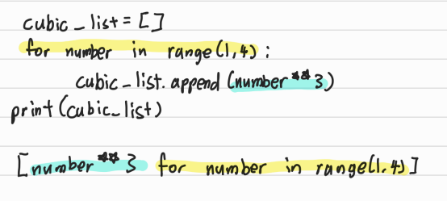
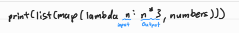

# 📋 Python 응용/심화

### Category

[List Comprehension](#%EF%B8%8F-list-comprehension)

[Dictionary Comprehension](#%EF%B8%8F-dictionary-comprehension)

[Lambda](#%EF%B8%8F-lambda)

[Filter](#%EF%B8%8F-filter)

[파이썬 표준 라이브러리](#%EF%B8%8F-파이썬-표준-라이브러리)

[가상 환경](#%EF%B8%8F-가상-환경)

[API](#%EF%B8%8F-api)


## ✔️ List Comprehension

> 표현식과 제어문을 통해 특정한 값을 가진 리스트를 간결하게 생성하는 방법
>
> 특정한 요소로 구성된 **리스트**로 만들 때, 유용하다

`[<expression> for <변수> in <iterable>]`

`[<expression for <변수> in <iterable> if <조건식>]`

```python
# 1~3의 세제곱의 결과가 담긴 리스트 만들기

cubic_list = []
for number in range(1, 4):
    cubic_list.append(number ** 3)
print(cubic_list)

# List Comprehension
cubic_list = [number ** 3 for number in range(1, 4)]
```




## ✔️ Dictionary Comprehension

`{key: value for <변수> in <iterable>}`

`{key: value for <변수> in <iterable> if <조건식>}`

```python
# 1~3의 세제곱의 결과가 담긴 딕셔너리
cubic_dict = {}
for number in range(1, 4):
    cubic[number] = number ** 3
print(cubic_dict)

# Dictionary Comprehension
cubic_dict = {number: number ** 3 for number in range(1, 4)}
```


## ✔️ Lambda

> 이름이 없는 (익명)의 함수
>
> 더보기 [click](./python_lambda.md)

**특징**

- return문을 가질 수 없음
- 간편 조건문 외 조건문이나 반복문을 가질 수 없음

**장점**

- 함수를 정의해서 사용하는 것보다 간결하게 사용 가능
- def를 사용할 수 없는 곳에서도 사용가능

```python
numbers = [1, 2, 5, 10, 3, 9, 12]

# 기본 반복/조건 코드
result = []
for n in numbers:
    result.append(n * 3)
print(result)
# [3, 6, 15, 30, 9, 27, 36]

# map을 쓰려면 함수를 정의해야 한다
def multiple_3(n):
    return n * 3
print(list(map(multiple_3, numbers)))
# [3, 6, 15, 30, 9, 27, 36]

# 람다 함수를 사용해 일시적으로 함수를 만들어낸다
print(list(map(lambda n: n * 3, numbers)))
# [3, 6, 15, 30, 9, 27, 36]
```




## ✔️ Filter

> 순회 가능한 데이터 구조(iterable)의 모든 요소에 함수(function) 적용하고, 그 결과가 True인 것들을 filter object로 반환
>
> iterable 중 참인 것들을 반환한다

```python
# 3의 배수인 리스트로만 만들기
numbers = [1, 2, 5, 10, 3, 9, 12]

# 기본 반복/조건 코드
result = []
for i in numbers:
    if n % 3 == 0:
        result.append(i)
print(result)
# [3, 9, 12]

# 람다 활용
print(list(filter(lambda i: i % 3 == 0, numbers)))
# [3, 9, 12]

# 함수 활용
def div_3(n):
    return n % 3 == 0
print(list(filter(div_3, numbers)))
```


## ✔️ 파이썬 표준 라이브러리

> 파이썬에 기본적으로 설치된 모듈과 내장 함수
>
> https://docs.python.org/ko/3/library/index.html

#### 파이썬 패키지 관리자 (PIP)

- PyPI (Python Package Index)에 저장된 외부 패키지들을 설치하도록 도와주는 패키지 관리 시스템


#### 파이썬 패키지 관리자 (PIP) 명령어

- 패키지 설치
  - 최신 버전/ 특정 버전 / 최소 버전을 명시하여 설지할 수 있음
  - 이미 설치되어 있는 경우 이미 설치되어 있음을 알리고 아무것도 하지 않음

`$ pip install SomePackage`

`$ pip install SomePackage==1.0.5`

`$ pip install 'SomePackage>=1.0.4'`


- 패키지 삭제
  - pip는 패키지를 업그레이드 하는 경우 과거 버전을 자동으로 지워줌

`$ pip uninstall SomePackage`


- 패키지 목록 및 특정 패키지 정보

`$ pip list`

`$ pip show SomePackage`


- 패키지 freeze
  - 설치된 패키지의 비슷한 목록을 만들지만, pip install에서 활용되는 형식으로 출력
  - 해당하는 목록을 requirements.txt(관습)으로 만들어 관리함

`$ pip freeze`


- 패키지 관리하기
  - 아래의 명령어들을 통해 패키지 목록을 관리하고 설치할 수 있다
  - 일반적으로 패키지를 기록하는 파일의 이름을 requirements.txt로 정의한다

`$ pip freeze > requirements.txt`

`$ pip install -r requirements.txt`

`$ pip freeze > requirements.txt`

`$ pip install -r requirements.txt`


## ✔️ 가상 환경

> 파이썬 표준 라이브러리가 아닌 외부 패키지와 모듈을 사용하는 경우 모두 pip를 통해 설치를 해야한다
>
> 복수의 프로젝트를 하는 경우 버전이 상이할 수 있다
>
> - 과거 외주 프로젝트 - django 버전 2.x
> - 신규 회사 프로젝트 - django 버전 3.x
>
> 이렇나 경우 가상환경을 만들어 프로젝트별로 독립적인 패키지를 관리할 수 있다


#### venv

- 가상 환경을 만들고 관리하는데 사용되는 모듈 (Python 버전 3.5부터)
- 특정 디렉토리에 가상환경을 만들고, 고유한 파이썬 패키지 집합을 가질 수 있음


## ✔️ API

> Application Programming Interface 응용 프로그램 인터페이스

컴퓨터나 컴퓨터 프로그램 사이의 연결 / 프로그램을 제어한다

​	예) TV를 조작하기 위한 인터페이스는 **리모콘**이다


**API를 활용시 확인 사항**

- 요청하는 방식에 대한 이해
  - 인증방식
  - URL (기본주소/ 원하는 기능에 대한 추가 경로/ 요청 변수)
- 응답 결과에 대한 이해
  - 응답 결과 타입 (JSON) / 응답 결과 구조

```python
import requests

BASE_URL = 'https://api.themoviedb.org/3'
path = '/movie/43261'
# path 는 원하는 기능에 대한 '추가 경로'이다

# api_key 발급받아서 각자 키를 넣는 것
params = {
    'api_key': '',
    'language': 'ko-KR'
}

# 응답 받은 값을 JSON 형태로 가지고 오는 것
response = requests.get(BASE_URL+path, params=params).json()

print(response)
```

