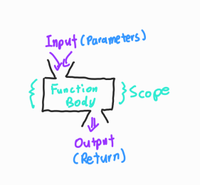

# 📋 Python Function

#### Category

[Why Function?](#%EF%B8%8F-why-function)

[함수](#%EF%B8%8F-함수)

- [사용자 함수](#사용자-함수)
- [함수 기본 구조](#함수-기본-구조)
- [선언과 호출](#선언과-호출)

[함수의 결과값 (Output)](#%EF%B8%8F-함수의-결과값-output)

[함수의 입력 (Input)](#%EF%B8%8F-함수의-입력-input)

- [Positional Arguments](#positional-arguments)
- [Keyword Arguments](#keyword-arguments)
- [Default Arguments Values](#default-arguments-values)
- [정해지지 않은 개수의 Argument](#정해지지-않은-개수의-argument)
- [정해지지 않은 개수의 Keyword Argument](#정해지지-않은-개수의-keyword-argument)

[함수의 범위 (Scope)](#%EF%B8%8F-함수의-범위-scope)

[함수 응용](#%EF%B8%8F-함수-응용)

- [map](#map)


## ✔️ Why Function?

> Decomposition : 기능을 분해해서, 재사용이 가능하다
>
> Abstraction : 추상화 (복잡한 내용을 숨기고, 기능에 집중하여 사용할 수 있음)


- Abstraction
  - 어떤 기능이 들어갔는지는 모르지만, input을 넣으면 output이 결과로 나온다

––– **Input** –→  📁  –→ **Output** –––


## ✔️ 함수

> 함수 (Function)는 특정한 기능을 하는 코드의 조각 (묶음)
>
> 사용자가 필요 시에만 호출하여 간편히 사용이 가능하다

#### 사용자 함수(Custom Function)

```python
def function_name					# function_name 에 입력할 값의 변수를 넣는다
	# code block
    return returning_value			# 반환할 값을 설정한다
-----------------------------------------------------------------------------------------------------------
# 예)
def add(a, b):
    return a + b

print(add(a, b))
```


#### 함수 기본 구조



- 선언과 호출 (Define & call)
- 입력 (Input)
- 범위 (Scope)
- 결과값 (Output)


#### 선언과 호출

> 선언할 때에는 `def` 키워드를 활용한다
>
> 호출은 함수명() 으로 호출한다

```python
# def == 선언 / func(a, b) == 호출
def func(a, b):
    return a + b
```


## ✔️ 함수의 결과값 (Output)

> 반드시 값을 **하나만 return** 한다.
>
> '콤마'를 활용하여 튜플로 반환할 수 있다

```python
def double(a, b):
    return a + b
	return a * b

print(double(1, 1))
# 2, 맨 위의 'return' 값만 반환된다
--------------------------------------------------------------------------------

def double(a, b):
    return a + b, a * b
print(double(1, 1))
# (2, 1) , 컴마를 이용함으로 튜플로 반환된다
```

#### return vs print

> **return**은 함수 안에서 값을 반환하기 위해 사용되는 키워드
>
> **print**는 출력을 위해 사용되는 함수


## ✔️ 함수의 입력 (Input)

> Parameter : 함수를 실행할 때, 함수 내부에서 사용되는 식별자
>
> Argument : 함수를 호출 할 때, 넣어주는 값

```python
def function(ham):		# parameter : ham
    return ham

function('spam')		# argument : 'spam'
```

#### Argument

- 함수 호출 시 함수의 parameter를 통해 전달되는 값
- value sent to the function when it is called


#### Positional Arguments

> 위치에 따라 함수 내에 전달

```python
def add(x, y):
    return x + y

add(2, 3)
# 위치에 따라 함수가 전달된다. x = 2 / y = 3
```


#### Keyword Arguments

> 직접 변수의 이름으로 특정 Argument를 전달

```python
def add(x, y):
    return x + y

add(y=5, x=2) or add(2, y=5)
# x, y의 값을 설정을 해준다. x = 2 / y = 5
```


#### Default Arguments Values

> 기본값을 정의해두는 것

```python
def add(x, y=0):
    return x + y

add(2)
# y는 이미 0으로 정의가 되어 있다. x = 2 / y = 0
```


#### 정해지지 않은 개수의 Argument

> 여러 개의 Positional Argument를 하나의 필수 parameter로 받아서 사용
>
> Argument들은 튜플로 묶여 처리되며, parameter에 *를 붙인다

```python
def add(*args):
    for arg in args:
        print(arg)
add(2)				# 2
add(2, 3, 4, 5)		# 2 3 4 5
```


#### 정해지지 않은 개수의 Keyword Argument

> 함수가 임의의 개수 Argument를 Keyword Argument로 호출될 수 있도록 지정
>
> 내부에서 Keyword Argument 딕셔너리 활용
>
> parameter에 **를 붙여 표현

```python
def my_function(**kid):
  print("His last name is " + kid["lname"])

my_function(fname = "Tobias", lname = "Refsnes")

# His last name is Refsnes
```


## ✔️ 함수의 범위 (Scope)

> 코드 내부에 local scope를 생성하며, 그 외 공간인 global scope로 구분

- Scope
  - Global Scope : 코드 어디에서든 참조할 수 있는 공간
  - Local Scope : 함수가 만든 scope. 함수 내부에서만 참조 가능

- 객체 생병주기
  - Built-in Scope : 파이썬이 실행된 이후부터 영원히 유지
  - Global Scope : 모듈이 호출된 시점 이후 혹은 인터프리터가 끝날 때까지 유지
  - Local Scope : 함수가 호출될 때 생성이되고, 함수가 종료될 때까지 유지


#### 이름 검색 규칙 (Name Resolution)

> LEGB Rule : Local scope → Enclosed Scope → Global Scope → Built-in scope
>
> 이 순서로 이름을 찾아 다닌다

**Local Scope** : 함수

**Enclosed Scope** : 특정 함수의 상위 함수

**Global Scope** : 함수 밖의 변수, Import 모듈

**Built-in Scope** : 파이썬 안에 내장되어 있는 함수 또는 속성


## ✔️ 함수 응용

> 파이썬 인터프리터에는 사용할 수 있는 많은 함수와 형(type)이 내장되어 있음

#### map

`map(function, iterable)` : 순회 가능한 데이터구조(iterable)의 모든 요소에 함수(function)를 적용하고, 그 결과를 map object로 반환

```python
number = ['1', '2', '3']
# 리스트를 숫자로 형 변환 불가능/ 숫자에서 문자는 가능

a = int(number[0])
b = int(number[1]) .... # 이렇게 해야 숫자로 변경된다

new_num = map(int, number)
print(new_num) / print(list(new_num)) 
# map 을 이용해서 리스트를 숫자 형으로 변환했다
```

