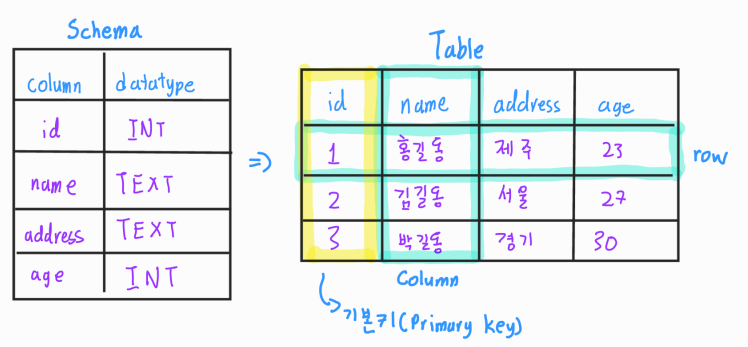

# 📋DataBase Basic

### Practice

[수업 복습](https://github.com/jejoonlee/sql_practice/blob/master/20220816/Practice/2_classmates.sql)

[Healthcare](https://github.com/jejoonlee/sql_practice/tree/master/20220816/Practice_2)


### Category

[Database란](#%EF%B8%8F-Database란)

​		[데이터베이스로 얻는 장점들](#데이터베이스로-얻는-장점들)

[RDB](#%EF%B8%8F-RDB)

[RDBMS](#%EF%B8%8F-RDBMS)

​		[SQLite Data Type](#sqlite-data-type)

[SQL](#%EF%B8%8F-SQL)

[CRUD](#%EF%B8%8F-CRUD)

​		[CREATE](#CREATE)

​		[READ](#READ)

​		[UPDATE](#UPDATE)

​		[DELETE](#DELETE)


## ✔️ Database란

> 데이터의 모임 / 정보의 집합

- 데이터베이스는 체계화된 데이터의 모임
- 여러 사람이 공유하고 사용할 목적으로 통합 관리되는 정보의 집합
- 논리적으로 연관된 (하나 이상의) 자료의 모음으로 그 내용을 고도로 구조화 함으로써 검색과 갱신의 효율화를 꾀한 것
- **즉, 몇 개의 자료 파일을 조직적으로 통합하여 자료 항목의 중복을 없애고 자료를 구조화하여 기억시켜 놓은 자료의 집합체**


#### 데이터베이스로 얻는 장점들

- 데이터 중복 최소화
- 데이터 무결성 (정확한 정보를 보장)
- 데이터 일관성
- 데이터 독립성 (물리적 / 논리적)
- 데이터 표준화
- 데이터 보안 유지


## ✔️ RDB

> Relational Database (관계형 데이터베이스)

- 서로 관련된 데이터를 저장하고 접근할 수 있는 데이터베이스 유형
- 키(key)와 값(value)들의 간단한 관계(relation)를 표(table) 형태로 정리한 데이터 베이스

 

- #### Schema

  - 데이터베이스에서 자료의 구조, 표현방법, 관계등 전반적인 명세를 기술 한 것
    - 어떤 자료가 들어갈지 기록

- #### 테이블

  - 열(컬럼/필드)과 행(레코드/값)으 ㅣ모델을 사용해 조직된 데이터 요소들의 집합

- #### 열 (column)

  - 각 열에 고유한 데이터 형식 지정

- #### 행 (row)

  - 실제 데이터가 저장되는 형태

- #### 기본키 (Primary Key)

  - 각 행(레코드)의 고유 값 / 중복을 없애기 위해서


## ✔️ RDBMS

> 관계형 데이터베이스 관리 시스템 (Relational Database Management System)

- MySQL, SQLite, PostgreSQL, ORACLE, SQL Server 등이 있다
- SQLite
  - 서버 형태가 아닌 파일 형식으로 응용 프로그램에 넣어서 사용하는 비교적 가벼운 데이터베이스
  - 구글 안드로이드 운영체제에 기본적으로 탑재된 데이터베이스이며, 임베디드 소프트웨어에도 많이 활용됨
  - 로컬에서 간단한 DB구성을 할 수 있으며, 오픈소스 프로젝트이기 때문에 자유롭게 사용가능


### SQLite Data Type

1. **NULL** :  아무것도 없음
2. **INTEGER** : 크기에 따라 0, 1, 2, 3, 4, 6 또는 8바이트에 저장된 부호 있는 정수
3. **REAL** : 8 바이트 부동 소수점 숫자로 저장된 부동 소수점 값
4. **TEXT**
5. **BLOB** : 입력된 그대로 정확히 저장된 데이터


### Resulting Affinity

- **INTEGER**
  - INT / INTEGER / TINYINT / SMALLINT / MEDIUMINT / BIGINT / UNSIGNED BIG INT / INT2 / INT8
- **TEXT**
  - CHARACTER(20) / VARCHAR(255) / VARYING CHARACTER(255) / NCHAR(55) / NATIVE CHARACTER(70) / NVARCHAR(100) / TEXT / CLOB
- **BLOB**
  - BLOB (no datatype specified)
- REAL
  - REAL / DOUBLE / DOUBLE PRECISION / FLOAT
- **NUMERIC**
  - NUMERIC / DECIMAL (10, 5) / BOOLEAN / DATE / DATETIME


## ✔️ SQL

> Structured Query Language
>
> Query = 질의

- 관계형 데이터베이스 관리시스템의 데이터 관리를 위해 특수 목적으로 설계된 프로그래밍 언어
- 데이터베이스 스키마 생성 및 수정
- 자료의 검색 및 관리
- 데이터베이스 객체 접근 조정 관리

| 분류                                                | 개념                                                         | 예시                               |
| --------------------------------------------------- | ------------------------------------------------------------ | ---------------------------------- |
| DDL - 데이터 정의 언어 (Data Definition Language)   | 관계형 데이터베이스 구조(테이블, 스키마)를 정의하기 위한 명령어 | CREATE / DROP / ALTER              |
| DML - 데이터 조작 언어 (Data Manipulation Language) | 데이터를 저장, 조회, 수정, 삭제 등을 하기 위한 명령어        | INSERT / SELECT / UPDATE / DELETE  |
| DCL - 데이터 제어 언어 (Data Control Langauage)     | 데이터베이스 사용자의 권한 제어를 위해 사용하는 명령어       | GRANT / REVOKE / COMMIT / ROLLBACK |

#### **SQL Keywords - Data Manipulation Language**

- INSERT : 새로운 데이터 삽입(추가)
- SELECT : 저장되어 있는 데이터 조회
- UPDATE : 저장되어 있는 데이터 갱신
- DELETE : 저장되어 있는 데이터 삭제


## ✔️ CRUD

### 데이터베이스 생성하기

```sqlite
$ sqlite3 tutorial.sqlite3
sqlite> .database

-- 데이터베이스를 생성한 후
-- 오른쪽 마우스에서 'open database'

sqlite> .headers on
sqlite> .mode column

-- rowid  name  age  address
-- -----  ----  ---  -------
-- 1      홍길동   23   서울
```


### Create

```sqlite
CREATE TABLE players (
    name TEXT NOT NULL,
    age INTEGER NOT NULL,
    address TEXT NOT NULL
);

.schema players
--CREATE TABLE players (
--    name TEXT NOT NULL,
--    age INTEGER NOT NULL,
--    address TEXT NOT NULL
--);

-- 여러 정보 한번에 넣기
INSERT INTO players VALUES
('홍길동','23','서울'),
('손흥민','29','서울'),
('세징야','30','대구'),
('전진우', '24','수원'),
('염기훈', '36','수원');
```

- **INSERT**
  - `INSERT INTO 테이블_이름 (컬럼1, 컬럼2) VALUES (값1, 값2);`
  - `INSERT INTO 테이블_이름 VALUES (값1, 값2, 값3);`


### READ

> 보고싶은 정보를 SELECT 다음에 넣으면 된다

```sqlite
SELECT rowid, * FROM players;
-- rowid  name  age  address
-- -----  ----  ---  -------
-- 1      홍길동   23   서울
-- 2      손흥민   29   서울
-- 3      세징야   30   대구
-- 4      전진우   24   수원
-- 5      염기훈   36   수원

SELECT rowid, name, address FROM players;
-- rowid  name  address
-- -----  ----  -------
-- 1      홍길동   서울
-- 2      손흥민   서울
-- 3      세징야   대구
-- 4      전진우   수원
-- 5      염기훈   수원

-- LIMIT 3를 해서 위에서 3명을 가지고 온다
SELECT rowid, name, address FROM players LIMIT 3;
-- rowid  name  address
-- -----  ----  -------
-- 1      홍길동   서울
-- 2      손흥민   서울
-- 3      세징야   대구

-- 앞에 3명을 건너뛰고, 그 뒤에 2명을 가지고 온다
SELECT rowid, name, address FROM players LIMIT 2 OFFSET 3;
-- rowid  name  address
-- -----  ----  -------
-- 4      전진우   수원
-- 5      염기훈   수원

-- 중복값을 없애준다
SELECT DISTINCT address FROM players;
-- address
-- -------
-- 서울
-- 대구
-- 수원

```

- **LIMIT**
  - 쿼리에서 반환되는 행 수를 제한
  - OFFSET 키워드랑 함께 사용
- **WHERE**
  - 쿼리에서 반환된 행에 대한 특정 검색 조건을 지정
- **SELECT DISTINCT**
  - 조회 결과에서 중복 행을 제거


### UPDATE

```sqlite
-- 저장된 정보에서 정보를 수정하기
UPDATE players SET name = '오헌규', age = 22 WHERE rowid = 5;
```

- `Where` 에 수정할 값을 넣고, `UPDATE players SET`을 통해 수정될 값을 넣는다


### DELETE

```sqlite
-- rowid가 5인 정보를 삭제한다
DELETE FROM players WHERE rowid = 5;
-- rowid  name  age  address
-- -----  ----  ---  -------
-- 1      홍길동   23   서울
-- 2      손흥민   29   서울
-- 3      세징야   30   대구
-- 4      전진우   24   수원
```

