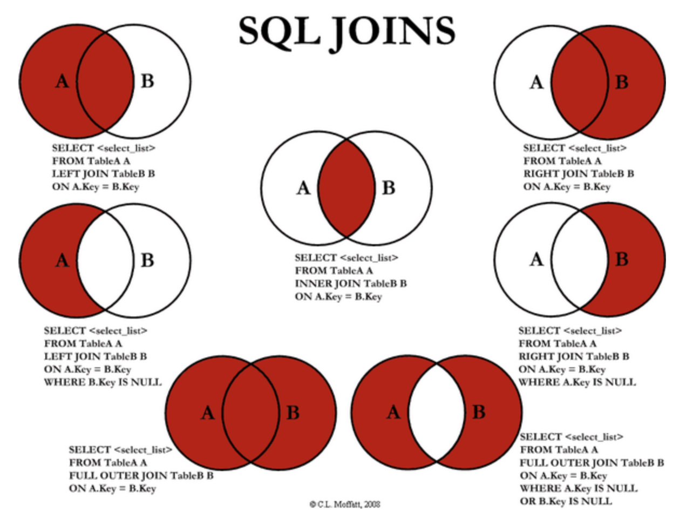
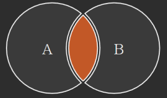
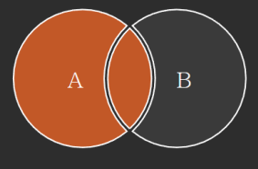
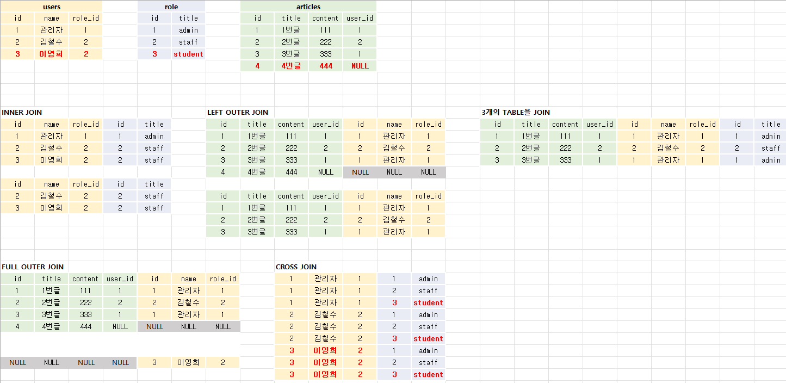

# 📋DataBase 기본 함수와 연산

### Practice

[JOIN](https://github.com/jejoonlee/sql_practice/blob/master/20220822/Practice/join.sql)

[실습](https://github.com/jejoonlee/sql_practice/tree/master/20220822/Practice_2)


### Category

[JOIN](#%EF%B8%8F-join)


## ✔️ JOIN

> 데이터베이스에는 하나의 테이블에 많은 데이터를 저장하는 것이 아니라 여러 테이블로 나눠 저장하게 된다
>
> 이럴 때에 여러 테이블을 결합(JOIN)하여 출력하여 활용
>
> 이때 외래키(Foreign Key)를 사용한다

#### 외래키

- 다른 테이블에 있는 정보를 Foreign Key를 통해 가지고 온다
- 주로 Foreign Key는 다른 테이블에 있는 `id` 를 가지고 온다



#### INNER JOIN

> 두 테이블에 모두 일치하는 행만 반환

```sqlite
SELECT *
FROM 테이블1 [INNER] JOIN 테이블2
ON 테이블1.칼럼 = 테이블2.칼럼;
```




#### OUTER JOIN

> 동일한 값이 없는 행도 반환

```sqlite
SELECT *
FROM 테이블1 [LEFT|RIGHT|FULL] OUTER JOIN 테이블2
ON 테이블1.칼럼 = 테이블2.칼럼;
```



이건 `OUTER JOIN` 중 `LEFT OUTER JOIN`


#### CROSS JOIN

> 모든 데이터의 조합

```sqlite
SELECT *
FROM users CROSS JOIN role;
```



