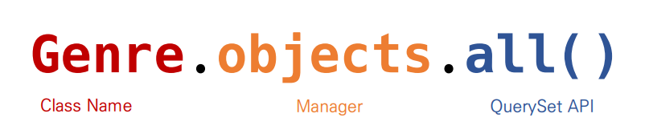

# 📋DataBase ORM

### Practice

[ORM Practice](./Practice.md)


### Category

[Object](#%EF%B8%8F-object)

[ORM](#%EF%B8%8F-orm)

- [모델 설계 및 반영](#모델-설계-및-반영)
- [Migrations](#migrations)

[ORM 기본조작](#%EF%B8%8F-orm-기본조작)


## ✔️ Object

> 모든 것이 객체!

- 객체는 **속성**과 **메서드**를 가지고 있다
  - 속성 : 어떠한 값 (`값`)
  - 메서드 : Class 내부에 저장된 함수 (`함수`) 
- **클래스 / 인스턴스**
  - 클래스 : 틀 (예: 사람)
  - 인스턴스 : 사례 (예: 방민아, 송민호)


## ✔️ ORM

> Object Relational Mapping
>
> 객체 지향 프로그래밍 언어 (Python)으로 Database를 조작하는 것
>
> 객체(Object)로 DB를 조작한다

- 객체 지향 프로그래밍 언어를 사용하여 호환되지 않는 유형의 시스템 간의 데이터를 변환하는 프로그래밍 기술
- 파이썬에는 SQLAlchemy, peewee 등 라이브러리가 있으며 Django 프레임워크에서는 내장 Django ORM을 활용


```python
# 파이썬
Genre.objects.all()
```

```sqlite
-- sql
SELECT * FROM Genre;
```

- 둘은 같은 맥락이다
- 파이썬에서는 데이터를 일종의 리스트로 변환해서 출력한다


### 모델 설계 및 반영

- ##### 클래스를 생성하여 내가 원하는 DB의 구조를 만든다

```python
class Genre(models.Model):
    name = models.CharField(max_length = 30)

# Genre는 Table 이름
# name은 행의 이름
# CharField는 입력될 행의 값의 타입 (ex. TEXT)
```

- ##### 클래스의 내용으로 데이터베이스에 반영하기 위한 migrations 파일을 생성한다

```python
# 터미널
$ python manage.py makemigrations

# migrations 폴더가 만들어진다
# migrations 폴더 안에 000_initial.py 파일이 만들어진다
```

- ##### DB에 migrate 한다

```python
# 터미널
$ python manage.py migrate

# SQLite 데이터 베이스가 만들어진다!
```


### Migrations

- Model에 생긴 변화를 DB에 반영하기 위한 방법
- Migrations 파일을 만들어 DB 스키마를 반영한다
- 명령어
  - `makemigrations` : migrations 파일 생성
  - `migrate` : migrations를 DB에 반영


#### Migrate

```python
BEGIN;
--
-- Create model Genre
--
CREATE TABLE "db_genre" (
"id" integer NOT NULL PRIMARY KEY AUTOINCREMENT,
"name" varchar(30) NOT NULL
);
COMMIT;
```

- 데이터들이 들어가는데, 모든 데이터들이 문제가 없으면 DB에 반영한다
- 반대로 오류가 뜨면 DB에 반영을 안 한다




## ✔️ ORM 기본조작

#### CREATE

```python
# 1. create 메서드 사용
Genre.objects.create(name = 'POP')

# 2. 인스턴스 조작
genre = Genre()
genre.name = 'POP'
genre.save()
```


#### READ

```python
# 1. 전체 데이터 조회 (all)
Genre.objects.all()
# <QuerySet [<Genre: Genre object (1)>, <Genre: Genre object (2)>]>

# 2. 일부 데이터 조회 (get)
Genre.objects.get(id = 1)
# <Genre: Genre object (1)>

# 3. 일부 데이터 조회 (filter)
Genre.objects.filter(id = 1)
# <QuerySet [<Genre: Genre object (1)>]>
```

`.get` 과 `.filter` 의 차이

- `.get` : 반드시 하나만 출력한다. 값이 존재하지 않거나, 많으면 오류가 뜬다
  - Primary Key는 값이 하나씩 존재함으로, ID 값을 찾고 싶을때 주로 쓴다
- `.filter` : 무조건 결과가 QuerySet (일종의 리스트)
  - PK가 아닌 DB에서 WHERE처럼 데이터를 조회하고 싶을 때 사용한다


#### UPDATE

```python
# 1. genre 객체를 활용
genre = Genre.objects.get(id = 1)
# 2. genre 객체 속성 변경
genre.name = 'Rap'
	# 만약 id, 1번의 노래 이름이 POP이었으면, Rap으로 바뀐다
# 3. genre 객체 저장
genre.save()
```


#### DELETE

```python
# 1. genre 객체 활용
genre = Genre.objects.get(id = 1)
# 2. genre 객체 삭제
genre.delete()
```


