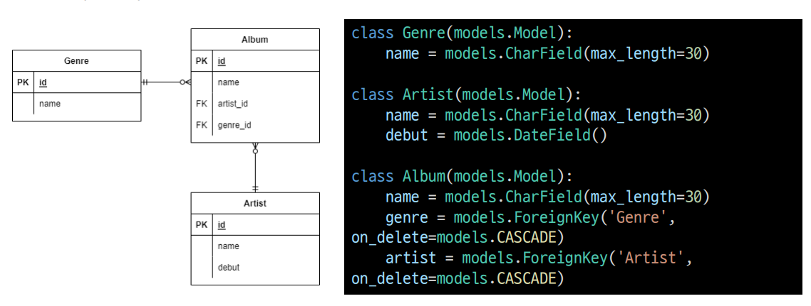

# 📋Database QuerySet API

### Practice

[QuerySet Practice](./Practice.md)


### Category

[QuerySet API](#%EF%B8%8F-queryset-api)

[활용](#%EF%B8%8F-활용)

[ORM 확장](#%EF%B8%8F-orm-확장)


## ✔️ QuerySet API

> 트로트의 앨범들 (plural) = QuerySet
>
> 앨번들의 장르 (singular) = 인스턴스


#### gt

> greater than

```python
Entry.objects.filter(id__gt = 4)
# Entry에서 id가 4보단 큰 query를 가지고 옴
```

```sqlite
SELECT ... WHERE id > 4;
```


#### gte

> greater than eqal

```python
Entry.objects.filter(id__gte = 4)
# Entry에서 id가 4보다 같거나 큰 query를 가지고 온다
```

```sqlite
SELECT ... WHERE id >= 4;
```


#### lt

> less than

```python
Entry.objects.filter(id__lt = 4)
# Entry에서 id가 4보다 작은 query를 가지고 온다
```

```sqlite
SELECT ... WHERE id > 4;
```


#### lte

> less than equal

```python
Entry.objects.filter(id__lte = 4)
# Entry에서 id가 4보다 같거나 작은 query를 가지고 온다
```

```sqlite
SELECT ... WHERE id >= 4;
```

#### 

#### in

```python
Entry.objects.filter(id__in=[1, 3, 4])
Entry.objects.filter(headline__in='abc')
# Entry에서 id 중 1, 3, 4이 포함된 것을 가지고 온다
# Entry에서 headline 중 'abc'가 포함된 것을 가지고 온다
```

```sqlite
SELECT ... WHERE id IN (1, 3, 4);
SELECT ... WHERE headline IN ('a', 'b', 'c');
```


#### startswith

> ~ 시작하는

```python
Entry.objects.filter(headline__startswith='Lennon')
# Entry에서 headline 중 'Lennon'으로 시작하는 것을 가지고 온다
```

```sqlite
SELECT ... WHERE headline LIKE 'Lennon%';
```


#### istartswith

> ~ 시작하는데 대소문자 구분 안 함

```python
Entry.objects.filter(headline__istartswith='Lennon')
# Entry에서 headline이 'Lennon'으로 시작하는 것을 가지고 오지만, 대소문자를 구분 안 한다
```

```sqlite
SELECT ... WHERE headline ILIKE 'Lennon%';
```

- 대소문자 구분하지 않음


#### endswith

> ~ 끝나는

```python
Entry.objects.filter(headline__endswith='Lennon’)
Entry.objects.filter(headline__iendswith='Lennon')
# Entry에서 headline이 'Lennon'으로 끝나는 것을 가지고 온다
```

```sqlite
SELECT ... WHERE headline LIKE '%Lennon';
SELECT ... WHERE headline ILIKE '%Lennon
```


#### contains

> ~ 포함

```python
Entry.objects.get(headline__contains='Lennon’)
Entry.objects.get(headline__icontains='Lennon’)
# Entry에서 headline이 'Lennon'이 포함된 query를 가지고 옴
```

```sqlite
SELECT ... WHERE headline LIKE '%Lennon%’;
SELECT ... WHERE headline ILIKE '%Lennon%';
```


#### Range

> 범위

```python
import datetime
start_date = datetime.date(2005, 1, 1)
end_date = datetime.date(2005, 3, 31)
Entry.objects.filter(pub_date__range=(start_date, end_date))
# Entry에서 pub date 중 'start_date'와 'end_date' 사이에 있는 쿼리를 가지고 옴
```

```sqlite
SELECT ... WHERE pub_date
BETWEEN '2005-01-01' and '2005-03-31';
```


#### 복합 활용

```python
inner_qs = Blog.objects.filter(name__contains='Cheddar')
entries = Entry.objects.filter(blog__in=inner_qs)
# 서브 쿼리
# inner_qs는 Blog에 name 중 'Cheddar'를 포함하는 ID
# entries는 inner_qs ID 중 Entry와 동일한 쿼리
```

```sqlite
SELECT ...
WHERE blog.id IN (SELECT id FROM ... WHERE NAME
LIKE '%Cheddar%’);
```


## ✔️ ORM 확장

> 1 : N

#### Foreign Key (외래키)

- 키를 사용하여 부모 테이블의 유일한 값을 참조 (참조 무결성)
  - 데이터베이스 관계 모델에서 관련된 2개의 테이블 간의 일관성
- 외래 키의 값이 반드시 부모 테이블의 기본 키일 필요는 없지만 유일한 값이어야 함

#### models.ForeignKey 필드

2개의 필수 위치 인자

- Model class : 참조하는 모델
- on_delete : 외래 키가 참조하는 객체가 삭제되었을 때 처리 방식
  - CASCADE : 부모 객체 (참조 된 객체)가 삭제 됐을 때 이를 참조하는 객체도 삭제
  - PROTECT : 삭제되지 않음
  - SET_NULL : NULL 설정
  - SET_DEFAULT : 기본 값 설정



- `Genre` 와 `Artist` 가 `ForeignKey`를 통해 연결이 되었다


#### Create

```python
artist = Artist.objects.get(id = 1)
# Artist의 id 중 1번을 가지고 온다
genre = Genre.objects.get(id = 1)
# Genre의 id 중 1번을 가지고온다

album = Album()
album.name = '앨범1'
album.artist = artist
album.genre = genre
album.save()
# 엘범에 있는 artist와 genre column에 Artist에서 가지고 온 ID와 Genre에서 가지고 온 ID를 저장한다
# 여기서 Artist에서 가지고 온 ID는 artist / Genre에서 가지고 온 ID는 genre
```


#### 참조와 역참조

```python
# 참조
album = Album.objects.get(id = 1)
album.artist
# <Artist: Artist object (1)>
album.genre
# <Genre: Genre object (1)>

# 2. 역참조
genre = Genre.objects.get(id=1)
genre.album_set.all()
# <QuerySet [<Album: Album object (1)>, <Album:
Album object (2)>]>

# 역참조를 쓸 때에는 '소문자_set'을 쓴다
```


