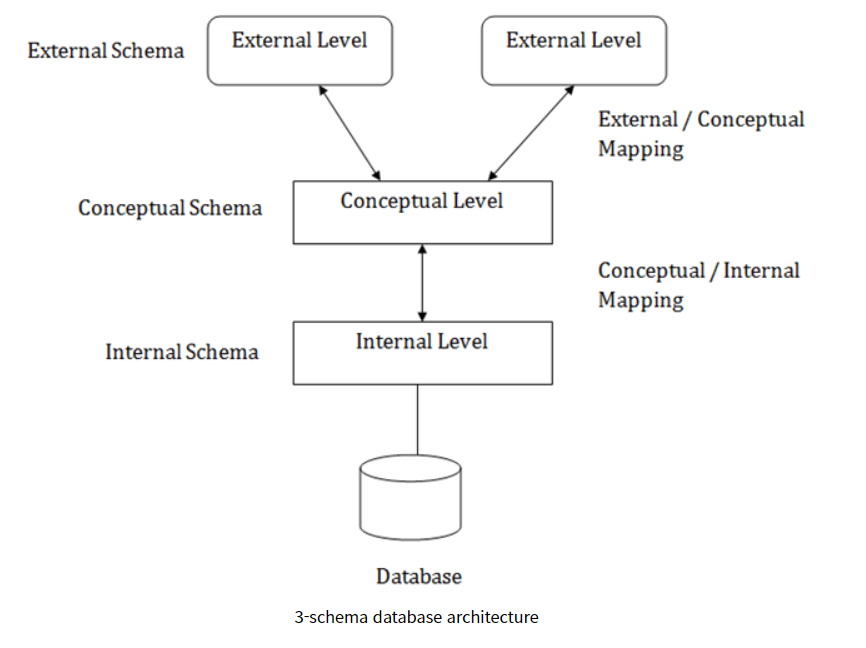

# 📋 SQLD 시험

[데이터 모델의 이해](#%EF%B8%8F-데이터-모델의-이해)

## ✔️ 데이터 모델의 이해

> 데이터 모델링이란?

- 정보시스템을 구축하기 위한 데이터 관점의 업무 분석 기법
- 현실세계의 데이터(what)에 대해 약속된 표기법에 의해 표현하는 과정
- 데이터베이스를 구축하기 위한 분석/설계의 과정
- 모델링은 단지 시스템 구현만을 위해 수행하는 것이 아니며, 시스템 구현을 포함한 업무 분석 및 업무 형상화를 하는 목적도 있다

> 데이터 모델링을 하는 주요한 이유

1. 업무정보를 구성하는 기초가 되는 정보들에 대해 일정한 표기법에 의해 표현하여, 정보시스템 구축의 대상이 되는 업무 내용을 정확하게 분석
2. 분석된 모델을 가지고 실제 데이터 베이스를 생성하여 개발 및 데이터 관리에 사용

즉 데이터 모델링은 데이터 베이스를 구축 하기 위한 용도만이 아닌, 데이터 모델링 자체로도 업무를 설명하고 분석하는 부분에서도 매주 중요하다

> 데이터 모델링을 할 때 유의할 사항

- **중복 (Duplication)** 
  - 중복되는 정보를 저장하는 않도록 한다
- **비유연성 (Inflexibility)** 
  -  데이터 혹은 프로세스의 작은 변화가 애플리케이션 또는 데이터베이스에 중대한 변화를 일으킬 수 있는 가능성을 줄인다
- **비일관성 (Inconsistency)** 
  - 데이터 간의 상호 연관 관계를 명확하게 정의하여 일관성 있게 데이터가 유지되도록 한다

> 모델링의 개념

- **개념적 데이터 모델링** 
  - 추상화 수준이 높고 업무 중심적이고 포괄적인 수준의 모델링 진행
  - 전사적 데이터 모델링, EA수립시 많이 이용
- **논리적 데이터 모델링** 
  - 시스템을 구축하고자 하는 업무에 대해 Key, 속성, 관계 등을 정확하게 표현, 재사용성이 높음
- **물리적 데이터 모델링** 
  - 실제로 데이터 베이스에 이식할 수 있도록 성능, 저장 등 물리적인 성격을 고려하여 설계

> 데이터 베이스 스키마 구조 3단계

- **외부 시키마 (External Schema)**
  - *최상위 단계*로 *뷰 단계*라고도 한다
  - 사용자, 프로그래머, 관리자 같이 나눠서 관심 있는 부분만 설명하고, 나머지는 세부사항은 숨긴다
- **개념 스키마 (Conceptual Schema)**
  - *논리적 단계*라고 한다
  - 데이터 베이스 전체 구조를 추상화하는 단계로 *개념 스키마*를 통해 구조를 기술한다
- **내부 스키마 (Internal Schema)**
  - *물리적 단계*라고 하며, 추상화의 *최하위 단계*이다
  - 하나의 내부 스키마가 존재하고, 개념 스키마에 대한 저장 구조를 정의한 것이므로 *저장 스키마*라고 한다

> ERD 작성 순서

엔터티를 그린다 → 엔터티를 적절하게 배치 → 엔터티간 관계 설정 → 관계명을 기술 → 관계의 참여도를 기술 → 관계의 필수여부를 기술

-  어디에 배치하는 것은 크게 중요하지 않다

> 엔터티의 특징

실체, 객체라는 의미로, 업무에 필요하고 유용한 정보를 저장하고 관리하기 위한 집합적인 것이다

- 반드시 해당 업무에서 **필요하고 관리하고자 하는 정보**여야 한다
- 유일한 식별자에 의해 식별이 가능해야 한다
- 영속적으로 존재하는 인스턴스의 집합이어야 한다 (한 개가 아니라 두 개 이상)
- 엔터티는 업무 프로세스에 의해 이용되어야 한다
- 엔터티는 반드시 속성이 있어야 한다
- 엔터티는 다른 엔터티와 최소 한 개 이상의 관계가 있어야 한다

