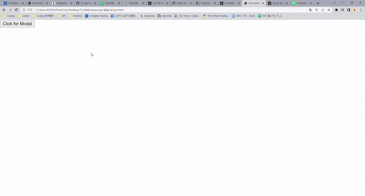

# 📋Web JavaScript

#### Category

[로그인](#%EF%B8%8F-로그인)


## ✔️ 로그인



오늘 배운 Modal을 사용해서 로그인 창을 만들어보았다

**먼저 버튼을 클릭했을때, Modal 입력창에 에니메이션을 주어 박스가 느리게 내려오는 효과를 주었다**

```css
animation-name: modal-box-appear;
animation-duration: 0.4s;

@keyframes modal-box-appear{
    from {top: -10px}
    to {top: 10px}
```

- `@keyframes` 을 통해 top 기준 -10px 에서 출발해서 10px까지 내려오도록 했다
  - 여기서 top 기준 10px은 `position: absolute` 기준에서 `top: 10px`을 미리 설정을 해 놓았다
- `animation-duration` 을 통해 내려오는 시간을 0.4초를 주었다

**그리고 JS에서 if문을 통해서 로그인 정보를 넣었을 때 발생할 수 있는 여러가지 변수들을 주었다**

```javascript
    // 로그인 확인
    const submit = document.querySelector('.submit')
    const email = document.querySelector('.email-input')
    const password = document.querySelector('.password-input')
    const passwordV = document.querySelector('.password-verify-input')

    submit.addEventListener('click', function() {
      if (!email.value || !password.value || !passwordV.value) {
        alert('빈칸을 채워주세요')
        return
      }
      if (password.value.length < 5) {
        alert('비밀번호 개수는 6개 이상입니다')
        return
      }

      if ((password.value !== passwordV.value)) {
        alert('비밀번호가 일치하지 않습니다')
        return
      }
      if (!email.value.includes('@')) {
        alert('이메일 형식이 틀립니다')
        return
      }
    })
```

- 여기서 제일 중요한 것은, 각 칸의 value를 비교하는 것이다!
