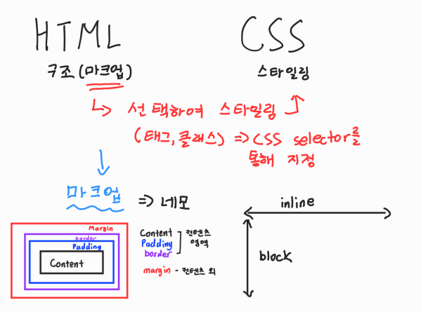
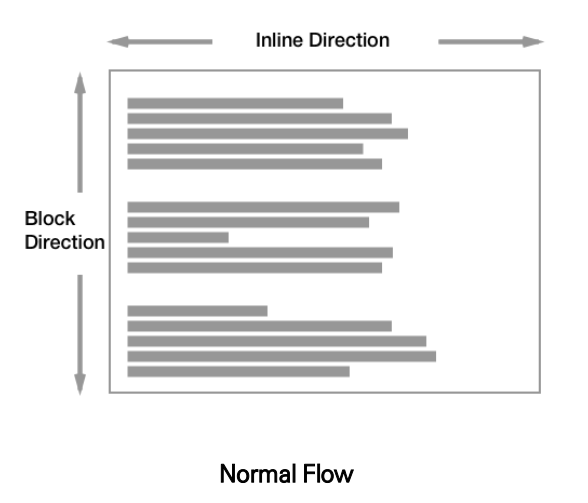
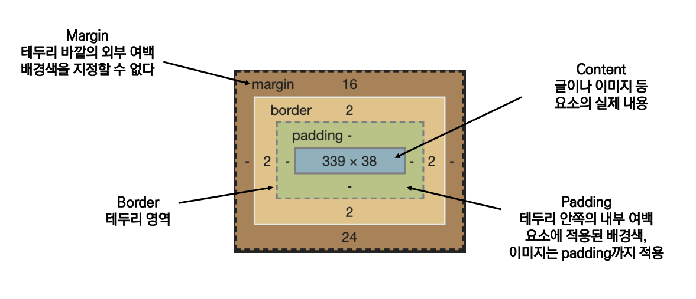
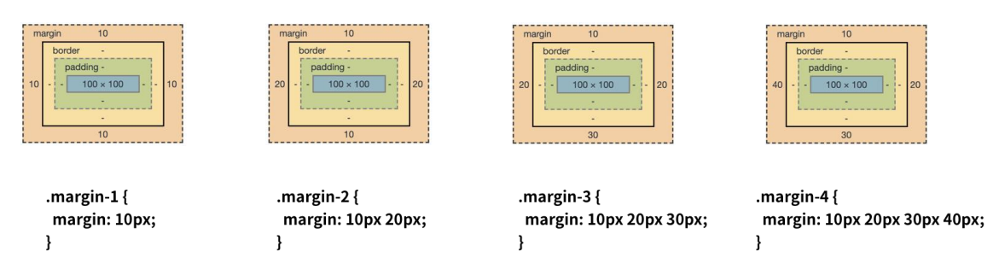

# 📋Web HTML & CSS

[실습](https://github.com/jejoonlee/TIL/blob/master/Web/%EC%8B%A4%EC%8A%B5/20220830/README.md)

#### Category

[CSS 기본 스타일](#%EF%B8%8F-css-기본-스타일)

- [크기 단위](#크기-단위)
- [색상 단위](#색상-단위)
- [CSS 문서 표현](#css-문서-표현)

[CSS Selectors](#%EF%B8%8F-css-selectors)

- [선택자(selector) 유형](#선택자(selector)-유형)
- [CSS 적용 우선순위](#CSS-적용-우선순위)
- [CSS 상속](#css-상속)

[CSS Box Model](#%EF%B8%8F-css-box-model)

- [Box Sizing](#box-sizing)

[CSS Display](#%EF%B8%8F-css-display)




## ✔️ CSS 기본 스타일

### 크기 단위

**px (픽셀)**

- 모니터 해상도의 한 화소인 '픽셀' 기준
- 픽셀의 크기는 변하지 않기 때문에 고정적인 단위

**%**

- 백분율 단위 (예) 해당 넓이(전체 스크린)의 몇 프로)
- 가변적인 레이아수에서 자주 사용

**em**

- (바로 위, 부모 요소에 대한) 상속의 영향을 받음
- 배수 단위, 요소에 지정된 사이즈에 상대적인 사이즈를 가잠

**rem**

- (바로 위, 부모 요소에 대한) 상속의 영향을 받지 않음
- 최상위 요소 (html)의 사이즈 기준으로 배수 단위를 가짐
  - 여기서 **html의 기본 사이즈는 16px**이다.

```html
<style>
	.font-big {
		font-size: 36px;
	}
	.em {
		font-size: 2em;
	}
	.rem {
		font-size: 2rem;
	}
</style>

<body>
	<ul class="font-big">
		<li class="em">2em</li>
		<li class="rem">2rem</li>
		<li>no class</li>
	</ul>
</body>
```

- 여기서 'rem'은 `2rem`이기 때문에 16px *` 2rem`이 된다
  - 즉 36px
- 'em'은 위에 부모 `font-big`의 크기가 36px이기 때문에, 36px * 2em 이다
  - 즉 72px

**viewport**

- 웹 페이지를 방문한 유저에게 바로 보이게 되는 웹 컨텐츠의 영역 (디바이스 화면)
- 디바이스의 viewport를 기준으로 상대적인 사이즈가 결정됨
  - `vw : 넓이` / `vh : 높이` / `vmin : 최소 viewport` / `vmax :최대 viewport`


### 색상 단위

- 색상 키워드 (`background-color: red;`)
  - 대소문자를 구분하지 않음
  - red, blue, black 과 같은 특정 색을 직접 글자로 나타냄
- RGB 색상 (`background-color: rgb(0, 255, 0);`)
  - 16진수 표기법 혹은 함수형 표기법을 사용해서 특정 색을 표현하는 방식
- HSL 색상(`background-color: hsl(0, 100%, 50%);`)
  - 색상, 채도, 명도를 통해 특정 색을 표현하는 방식


### CSS 문서 표현

- 텍스트
  - 서체(font-family), 서체 스타일(font-style, font-weight 등)
  - 자간(letter-spacing), 단어 간격(word-spacing), 행간(line-height) 등
- 컬러(color), 배경(background-image, background-color)
- 기타 HTML 태그별 스타일링
  - 목록 (li), 표 (table)


## ✔️ CSS Selectors

### 선택자(selector) 유형

- 기본 선택자
  - 전체 선택자, 요소 선택자
  - 클래스 선택자, 아이디 선택자, 속성 선택자
- 결합자 (Combinators)
  - 자손 결합자, 자식 결합자
  - 일반 형제 결합자, 인접 형제 결합자
- 의사 클래스/요소(Pseudo Class)
  - 링크, 동적 의사 클래스
  - 구조적 의사 클래스, 기타 의사 클래스, 의사 엘리먼트, 속성 선택자


### CSS 적용 우선순위

1. **중요도 (Importance) : 사용시 주의**
   - !important
2. **우선 순위 (Specificity)**
   - 인라인  →  id (#id_name)  →  class (.class_name), 속성, pseudo-class  → 요소, pseudo-element
3. **CSS 파일 로딩 순서**


### CSS 상속

- CSS는 상속을 통해 부모 요소의 속성을 자식에게 상속한다 (MDN에서 확인할 수 있음)
  - 속성(프로퍼티) 중에는 상속이 되는 것과 되지 않는 것들이 있다
  - 상속 되는 것 예시
    - 예) Text 관련 요소 (font, color, text-align), opacity, visibility 등
  - 상속 되지 않는 것 예시
    - 예) Box model 관련 요소 (width, height, margin, padding, border, box-sizing, display), position 관련 요소(position, top/right/bottom/left, z-index) 등


## ✔️ CSS Box Model

> **모든 요소는 네모 (박스 모델)이고, 위에서부터 아래로, 왼쪽에서 오른쪽으로 쌓인다. (좌측 상단에 배치)**



- Inline Direction: 한 줄 배치. 왼쪽에서 오른쪽으로. 새로운 줄을 만들지 않는다
- Block Direction: block으로 위, 아래 배치한다. 즉 새로운 줄을 만든다


#### 하나의 박스는 네 부분(영역)으로 이루어져 있다



- **Margin**은 콘텐츠 요소가 아니다. 배경색을 지정할 수 없음

> 크기 조절도 가능하다.
>
> 1. 상하좌우, 모두 margin이 `10px`
> 2. `10px = 상하` / `20px = 좌우`
> 3. `10px = 상` / `20px = 좌우` / 30 = 하`
> 4. `10px = 상` /  `20px = 우` /  `30px = 하` /  `40px = 좌`




### Box sizing

> 일반적으로 박스를 만들면, content, padding, border 모두 더해야 한다

```css
.box{
    width: 100px;
    margin: 10px auto;
    padding: 20px;
    border: 1px black solid;
}
```

- 위를 보면 content 넓이는 100px, padding 20px 그리고 border가 1px이다
  - content는 하나기 때문에 100px
  - padding은 좌우 20px 씩이니깐 40px
  - border도 좌우 1px씩이니깐 2px
  - 총 142px이 된다

> 하지만 box-sizing을 border-box로 설정을 하게 되면, css에서 알아서 내가 원하는 너비로 맞춰준다

- 위에서 넓이 100px을 맞추고 싶다
  - padding과 border는 그대로 놔둔다
  - content 즉 width에서 100px이 아니라, 42px을 줄인 58px로 바뀐다


## ✔️ CSS Display

> 모든 요소는 네모(박스모델)이고, 좌측상단에 배치
>
> **display에 따라 크기와 배치가 달라진다**

#### display: block

- 줄 바꿈이 일어나는 요소
- 화면 크기 전체의 가로 폭을 차지한다. margin으로 없애려고 해도, 무조건 차지한다
- 블록 레벨 요소 안에 인라인 레벨 요소가 들어갈 수 있음

#### display: inline

- 줄 바꿈이 일어나지 않는 행의 일부 요소
- content 너비만큼 가로 폭을 차지한다
- width, height, margin-top, margin-bottom을 지정할 수 없다
- 상하 여백은 line-height로 지정한다

#### display: inline-block

- block과 inline 레벨 요소의 특징을 모두 가진다
- inline처럼 한 줄에 표시할 수 있고, block처럼 width, height, margin 속성을 모두 지정할 수 있음

#### display: none

- 해당 요소를 화면에 표시하지 않고, 공간조차 부여되지 않음
- 이와 비슷한 visibility: hidden은 해당 요소가 공간은 차지하나 화면에 표시만 하지 않는다


### 블록 레벨 요소와 인라인 레벨 요소

- 블록 레벨 요소와 인라인 레벨 요소 구분
- 대표적인 블록 레벨 요소
  - div / ul, ol, li / p / hr / form 등
- 대표적인 인라인 레벨 요소
  - span / a / img / input, label / b, em, i, strong 등