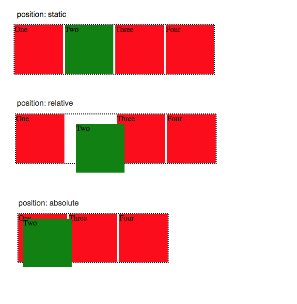
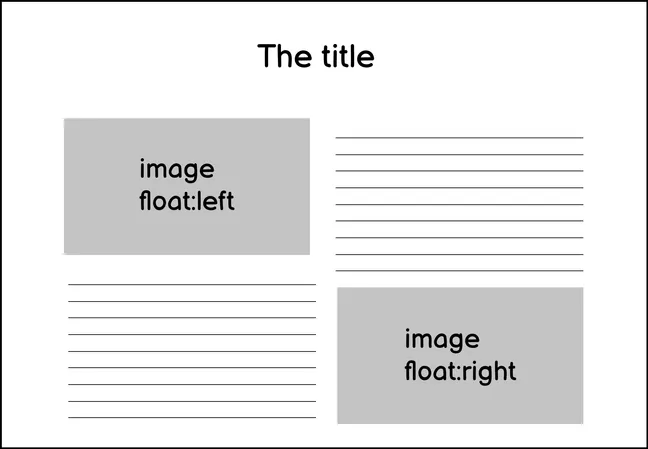
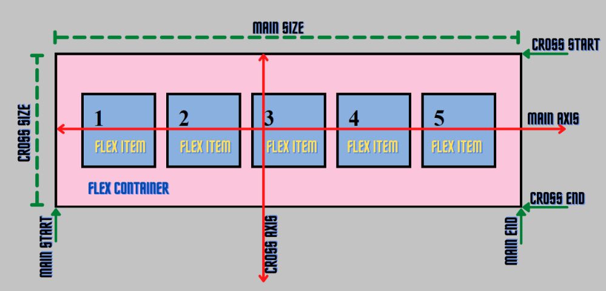
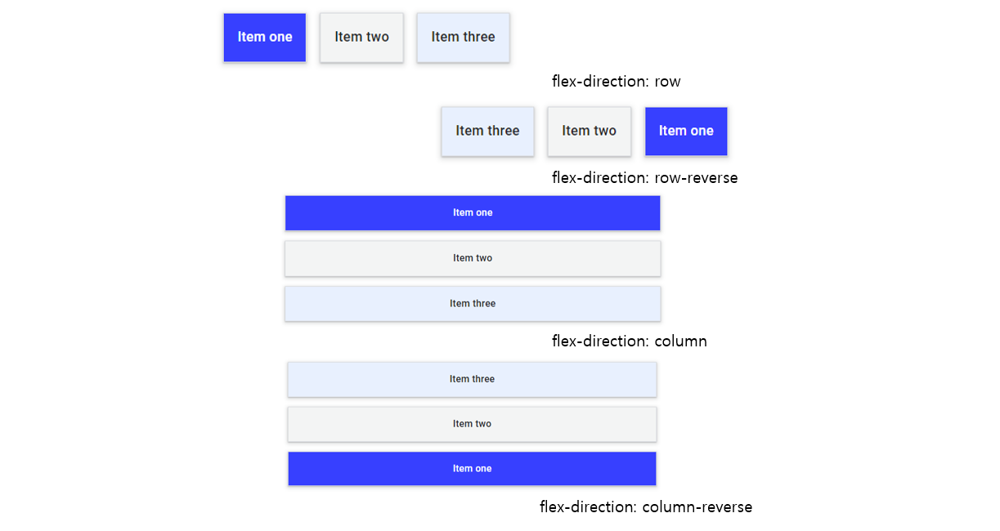
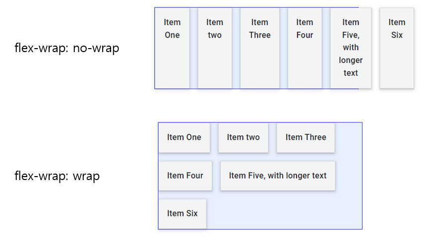
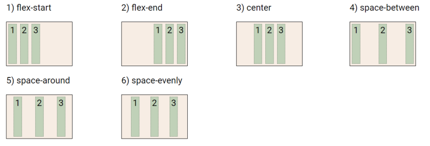
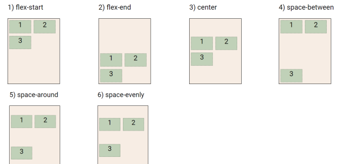
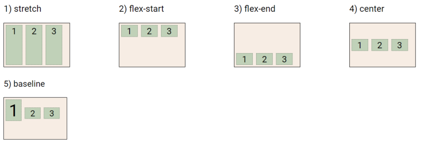
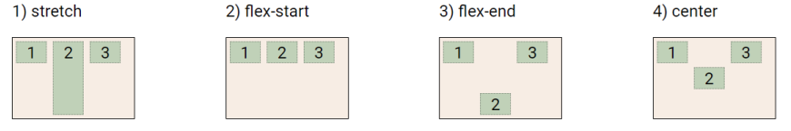

# 📋Web HTML & CSS

[실습](https://github.com/jejoonlee/TIL/blob/master/Web/%EC%8B%A4%EC%8A%B5/20220831/README.md)

#### Category

[CSS Position](#%EF%B8%8F-css-position)

[CSS Layout](#%EF%B8%8F-css-layout)

- [Float](#float)

- [Flexbox](#flexbox)

  - [flex-direction](#flex-direction)

  - [flex-wrap](#flex-wrap)

  - [flex-flow](flex-flow)

  - [justify-content and align-content](#justify-content-and-align-content)

  - [justify-content](#justify-content)

  - [align-content](#align-content)

  - [align-items and align-self](#align-items-and-align-self)

  - [align-items](#align-items)

  - [align-self](#align-self)

  - [기타](#기타)

    

## ✔️ CSS Position

> 문서 상에서 요소의 위치를 지정

- **static**  : 모든 태그의 기본 값(기준 위치)
  - 일반적인 요소의 배치 순서에 따른다 (좌측 상단)
  - 부모 요소 내에서 배치될 때는 부모 요소의 위치를 기준으로 배치 됨
- **relative, absolute, fixed, sticky** 는 (top, bottom, left, right)을 사용하여 이동이 가능하다

> `position: relative;` / `position: absolute;` / `position: fixed;` / `position: sticky;`

- `position: relative` : 상대 위치
  - 자기 자신의 static 위치를 기준으로 이동 **(normal flow 유지)**
- `position: absolute` : 절대 위치
  - 요소를 일반적인 문서 흐름에서 제거 후 레이아웃 공간을 차지하지 않음 **(normal flow에서 벗어남)**
  - 기본적으로 브라우저 화면 기준으로 이동한다
  - 특정 영역 위에 존재하기 위해서 쓴다
  - **부모 요소에 absolute를 주려면, 부모에 relative를 써야한다**
- `position: fixed;`
  - 요소를 일반적인 문서 흐름에서 제거 후 레이아웃에 공간을 차지하지 않음 **(normal flow에서 벗어남)**
  - 부모 요소와 관계없이 viewport를 기준으로 이동
    - 스크롤 시에도 항상 같은 곳에 위치함
- `position: sticky;`
  - 평소에 문서 안에서 `position: static;` 상태지만, 스크롤 위치가 임계점에 이르면 `position: fixed;`와 같이 박스를 화면에 고정할 수 있다

- absolute는 normal flow에서 벗어남. 즉 다음 블록 요소가 좌측 상단으로 붙음
- relative는 normal flow는 유지한다. 실제 위치는 그래도지만, 사람 눈에만 이동한다

## ✔️ CSS Layout

### Float

> 박스를 왼쪽 혹은 오른쪽으로 이동시켜 텍스트를 포함 인라인 요소들이 주변을 wrapping 하도록 함
>
> 요소가 normal flow를 벗어나도록 함

### Flexbox

> 행과 열 형태로 아이템들을 배치하는 1차원 레이아웃 모델
>
> 수직으로 정렬이 가능하고
>
> 아아템의 너비와 높이 혹은 간격을 동일하게 배치할 수 있다

- **축**
  - **main axis (메인 축)** : 기본값은 row
  - **cross axis (교차 축)** : 기본값은 column
- **구성 요소**
  - **Flex container** : 부모 요소
    - flexbox 레이아웃을 형성하는 가장 기본적인 모델
    - flex item들이 놓여있는 영역
    - display 속성을 flex 혹은 inline-flex로 지정
  - **Flex item** : 자식 요소
    - 컨테이너에 속해 있는 컨텐츠(박스)

#### flex- direction

> main axis의 방향을 정하는 것이다

초기 값은 `row`이다

- **row** : 항목이 행으로 배치된다
- **row-reverse** : 항목이 플렉스 컨테이너의 끝에서 행으로 배치가 된다 (순서도 뒤로 된다)
- **column** : 항목이 열로 배치된다
- **column-reverse** : 항목이 플렉스 컨테이너의 끝에서 열로 배치된다 (순서도 뒤로 바뀐다)

#### flex-wrap

> 아이템이 컨테이너를 벗어나는 경우 해당 영역 내에 배치되도록 설정
>
> 기본적으로 컨테이너 영역을 벗어나지 않도록 함

`flex-wrap` 의 초기 값은 `no-wrap`

- flex container가 `wrap`이 되면 여러 플렉스 라인이 생성된다.
- 공간 분배 측면에서 각 라인은 새로운 플렉스 컨테이너처럼 작동한다

#### flex-flow

> `flex-direction`과 `flex-wrap`을 설정할 수 있는 shorthand

`flex-flow: column wrap` : flex의 main axis는 column이면서 wrap을 한다

#### justify-content and align-content

**공간 배분**

- `flex-start` : 기본값, 아이템들을 axis 시작점으로 
- `flex-end` : 아이템들을 axis 끝 쪽으로
- `center` : 아이템들을 axis 중앙으로
- `space-between` : 아이템 사이의 간격을 균일하게 분배
- `space-around` : 아이템을 둘러싼 영역을 균일하게 분배
- `space-evenly` : 전체 영역에서 아이템 간 간격을 균일하게 분배

####  justify-content

> main axis 기준으로 공간을 배분한다

#### align-content

> cross axis 기준으로 공간 배분

#### align-items and align-self

- `stretch` : 기본값, 컨테이너를 가득 채움
- `flex-start` : 위
- `flex-end` : 아래
- `center` : 가운데
- `baseline` : 텍스트 baseline에 기준선을 맞춤

#### align-items

> 모든 아이템을 Cross axis 기준으로 정렬

#### align-self

> 개별 아이템을 Cross axis 기준으로 정렬. 컨테이너 안에 있는 개별 아이템에게 적용

#### 기타

- `flex-grow` : 남은 영역을 아이템에 분배
- `order` : 배치 순서