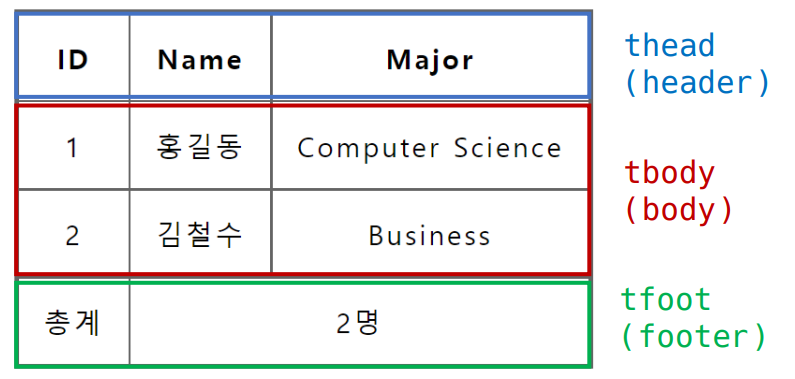
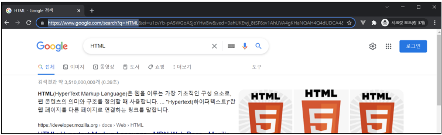
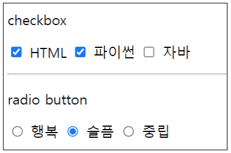
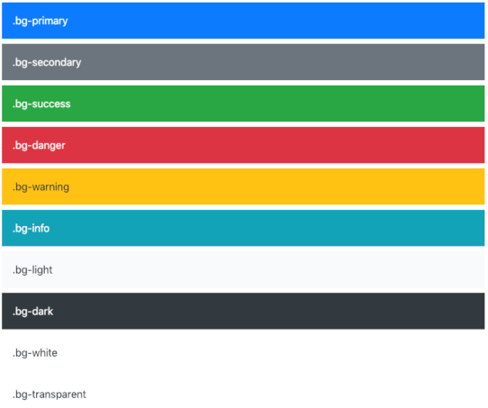
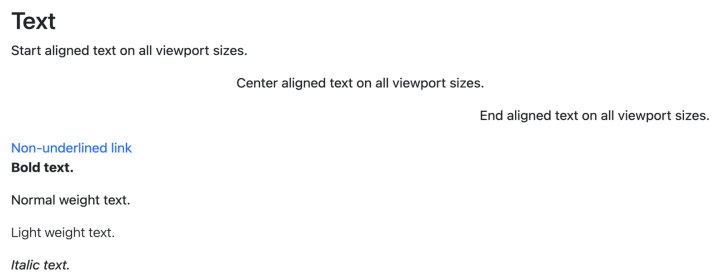

# 📋Web HTML & CSS

[실습](https://github.com/jejoonlee/TIL/blob/master/Web/%EC%8B%A4%EC%8A%B5/20220905/README.md)

#### Category

[HTML](#%EF%B8%8F-html)

- [table](#table)

- [form](#form)
  - [input 유형 - 일반](#input-유형-일반)
  - [input 유형 - 항목 중 선택](#input-유형-항목-중-선택)
  - [input 유형 - 기타](#input-유형-기타)

[Bootstrap](#%EF%B8%8F-Bootstrap)

- [spacing](#spacing)
- [color](#color)
- [display](#display)

## ✔️ HTML

### Table

> table의 각 영역을 명시하기 위해 `<thead>`, `<tbody>`, `<tfoot>` 요소를 활용



```html
<body>
    <table>
        <thead>
        	<tr>
            	<th>ID</th>
                <th>Name</th>
                <th>Major</th>
            </tr>
        </thead>
        <tbody>
            <tr>
                <td>1</td>
                <td>홍길동</td>
                <td>Computer Science</td>
            </tr>
            <tr>
                <td>2</td>
                <td>김철수</td>
                <td>Business</td>
            </tr>
        </tbody>
        <tfoot>
            <tr>
            	<td>총계</td>
                <td colspan="2">2명</td>
            </tr>
        </tfoot>
    </table>
</body>
```

- **`<tr>` 안에 `<thead>`일 경우 `<th>` 또는 `<tbody>`랑 `tfoot` 일 경우 `<td>`를 넣는다**


### form

> `<form>`은 정보(데이터)를 서버에 제출하기 위해 사용하는 태그
>
> input으로 입력을 받아서 사용자 입력값을 변수로 만들고 서버에 전송한다
>
> 사용자 입력 or 개발자 value 설정

- `<form>` 기본 속성
  - action : form을 처리할 서버의 URL (데이터를 보낼 곳)
  - method : form을 제출할 때 사용할 HTTP 메서드 (GET 혹은 POST)
  - enctype : method가 post인 경우 데이터의 유형
    - application/x-www-form-urlencoded : 기본값
    - multipart/form-data : 파일 전송시 (input type이 file인 경우)
- `<input>`
  - 다양한 타입을 가지는 입력 데이터 유형과 위젯이 제공됨
  - `<input>` 대표적인 속성
    - name : form control에 적용되는 이름 (이름/값 페어로 전송됨)
    - value: form control에 적용되는 값 (이름/값 페어로 전송됨)
    - required, readonly, autofocus, autocomplete, disabled 등

```html
<form action="/search" method="GET">
	<input type="text" name="q">
</form>

<!-- 여기서 q는 query -->
```



- `<label>`
  - `<label>` 을 클릭하여 `<input>` 자체의 초점을 맞추거나 활성화 시킬 수 있음
    - 사용자는 선택할 수 있는 영역이 늘어나 웹/ 모바일(터치) 환경에서 편하게 사용할 수 있음
    - label과 input 입력의 관계가 시각적 뿐만 아니라 화면리더기에도 label을 읽어 쉽게 내용을 확인 할 수 있도록 함
  - `<input>`에 id 속성을, `<label>`에는 for 속성을 활용하여 상호 연관을 시킴

```html
<label for="agreement">개인정보 수집에 동의합니다.</label>
<input type="checkbox" name="agreement" id="agreement">

<!-- label에서 for과 input에서 id를 일치 시키면, label을 클릭해도 input이 동작한다 -->
```


#### input 유형 - 일반

> 일반적으로 입력을 받기 위하여 제공되며 타입별로 HTML 기본 검증 혹은 추가 속성을 활용할 수 있음

- text : 일반 텍스트 입력
- password : 입력 시 값이 보이지 않고 문자를 특수기호 (*)로 표현
- email : 이메일 형식이 아닌 경우 form 제출 불가
- number : min, max, step 속성을 활용하여 숫자 범위 설정 가능
- file : accept 속성을 활용하여 파일 타입 지정 가능


#### input 유형 - 항목 중 선택

- 일반적으로 label 태그와 함께 사용하여 선택 항목을 작성함
- 동일 항목에 대하여는 name을 지정하고, 선택된 항목에 대한 value를 지정해야 함
  - checkbox : 다중 선택
  - radio : 단일 선택

```html
<div>
	<p>checkbox</p>
	<input id="html" type="checkbox" name="language" value="html">
	<label for="html">HTML</label>
	<input id="python" type="checkbox" name="language" value="python">
	<label for="python">파이썬</label>
	<input id="python" type="checkbox" name="language" value="java">
	<label for="java">자바</label>
	<hr>
</div>
```




#### input 유형 - 기타

- 다양한 종류의 input을 위한 picker를 제공
  - color : color picker
  - date : date picker
- hidden input을 활용하여 사용자 입력을 받지 않고 서버에 전송되어야 하는 값을 설정
  - hidden : 사용자에게 보이지 않는 input


## ✔️ Bootstrap

### CDN

> Content Delivery(Distribution) Network

컨텐츠(CSS, JS, Image, Text 등)을 효율적으로 전달하기 위해 여러 노드에 가진 네트워크에 데이터를 제공하는 시스템

개별 end-user의 가까운 서버를 통해 빠르게 전달 가능 (지리적 이점)

외부 서버를 활용함으로써 본인 서버의 부하가 적어짐


#### spacing

> Margin and Padding

{property}{side} - {size}

```html
<div class="mt-3 ms-5">bootstrap-spacing</div>
```

- mt-3 : margin top 1rem
- ms-5 : margin start 3rem

> **property**

**m** : property for margin

**p** : property for padding

> **sides**

**t** : top

**b** : bottom

**s** : start (margin-left, padding-left in Left To Right / margin-right, padding-right in Right To Left)

**e** : end (margin-right, padding-right in Left To Right / margin-left, padding-left in Right To Left)

**x** : left and right

**y** : top bottom

**blank** : all the sides

> **spacing**

| Class Name | rem  | px   |
| ---------- | ---- | ---- |
| m-1        | 0.25 | 4    |
| m-2        | 0.5  | 8    |
| m-3        | 1    | 16   |
| m-4        | 1.5  | 24   |
| m-5        | 3    | 48   |


#### color






```html
<h2>Text</h2>
<p class="text-start">margin-top 3</p>
<p class="text-center">margin 4</p>
<p class="text-end">mx-auto, 가운데 정렬</p>
<a href="#" class="text-decoration-none">Non-underlined link</a>
<p class="fw-bold">Bold text.</p>
<p class="fw-normal">Normal weight text.</p>
<p class="fw-light">Light weight text.</p>
<p class="fst-italic">Italic text.</p>
```


#### Display

- d - {value} for xs
- d - {breakpoint} - {value} for sm, md, lg, xl and xxl

>  breakpoint란 웹사이트의 사이즈가 바뀔때 반응하는 지점

| Breakpoint        | Class infix | Dimensions |
| ----------------- | ----------- | ---------- |
| Extra small       | NONE        | < 576px    |
| Small             | sm          | >= 576px   |
| Medium            | md          | >= 768px   |
| Large             | lg          | >= 992px   |
| Extra large       | xl          | >= 1200px  |
| Extra extra large | xxl         | >= 1400px  |

> values

`none` / `inline` / `inline-block` / `block` / `grid` / `table` / `table-cell` / `table-row` / `flex` / `inline-flex`
