# 📋Web HTML & CSS

[실습](https://github.com/jejoonlee/TIL/blob/master/Web/%EC%8B%A4%EC%8A%B5/20220906/README.md)

#### Category

[Bootstrap Components](#%EF%B8%8F-Bootstrap-Components)

- [Accordion](#accordion)
- [Alert](#alert)
- [Badge](#badge)
- [Breadcrumb](#breadcrumb)
- [Button](#button)
- [Button group](#button-group)
- [Card](#card)
- [Carousel](#Carousel)
- [Close Button](#close-button)
- [Collapse](#collapse)
- [Dropdowns](#dropdowns)
- [Modal](#modal)
- [Navbar](#navbar)
- [Navs and tabs](#navs-and-tabs)
- [Offcanvas](#offcanvas)
- [Pagination](#pagination)
- [Placeholders](#placeholders)
- [Popovers](#popovers)
- [Progress](#progress)
- [Scrollspy](#scrollspy)
- [Spinners](#spinners)
- [Toasts](#toasts)

## Bootstrap Components

> Bootstrap 의 다양한 UI 요소를 활용할 수 있음

https://getbootstrap.com/docs/5.2/getting-started/introduction/

- 이 곳에서 Components 섹션을 보면, 다양한 요소들이 있다

**Bootstrap 코드에 id가 있으면 id를 일치시키서 유지해야 한다**

 - 대부분 Javascript를 활용하고 있고, 타겟으로 활용되는 경우가 있다

### Accordion

> https://getbootstrap.com/docs/5.2/components/accordion/
>
> 박스를 클릭하면, 밑에 내용들이 나오는 것

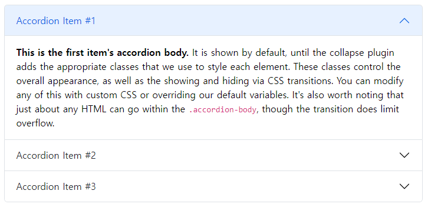

### Alerts

> https://getbootstrap.com/docs/5.2/components/alerts/
>
> 유저들이 어떤 행위를 했을때, 알려주는 알람

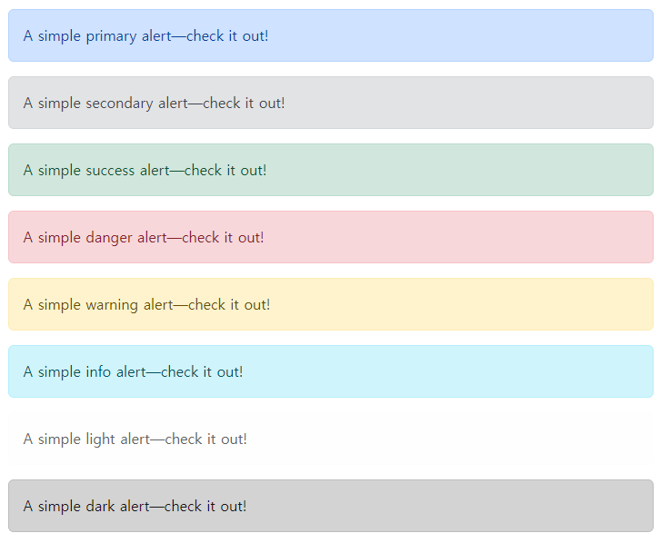

### Badge

>https://getbootstrap.com/docs/5.2/components/badge/
>
>중요한 것을 표시할 때. 예) 새로운 것을 표현하고 싶을 때

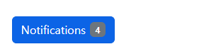

### Breadcrumb

> https://getbootstrap.com/docs/5.2/components/breadcrumb/
>
> 현재 페이지의 위치를 알려주는 역할

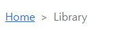

### Buttons

> https://getbootstrap.com/docs/5.2/components/buttons/
>
> 말 그대로 버튼

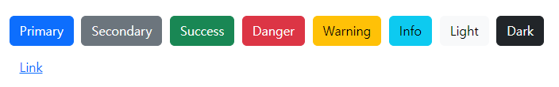

### Button group

> https://getbootstrap.com/docs/5.2/components/button-group/
>
> 버튼을 한 그룹으로 만들어서 사용

### Card

> https://getbootstrap.com/docs/5.2/components/card/
>
> 어떻한 것을 소개하는 이미지와, 밑에 설명글이 있는 것

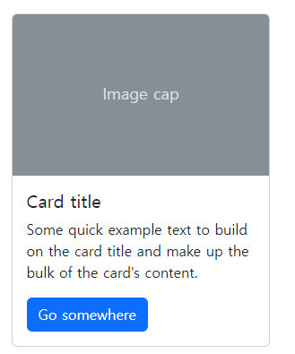

### Carousel

> https://getbootstrap.com/docs/5.2/components/carousel/
>
> 회전목마. 슬라이드이면서 여러 이미지를 볼 수 있도록 하는 기능

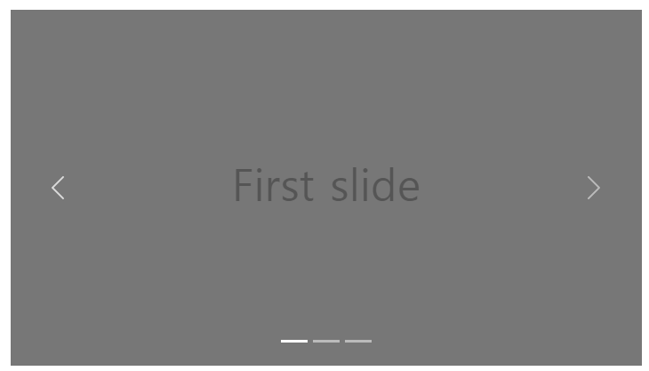

### Close button

> https://getbootstrap.com/docs/5.2/components/close-button/
>
> 닫기 버튼

### Collapse

> https://getbootstrap.com/docs/5.2/components/collapse/
>
> 클릭하면, 숨겨져 있던 요소가 나오는 것

- 여기서 `Link with href` 또는`Button with data-bs-target`을 누르면, 밑에 박스가 나타난다

### Dropdowns

> https://getbootstrap.com/docs/5.2/components/dropdowns/
>
> 옵션같이, 누르면 선택할 수 있는 내용들이 나온다

### Modal

> https://getbootstrap.com/docs/5.2/components/modal/
>
> 사용자 알림 또는 사용자 정의 컨텐츠

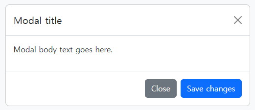

### Navbar

> https://getbootstrap.com/docs/5.2/components/navbar/
>
> 네비게이션 바

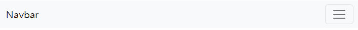

### Navs and tabs

> https://getbootstrap.com/docs/5.2/components/navs-tabs/
>
> 네비게이션 컴포넌트를 어떻게 사용하는지 알려주는 문서와 예시

### Offcanvas

> https://getbootstrap.com/docs/5.2/components/offcanvas/
>
> 네비게이션이나 쇼핑카트 등에 유용한 숨겨진 사이드바

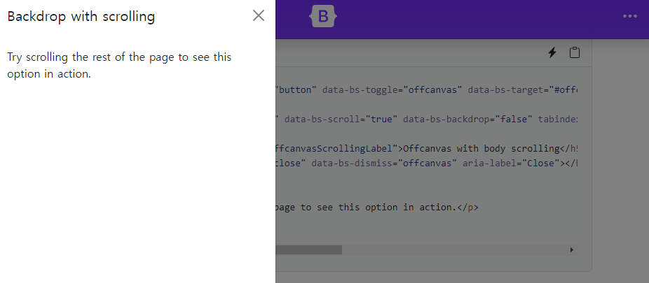

### Pagination

> https://getbootstrap.com/docs/5.2/components/pagination/
>
> 여러 페이지가 있을 때, 페이지 장수를 보여주는 기능

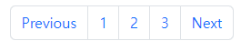

### Placeholders

> https://getbootstrap.com/docs/5.2/components/placeholders/
>
> 로딩할때 보여주는 기능

### Popovers

> https://getbootstrap.com/docs/5.2/components/popovers/
>
> 팝업으로 뜨는 기능

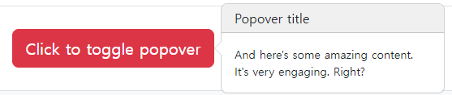

### Progress

> https://getbootstrap.com/docs/5.2/components/progress/
>
> 로딩 하는 것을 보여주는 기능 

### Scrollspy

> https://getbootstrap.com/docs/5.2/components/scrollspy/
>
> 네비게이션 또는 목록 그룹 컴포넌트를 자동으로 갱신하여 뷰포트 내에서 어떤 링크가 활성화 된지를 나타낸다

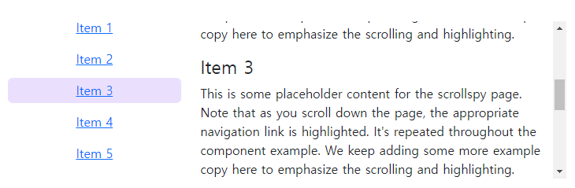

### Spinners

> https://getbootstrap.com/docs/5.2/components/spinners/
>
> 로딩할때 보이는 기능

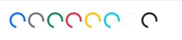

### Toasts

> https://getbootstrap.com/docs/5.2/components/toasts/
>
> 알림 메세지로 푸시 알림을 보내는 것

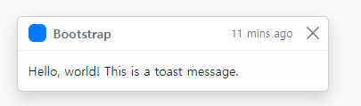
