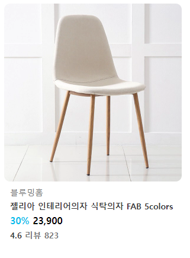

# 🧑‍💻20220830 HTML, CSS 실습 정리 

[실습 1](#실습-1)

[실습 2](#실습-2)


## 실습 1


> 위에 보이는 사이트 일부분을 만드는 것
>
> font는 기본 폰트로 사용

[실습 Detail](./실습1/README.md)

#### 실습 레이아웃


### 실습 결과물


- 진행을 하면서 레이아웃과 조금씩 달라지긴 했다

#### 사용 코드

- HTML에서는 모든 태그들을 `class`로 묶어줬다
- 그리고 오늘은 CSS 관련해서 `display: block`, `display: inline`, `display: inline-block`을 배웠기에, 최대한 이 안에서 실습을 진행 했다

```html
<div class="cards">
    <div class="card">
      
      <p class="installation">INSTALLATION</p>
      <p class="guide">BESPOKE Infinite Line 단독 설치 가이드</p>
      <p class="detail">내게 딱 맞는 조합과 컬러를 선택했지만,<br>우리 집 설지 공간과 맞을지 고민이라면 확인해보세요.</p>
    </div>
```

```css
.category{
    font-size: 12px;
}

.cards{
    width: 900px;
    margin: 0 auto;
}

.card{
    display: inline-block;
    width: 300px;
    margin: 0px 5px;
    vertical-align: top;
}
/* 각 .card들에 inline-block을 통해 .card 블럭들을 양옆으로 정렬을 시켰다 */

img{
    width: 100%;
    border-radius: 15px;
}

p{
    padding: 0px 12px;
    font-size: 15px;
    margin: 5px 0;
}

.installation{
    font-size: 12px;
    color: rgb(73, 73, 73);
}

.guide{
    font-weight: bold;
}

.detail{
    margin-top: 8px;
    font-size: 10px;
    color: rgb(122, 122, 122);
```

- 대부분 수월하게 돌아갔다. 근데 `.card` 박스 사이즈가 달라질 때마다, 최하단으로 정렬이 되었다.
  - 여기서 `vertical-align: top` 을 통해서 박스 사이즈가 달라져도, 상단 기준으로 정렬하게 했다


## 실습 2


> 위 사진처럼 결과물을 만드는 것
>
> 폰트, 색깔은 바꿀 수 있었음

#### 실습 레이아웃


#### 실습 결과물



- 실습 1보다 쉬웠던 실습이었다. 여기서 중요한 것은 글씨 중간중간, 색깔이 바뀌는 부분을 `<span>`을 HTML에서 만들었던 부분이다.

  